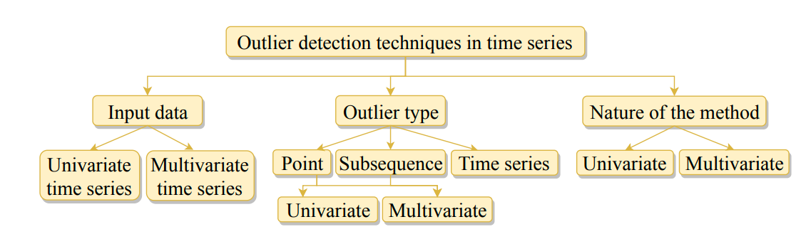
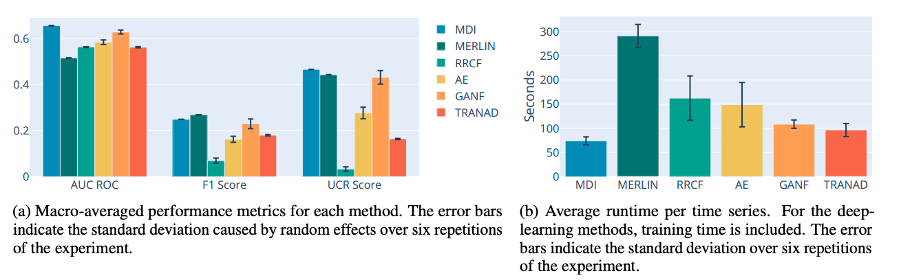
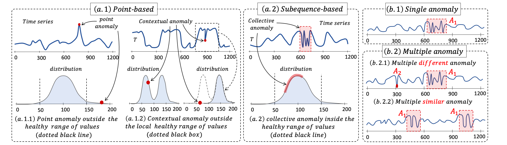
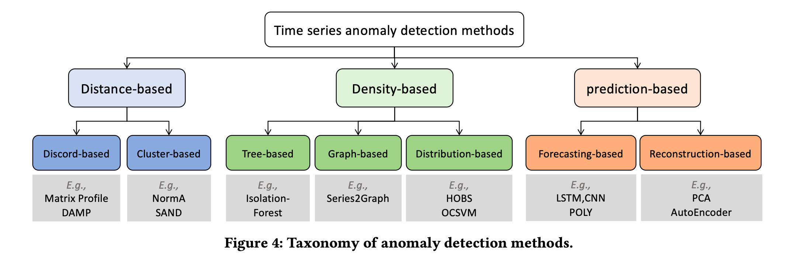
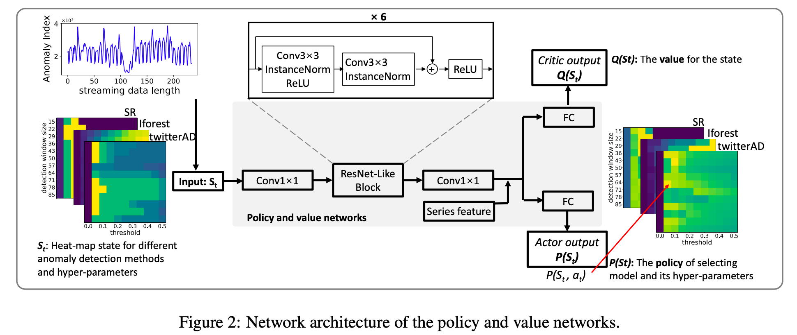

# Paper

## Review

### 2021-A review on TSAD

*A review on outlier/anomaly detection in time series data*[@blazquez2021review].

论文对一元和多元时间序列在Point outlier, Subsequence outlier和Outlier time series的检测算法进行了
详尽的介绍. 总共涵盖了近几十年来的几十个算法, 并对每个算法进行了简单的介绍和分类.
同时论文给出了一些算法的开源代码仓库, 方便直接测试并应用相关算法.

### 2022-A Comprehensive Evaluation on TSAD

*Anomaly Detection in Time Series: A Comprehensive Evaluation*[@schmidl2022anomaly].
论文收集了来自Statistics, Stochastic Learning, Signal Analysis, Classic ML,
Data Mining, Outlier Detection和Deep learning共7个领域累计158种异常检测算法, 并选取其中71个有代表性的
算法在976个时间序列数据集上进行了测试验证和水平对比, 总结出14个RI(Research Insight).

这些RI提供了一个足够广阔的视角和相当实用的方法论, 这对我们实际落地实现有很大的帮助.
这里列举其中一些和我个人实践经验非常匹配的几个结论:

- Deep learning approaches are not (yet) competitive despite their higher processing effort
on trainning data
- There is no one-size-fits-all solution in the set of currently available algorithms...there is no clear winner
- Simple methods yield performance almost as good as more sophisticated methods
- Every practical algorithm deployment needs careful testing
- Anomalies on periodic time series are easier to detect than on non-periodic time series

### 2023-IS IT WORTH IT?

*IS IT WORTH IT? COMPARING SIX DEEP AND CLASSICAL METHODS FOR UNSUPERVISED ANOMALY DETECTION IN TIME SERIES*
[@rewicki2023worth].

论文选取了用于时序异常检测的三种统计机器学习算法(MDI, MERLIN, RRCF)
和三种深度学习算法(AE, GANF, TRANAD), 对这六种算法进行了详细的水平对比.
最后的结论是发现深度学习的效果其实并不如统计机器学习算法.这点和上述Comprehensive Evaluation[@schmidl2022anomaly]
中得到的结论是一致的.

### 2023-New Trends in Time-Series Anomaly Detection

*New Trends in Time-Series Anomaly Detection*[@boniol2023new].
[Paul Boniol](https://boniolp.github.io/)新出的综述, 对时序异常的类型和检测算法进行了进一步的划分.

## Systems

### 2017-Twitter-ESD
  H-S-ESD[@hochenbaum2017automatic]是较早的时序异常检测系统，
  主要理论依据为时序STL分解与ESD(Extreme Studentized Deviate test)。
  在后来的研究中也可以看出，这种基于时序分解的思想本质上从属于时序转化的思想：
  当原始序列$X$的异常不容易检测时，将其转化为更容易检测的序列$Y$,通过对$Y$进行异常检测以达到检测异常的目的。

### 2020-Alibaba-RobustX

  阿里达摩院基于STL分解的思路利用深度学习做了一系列的创新研究。
  分别有RobustTrend[@wen2019robusttrend], RobustSTL[@wen2019robuststl],
  和RobustPeriod[@wen2020robustperiod],
  最后以RobustTAD[@gao2020robusttad]将上述算法集成的一个统一的异常检测系统。
  其整体上体系还是根植于最早Twitter的STL+ESD的结构。
  另外这一系列算法在标准数据集上的表现可能尚可，但是根据对其中部分算法的测试发现算法性能较差，
  在实际部署的时候可能存在性能瓶颈或者需要较大的资源开销。

### 2020-Amazon-GluonTS

  GluonTS[@alexandrov2020gluonts]主要专注于时间序列概率模型。

### 2020-Zillow-Luminaire
  Luminaire[@chakraborty2020building]列出了当前时序异常检测系统的挑战，并针对性地给出了解决方案，
  形成了一套基于无监督检测算法的简单易用全自动的系统。

### 2020-Microsoft-Auto-Selector
  Auto-Selector[@ying2020automated]是微软提出的一种自动做模型选择的时序异常检测框架。

### 2021-Salesforce-Merlion
  Merlion[@bhatnagar2021merlion]是针对时间序列设计的一个比较完备的系统，
  架构清晰，易用性强，具有较大的落地参考价值。

### 2021-Linkedin-Silverkite

  Silverkite[@hosseini2021flexible]专注于时间序列的预测，也是通过对时间序列进行变换分解的思路。
  基于之前对Twitter和Alibab系统的介绍, 当然我们也可以将其应用于时序异常检测.

### 2022-IBM-AnomalyKiTS
  AnomalyKiTS[@patel2022anomalykits]是专门针对时间序列异常检测设计的系统，专注于无监督和半监督算法。

### 2022-MicroSoft-HEAT-RL

HEAT-RL[@wang2022heat]是微软的一篇关于时序异常检测系统中如和模型自动选择的文章。
论文选取SR, IForest和TwitterAD作为基础的时序异常检测算法, 然后利用强化学习通过用户反馈来调整各模型的参数.
个人感觉这个方法总体来说还是有些太重了, 可以作为成熟系统的拓展尝试.

最后比较有意思的一点是, 论文用online click-through rate(CTR)来衡量该算法带来的收益:
>After shipping the Heat-RL algorithm to a commercial monitoring service, the online click-through rate (CTR) of
anomaly alerts has been improved by 29.9% (Figure 8). Online CTR indicates the probability of a customer to click into
the system portal after receiving an anomaly alert, which reflects how much the customers trust our anomaly detection
results. Therefore, higher CTR score indicates better user satisfaction

## Algorithms

### 2016-Amazon-RRCF
RRCF[@guha2016robust]较为通用的多指标异常检测算法，
其原始模型虽然没有考虑太多时序的问题，但是我们可以将滚动窗口的时序特征抽取出来作为新的指标特征加入模型
以完成针对指标时序特征的建模。

### 2017-IRISA-SPOT
SPOT[@siffer2017anomaly]是基于EVT的极值点异常检测算法。

### 2021-Huawei-FluxEV

FluxEV[@li2021fluxev]是一个波动异常检测算法，主要用于指标陡升陡降的检测。
其本身检测准确率很高，可以精准地捕捉到指标的各种非异常的波动。
但是其也存在各种缺点，如算法复杂度略高，这在大规模部署的时候存在较大的性能问题，会占用过多的机器资源等；
另外算法本身要求指标具有周期性，而且需要相当多个周期的数据，这使得其适用范围变的比较窄。
针对算法存在的这些问题和出于实用考虑我们可以针对性的做若干改进：
去除周期性相关部分；在连续异常的时候自动将EWMA窗口做Level Shift(通过将历史异常点换存在模型即可做到)等。

### 2021-NUS-MemStream
MemStream[@bhatia2021memstream]明确地提出Memory的概念，
相对于Matrix Profile更加的轻量，相对于其他的多指标异常检测算法具有更多的可解释性。

### TODO: 2022-EDF-Series2Graph

Series2Graph[@boniol2022series2graph], GraphAn[@boniol2020graphan]和DADS[@schneider2021distributed]
是Series2Graph系列的三篇文章: 其中Series2Graph是主要的算法部分([主页](https://helios2.mi.parisdescartes.fr/~themisp/series2graph/))，GraphAn强调问题与挑战，
DADS专注于时序异常检测分布式系统的实现，具体采用Actor Programming Model实现，具体参考[Github](https://github.com/HPI-Information-Systems/DADS)。

## Evaluation

### TODO: 2022-Theseus
*Theseus: Navigating the Labyrinth of Time-Series Anomaly  Detection*[@boniol2022theseus]

### TODO: 2022-Rigorous Evaluation
*Towards a rigorous evaluation of time-series anomaly detection*[@kim2022towards]

### TODO: 2022-Huawei-Local Evaluation
*Local Evaluation of Time Series Anomaly Detection Algorithms*[@huet2022local]

### TODO: 2022-Volume under the surface
*Volume under the surface:
a new accuracy evaluation measure for time-series anomaly detection*[@paparrizos2022volume]

### TODO: 2022-TimeEval
*TimeEval: a benchmarking toolkit for time series anomaly detection algorithms*[@wenig2022timeeval]

### TODO: 2022-TSB-UAD
*TSB-UAD: an end-to-end benchmark suite for univariate time-series anomaly detection*[@paparrizos2022tsb]

### TODO: 2023-SINTEF-TSAD Metric

SINTEF Digital关于时序异常检测算法衡量指标的分析[@sorbo2023navigating].

> The field of time series anomaly detection is constantly advancing, with several methods available,
making it a challenge to determine the most appropriate method for a specific domain. The evaluation
of these methods is facilitated by the use of metrics, which vary widely in their properties. Despite
the existence of new evaluation metrics, there is limited agreement on which metrics are best suited
for specific scenarios and domain, and the most commonly used metrics have faced criticism in the
literature. This paper provides a comprehensive overview of the metrics used for the evaluation of
time series anomaly detection methods, and also defines a taxonomy of these based on how they are
calculated. By defining a set of properties for evaluation metrics and a set of specific case studies and
experiments, twenty metrics are analyzed and discussed in detail, highlighting the unique suitability
of each for specific tasks. Through extensive experimentation and analysis, this paper argues that the
choice of evaluation metric must be made with care, taking into account the specific requirements of
the task at hand.
