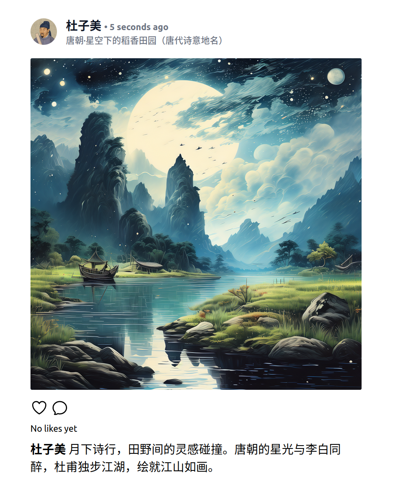

# 2024

总结一下 2024 年。

<!-- more -->

## GitHub 上的 6 个里程碑


在 2024 年初的时候决定 All in GitHub 来记录各项事宜：博客，读书计划，项目计划……
同时在年初的时候为 2024 年列了 6 个里程碑来大致确定这一年学习的方向。

6 个里程碑如下，分别是后端 (Python 技术栈)，前端 (React&Nextjs)，语言学习 (Rust & Elixir)，大语言模型 (LLMPaper 阅读)，最佳工程实践 (输出博客):

- [2024-Backend: Python develop stack/tools](https://github.com/shenxiangzhuang/shenxiangzhuang.github.io/milestone/7)
    - 学习，实践，总结 Python 后端开发技术栈
- [2024-Frontend: React](https://github.com/shenxiangzhuang/shenxiangzhuang.github.io/milestone/8)
    - 学习 React(Next.js)，总结相关工具，以开发简单 Web 页面为阶段性目标
- [2024-Language Learning: Rust](https://github.com/shenxiangzhuang/shenxiangzhuang.github.io/milestone/5)
    - Rust 语言学习：初步了解学习，以完成一个项目为阶段目标
- [2024-Language Learning: Elixir](https://github.com/shenxiangzhuang/shenxiangzhuang.github.io/milestone/6)
    − Elixir 语言学习：初步学习，深入了解 Actor 模型，以完成一个项目为阶段性目标
- [2024-Engineering: Best Practice](https://github.com/shenxiangzhuang/shenxiangzhuang.github.io/milestone/9)
    - 总结 SDE & MLE 最佳工程实践，以几篇代表性的 Blog 为阶段性目标
- [2024-LLM: Read all the papers in reading list](https://github.com/shenxiangzhuang/shenxiangzhuang.github.io/milestone/4)
    - 大量阅读 LLM 相关论文

先做个简要的总结：前 4 个里程碑基本上是达成了的；最佳工程实践这部分算是差强人意；最后 LLM 论文的里程碑基本算作未达成。

### Backend: Python develop stack/tools

Python 相关的后端开发主要是工作中用的多一些，这部分的学习和应用比我想象中要简单一些，当然这也要归功于 FastAPI 优秀的文档。
相关的学习资料记录在[Backend/Python](https://datahonor.com/se/backend/python/)。
期间为了加深对 Async 的理解，又读完了[Python Concurrency with asyncio](https://datahonor.com/se/backend/python/#books)这本书。

### Frontend: React

由于 LLM 辅助编程工具的大量涌现，前端的学习变得更加简单。2024 年和前端有关的学习和实践都在[AI Glimpse](https://aiglimpse.datahonor.com/)的官网。
主要的改动是 Docs 和 Blog 部分的集成，这里采用的是[fumadocs](https://github.com/fuma-nama/fumadocs)，集成过程相当丝滑。
得益于优秀的框架和前端丰富的第三方库，目前网站 Docs/Blog 已经对 MDX 有了很好的支持：
数学公式和代码的友好显示，浏览器本地运行 Python 代码，BibTex 集成，评论系统集成……
至此，总算搭建起一个基础的面向教育的站点框架，接下来就是内容的逐渐丰富了。

### Language Learning: Rust

Rust 的学习和实践过程是比较令我惊喜的。久闻 Rust 有着极为陡峭的学习曲线，我在 2023 年的尝试也并不顺利——是的，它没有那么好学。
在今年的学习过程中，我的策略是少看一些书，多写一些代码。
所以我在 4 月份着手写了第一个 Rust 库：[bleuscore](https://github.com/shenxiangzhuang/bleuscore)。


### Language Learning: Elixir

学习 Elixir 的过程也是比较有趣的。Elixir 官方文档写得非常好，我在学习的过程中也是主要参考官方文档。
另外也学完一门课程：[The Pragmatic Studio： Elixir & OTP](https://datahonor.com/cs/programming/elixir/#courses)。
实践方面主要是对[shinstagram](https://github.com/shenxiangzhuang/shinstagram)(一个 LLM 驱动的仿 Instagram 的平台) 进行改造：
将 LLM 替换为 Qwen，将对象存储换为 Tencent COS 等。

<figure markdown="span">
  { width="500" }
  <figcaption>shinstagram: Qwen & Tencent COS</figcaption>
</figure>

另外写了一个 Elixir 库：[qwen](https://github.com/shenxiangzhuang/qwen)。
这个库是一个简单的 Qwen 的 API 封装，主要是为了方便在 Elixir 项目中使用 Qwen 系列的大模型。

### Engineering: Best Practice
这部分原计划多写几篇 MLE 相关的高质量的博客，但是因为写这么一篇博客需要大量的时间，所以这一年的输出并不多。
比较硬核的一篇是 [Dawid-Skene 算法](https://datahonor.com/blog/2024/08/21/ds/)，这篇文章花了很多时间来写。
因为是团队内一个比较核心的算法，也对算法做了一些优化 (优化部分也合入到了社区)，所以这篇文章对算法细节和工程细节都写的比较详细。
最后也在公司内部做了一个分享。

另外两篇更加偏向于解读类型，分别是
[斯坦福小镇 (AI-Town) 系统解读](https://datahonor.com/blog/2024/11/28/ai-town/)
和
[LLM in 2024](https://datahonor.com/blog/2024/12/23/ai_think_2024/)。

个人对这三篇文章还是比较满意的，所以我个人认为这个里程碑算是基本完成了。

### LLM: Read all the papers in reading list
这个目标定的有点高...所以最后并没有完成。LLM 相关的论文太多了，而且每篇论文都需要仔细读好多遍然后看实现代码才能基本看懂。
所以今年算下来并没有读很多论文，主要还是看了一些[书](https://datahonor.com/odyssey/llm/#books)来补充一些基础知识。

DeepMind 的这篇*Accelerating Large Language Model Decoding with Speculative Sampling*算是今年读的比较有意思的一篇论文。
不过今年又出了很多关于 LLM Speculative Sampling 的论文，都还没有来得及看。


## 开源项目

### Beer
[beer](https://github.com/shenxiangzhuang/beer)是一个概率论与统计学题解项目。
今年新增了 6 个题解，有了第一个社区贡献者，总的来说还算不错。

- [Curing the Compulsive Gambler](https://datahonor.com/beer/fifty/7_curing_compulsive_gambler/)
- [Perfect Bridge Hand](https://datahonor.com/beer/fifty/8_perfect_bridge_hand/)
- [Craps](https://datahonor.com/beer/fifty/9_craps/)
- [生育政策与男女比例 (Fertility Policy)](https://datahonor.com/beer/mystery/3_fertility_policy/)
- [Expectation of Length of Maximum Monotone Sequence](https://datahonor.com/beer/misc/1_expectation_of_length_of_maximum_monotone_sequence/)
- [Bet until win all the money](https://datahonor.com/beer/misc/2_bet_until_win/)


### MPPT
[mppt](https://github.com/shenxiangzhuang/mppt) 是一个 Python 库模板，今年的更新主要是将包管理工具从 Poetry 更换为 Uv。
两年来已经逐渐将其他项目 (比如下面的 ToyML 和 Zh-Plot 等) 的都统一替换为 MPPT 的结构，整体使用体验非常不错。


### Zh-Plot
[zhplot](https://github.com/shenxiangzhuang/zhplot) 的主要目的是为了解决中文绘图的问题，即“一行代码搞定 Python 图表中文展示”。
可以通过一行`import zhplot`来解决`matplotlib`和`wordcloud`(词云图) 两个库的中文显示问题：
```diff
+ import zhplot
import matplotlib.pyplot as plt
import wordcloud
```
得益于 MPPT 的模板，这个库在不到一天的时间就基本开发完成了，发布到 V2EX 上后发现大家还算比较认可。
目前 20 个 Star，不多，但能帮到人还是挺开心的。

### ToyML
[toyml](https://github.com/ai-glimpse/toyml) 是一个做了很久的项目了，主要是用纯 Python 实现一些机器学习算法。
今年主要是对原先的代码进行了一些重构，同时增加了大量测试和文档，将测试覆盖率提高到了 98% 。
另外在 0.4.0 版本新增了 Isolation Forest 算法的实现。

### ToyLLM
[toyllm](https://github.com/ai-glimpse/toyllm) 是一个简单的 GPT-2 实现，主要是为了学习 LLM 的原理。
起因是在读*Build a Large Language Model From Scratch*的时候觉着可以自己手动对书里的代码进行一些封装，所以就动手写了这个库。
代码主要来自 [rasbt/LLMs-from-scratch](https://github.com/rasbt/LLMs-from-scratch)。

目前已经完成了 GPT-2 的核心实现部分。后续打算继续加入一些新的 Feature，比如 Speculative Sampling 等。

### Qwen
[qwen](https://github.com/shenxiangzhuang/qwen) 是一个简单的 Qwen 的 API 封装，
主要是为了方便在 Elixir 项目中使用 Qwen 系列的大模型。目前已经发布到 [Hex](https://hexdocs.pm/qwen)，
添加`{:qwen, "~> 0.2.1"}`即可使用。

```elixir
iex> import Qwen.Sigils
iex> prompt = ~l"model: qwen-turbo
...>             system: 你是一个学贯中西，通晓古今的文学家，给定一些历史上的文人，你能够根据这些人物的特征给出符合人物形象的对话。
...>             user: 你是唐代诗人李白，请做一首诗评价一下意大利作家卡尔维诺"
iex> Qwen.chat(prompt)
{:ok,
"我李白，醉卧青天云间游，笔下挥洒天地秋。虽非意大利文豪，但对异国才子亦有敬意。卡尔维诺如织梦者，编织文字的绮丽迷宫，
《看不见的城市》唤起无尽想象，跨越时空的桥梁。
心灵之旅如幻如真，寓言世界深邃如渊。
他的故事如月挂天涯，照亮异域文化之光。
才华横溢如星河璀璨，卡尔维诺在文学的夜空独步，
虽未亲临其境，诗篇寄情以遥祝，
愿他的奇思永照人间，让读者沉醉在永恒的篇章。"}
```


```elixir
iex> image_prompt = ~p"model: wanx-v1
...>                   prompt:根据杜甫的《旅夜书怀》做一副富有意境和想象力的画
...>                   parameters.style: <chinese painting>
...>                   parameters.size: 1024*1024
...>                   parameters.n: 1
...>                   parameters.seed: 42"
iex> Qwen.text_to_image(image_prompt, "./旅夜书怀.png")  # 提供 image_path, 存储图片到 image_path 并返回
Save image to ./旅夜书怀.png
```


### Bleuscore
[bleuscore](https://github.com/shenxiangzhuang/bleuscore)是一个 BLEU 得分计算器。
写这个库的原因有两个：一是 BLEU 分数是一个比较经典且并不复杂的算法，适合作为 Rust 的入门练习；
二是我发现 Huggingface 的 Evaluate 库对 BLEU 的支持并不好 ([#10](https://github.com/shenxiangzhuang/bleuscore/issues/10))。

其实我觉着 Huggingface 对这个库的维护态度很值得商榷，看 GitHub 上的 [Issue](https://github.com/huggingface/evaluate/issues)
就能看出来，很多重要的 Issue 都没有得到解决，这也是我写这个库的原因之一。
这个库从设计到实现，再到测试发布都是花了一些心思的。
首先整个库的架构是 Rust 做核心实现，同时作为独立的库发布到 crate.io；
之后通过 PyO3 增加 Python Binding，发布到 PyPI。（后续打算增加 JS Binding 并发布到 NPM）

至于 Python 库接口的设计，为了方便用户从 Evaluate 库迁移，我参考了 Huggingface 的 Evaluate 库的接口设计，最后的调用方式和参数基本一致：

为了保障算法实现的正确性，这里做个极为充分的测试。首先基本的单元测试和集成测试在 Rust 内部测试就够了。
但是我在写这个库的时候更关系的是算法实现的正确性，我需要 100% 确保我实现的 BLEU 算法和 Huggingface 的 Evaluate 库的 BLEU 算法是一致的。
这点其实非常重要，因为 BLEU 算法的流程虽然简单，但是有很多细节需要注意，尤其一些正则表达式的处理。
这就需要做一些类似 Property-based Testing 的测试，[具体做法](https://github.com/shenxiangzhuang/bleuscore/blob/5619351a4f22486151be6ec57421484e8e25f50d/tests/test_bleu_score.py)
是用 Python 的 Hypothesis 库在大量随机输入上测试 bleuscore 和 Evaluate 库的输出是否一致。
后来我发现有别的库也在做类似的事情，比如 [evalica](https://github.com/dustalov/evalica)(这里的方法甚至还能更加优雅一些！)。

因为 Rust 来写的一个重要原因是性能，所以我也做了一些性能测试。
这里主要是通过[bencher](https://bencher.dev/)来实现 continuous benchmarking，离线性能测试通过[hyperfine](https://github.com/sharkdp/hyperfine)来实现。

总的来说，这个库的设计和实现过程让我对 Rust 有了更深的理解，也让我对 BLEU 算法有了更深的理解，是个很不错的体验。


### ToyML-RS
[toyml-rs](https://github.com/shenxiangzhuang/toyml-rs) 是上述 ToyML 项目的 Rust 版本。
写这个项目的原因是我需要一套算法代码来同时支持 Python 和 JS 的调用，同时保证一定的性能。
因为 PyO3 & maturin 和 wasm-bindgen & napi-rs 的存在，使用 Rust 来写这个库是一个很好的选择。

经过几个月的折腾，终于将基于 Kmeans 算法的 POC 完成了：目前已经支持 Python 和 JS(WASM) 的调用。
目前 JS(WASM) 的包已经发布到 NPM([toymlrs](https://www.npmjs.com/package/toymlrs))，
并且已经在 AI Glimpse 上使用了 ([Kmeans Algorithm in Rust(WASM)](https://aiglimpse.datahonor.com/docs/ml/kmeans#kmeans-algorithm-in-rustwasm))，
效果还不错：

<figure markdown="span">
  { width="500" }
  <figcaption>Kmeans Algorithm in Rust(WASM)</figcaption>
</figure>

因为对 WASM 和 JS 都不太熟悉，所以这个项目的进展并不顺利，最终完成 POC 达到自己预期效果时真的很开心。


### CTeX Book Template
[ctexbook-template](https://github.com/shenxiangzhuang/ctexbook-template): 一个不太复杂的中文书籍 LaTeX 模板。
主要是提供一个模板可以快速开始写中文书籍。
<figure markdown="span">
  { width="500" }
  <figcaption>CTeX Book Template 目录</figcaption>
</figure>

### Typst CN Book Template
[typst-cn-book](https://github.com/shenxiangzhuang/typst-cn-book): 一个简单的中文书籍 Typst 模板。
是 ctexbook-template 的 Typst 版本，也是为了方便写中文书籍。不过目前这个模板还不太完善，只是一个初步的版本。
感觉 Typst 在中文排版上还是有一些问题，所以目前还是在探索阶段，目前严肃的场景还是用的 ctexbook-template 这套。
