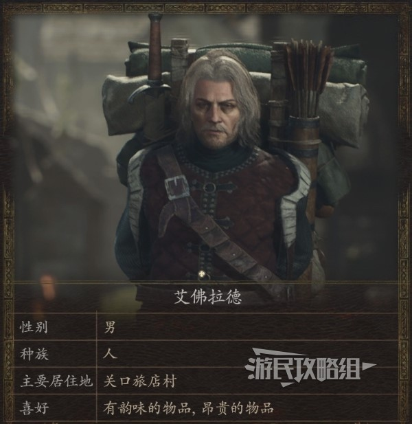
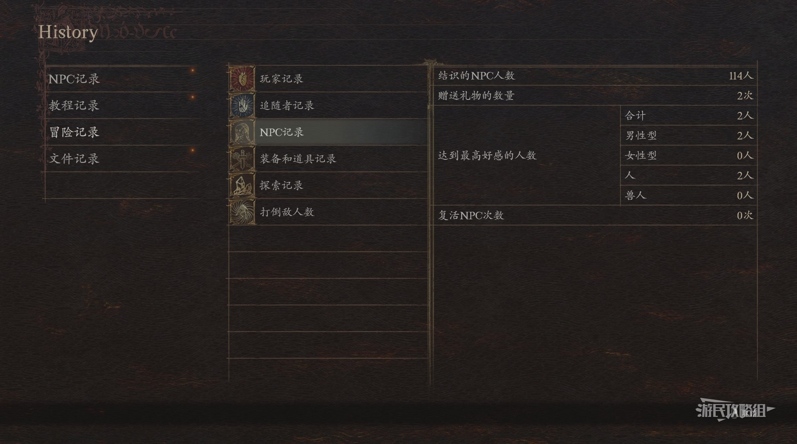
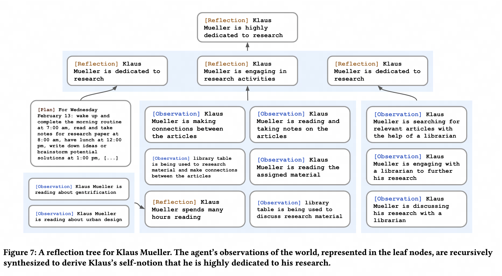

# 斯坦福小镇 (AI-Town) 系统解读

斯坦福小镇论文摘要与简单解读。

<!-- more -->

## Terminology
### Believable

!!! quote "Believable"

    **Believable** proxies of human behavior...agents act **consistently** with their past experiences and
    react **believably** to their environments.

- 保证 AI 行为的可信性是关键，也可以算作是整个框架的最终目的。后续对观察，记忆，反思，计划等的建模，都是为了保证 AI 的行为更加真实可信。
- 可信性难以保证的原因是因为人类行为本身就具有很高的复杂度 ("due to the complexity of human behavior")
- 过去近四十年的尝试：有限状态机，行为树...

###  (experiences/observation -> memory -> reflections) => plan behavior -> action/react
基本的逻辑都是：体验/观察 -> 记忆 -> 反思 -> 计划 -> 行动/反应

!!! quote "(experiences -> memory -> reflections) => plan behavior"

    To enable generative agents, we describe an architecture that extends a large language model
    to store a complete record of the agent’s **experiences** using natural language,
    synthesize those **memories** over time into higher-level **reflections**,
    and retrieve them dynamically to plan **behavior**.

!!! quote "observation, planning, and reflection"

    We demonstrate through ablation that the components of our agent
    architecture—**observation**, **planning**, and **reflection**—each
    contribute critically to the believability of agent behavior.

!!! quote "retrieve(memory) -> reflect -> plans & reactions"

    Success requires an approach that can **retrieve** relevant events
    and interactions over a long period, **reflect** on those memories to generalize and draw higher-level inferences,
    and apply that reasoning to create **plans** and **reactions** that make sense in the moment
    and in the longer-term arc of the agent’s behavior.

!!! quote "ensure long-term coherence"

    fully general agents that ensure long-term coherence would be better
    suited by architectures that manage constantly-growing memories as new interactions,
    conflicts, and events arise and **fade over** time while handling cascading social dynamics
    that unfold between multiple agents.

- Ideas: Memory 应增加遗忘机制 (fade over): 设置记忆力能力值，记忆力根据记忆力进行衰减
    - 遗忘一些细微事件有助于减少信息干扰，让 LLM 专注于重要事件，一定程度上会使得 NPC 行为更加稳定
    - 这在一些开源框架的设计中也有体现
        - 如 Mem0: "Recency, Relevancy, and Decay: Mem0 prioritizes recent interactions and gradually forgets outdated information, ensuring the memory remains relevant and up-to-date for more accurate responses."
    - 可以通过查 diary 重新将已经遗忘的 Event 加入 Memory
        - diary 是目前想到一个可能比较有趣的功能，比如玩家可以查看 Agent 写的日记等，具有一定的可玩性

!!! quote "inference -> daily plans -> react -> re-plan"

    Generative agents draw a wide variety of **inferences** about themselves,
    other agents, and their environment; they create daily **plans** that reflect their characteristics and experiences,
    act out those **plans, react, and re-plan** when appropriate;
    they respond when the end user changes their environment or commands them in natural language.
    For instance, generative agents turn off the stove when they see that their breakfast is burning,
    wait outside the bathroom if it is occupied, and stop to chat when they meet another agent they want to talk to.

- Ideas(UGC 相关)
    - 根据实际 event/自身数值状态进行 re-plan

## Architecture
三大部分：memory, reflection, plan

### Overview
- 输入输出
    - 输入："current environment and past experiences"
    - 输出："behavior"
- 三大部分
    - memory(核心)
    - reflection
    - plan

- 为什么需要这样的一个架构？
    - "the resulting agents may not react based on the agent’s past experiences, may not make important inferences, and may not maintain long-term coherence"

### Memory Stream

!!! quote "Memory Stream"

    The first is the memory stream, a long-term memory module that records, in natural language,
    a comprehensive list of the agent’s experiences. A memory retrieval model combines relevance, recency,
    and importance to surface the records needed to inform the agent’s moment-to-moment behavior.

#### Seed/Initial Memory
<figure markdown="span">
  { width="400" }
  <figcaption>龙之信条 2 中的 NPC 信息</figcaption>
</figure>

!!! quote "Seed/Initial Memory: 初始化记忆，相当于 Agent 的基础人设"

    We authored one paragraph of natural language description to depict each agent’s identity, including their occupation and relationship with other agents, as seed memories

#### Relationship Memory

!!! quote "Relationship Memory"

    Agents in Smallville form new relationships over time and remember their interactions with other agents.

<figure markdown="span">
  { width="800" }
  <figcaption>龙之信条 2 中的 NPC 人物关系信息</figcaption>
</figure>

#### Plan Memory

!!! quote "Plan 也是 Memory 的一种"

    The agent saves this plan in the memory stream and then recursively decomposes it to create finer-grained actions

### Reflection

!!! quote ""

    The second is reflection, which **synthesizes memories into higherlevel inferences over time**,
    enabling the agent to draw conclusions about itself and others to better guide its behavior....
    **Reflections are higher-level, more abstract thoughts generated by the agent**

<figure markdown="span">
  { width="800" }
  <figcaption>摘自斯坦福小镇论文</figcaption>
</figure>

Reflection 的步骤如下：
- 圈定用于 Reflection 的 Memory Event
    - 论文用了最近的 100 条 Memory Event
- 对于圈定的 Memory Event，让 LLM 提出 3 个相关的问题
    - "Given only the information above, what are 3 most salient high level questions we can answer about the subjects in the statements?"
- 对于每个问题，索引出相关的 Memory Event 并让 LLM 总结 Insight，并给出得出此总结的 Memory Event 编号
    - 得到的 Reflection 输出示例："Klaus Mueller is dedicated to his research on gentrification (because of 1, 2, 8, 15)"

### Planning

!!! quote "Planning"

    The third is **planning**, which translates those conclusions and the current environment
    into high-level action plans and then recursively into detailed behaviors for **action and reaction**.
    These reflections and plans are fed back into the memory stream to influence the agent’s future behavior.

- Ideas: 区分 action 和 reaction
    - action 是主动行为；reaction 是被动行为
      - action 时如果观测到新事件 (打招呼，发现紧急情况等) 需要及时作出 reaction，同时执行 re-planning

## Evaluation

!!! quote "interviewing"

    In the technical evaluation, we leverage a methodologi- cal opportunity
    to evaluate an agent’s knowledge and behavior by “interviewing” it
    in natural language to probe the agents’ ability to stay in character, remember, plan, react,
    and reflect accurately.

<figure markdown="span">
  { width="600" }
  <figcaption>《西部世界》中对 AI 的 Analysis</figcaption>
</figure>

- Ideas: 这里的 interviewing 类似 agent 的 debug mode
    - 这个对我们观察 Agent 行为是否符合预期很有用
    - 类似西部世界中对 NPC 的"Analysis", [Google Werewolf](https://github.com/google/werewolf_arena)中的 Debug 模块

## Limitations

### Overly formal

!!! warn "overly formal"

    We note that the conversational style of these agents can feel overly formal,
    likely a result of instruction tuning in the underlying models.
    We expect that the writing style will be better controllable in future language models.

## References
- Paper: Generative Agents: Interactive Simulacra of Human Behavior
- Code: https://github.com/joonspk-research/generative_agents
