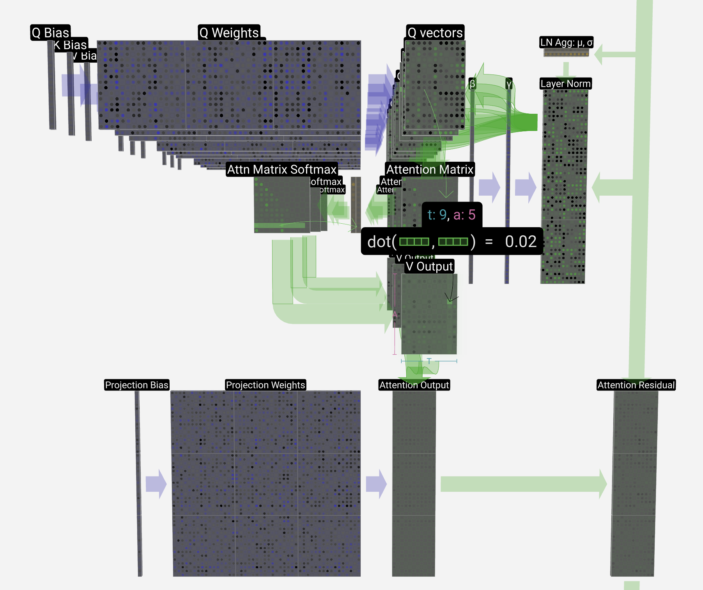
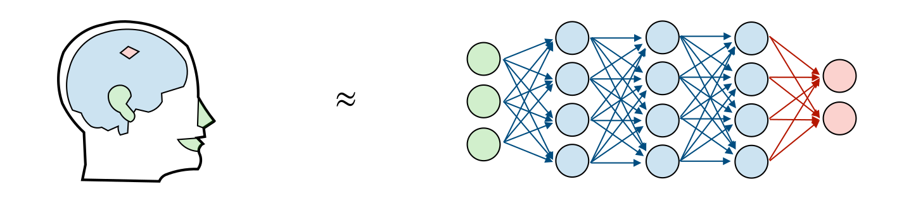
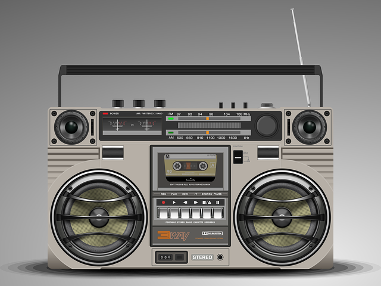
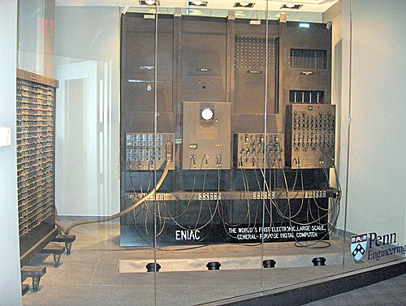

<figure markdown="span">
  { width="800" }
  <figcaption>管窥精密机器内部核心组件 (GPT 模型的内部构造 Transformer 部分)</figcaption>
</figure>

我个人对 AI(人工智能)/LLM(Large Language Model, 大语言模型) 是完全祛魅的。即使是在 ChatGPT 问世之后，即使是在 LLM 在各个领域掀起热潮的今天，
我也仍然认为这里并没有什么所谓“智能”的东西——我个人不认为现在的 LLM 会思考，不认为它能真正地创作等等。
我更倾向于将现在的 LLM 看作一个庞大而又精密的机器：庞大到包含几百亿个元件，精密到可以和人类对话并完成各种复杂的任务。
尽管如此，我仍然认为我们正处于一个人工智能的黄金时代，一个 AI 可以大方异彩，可以很大程度上改变我们的未来生活方式的时代！

<!-- more -->

## 对 LLM 的基本认识

<figure markdown="span">
  { width="800" }
  <figcaption>人工神经网络是受大脑工作方式激发的模型</figcaption>
</figure>

人类的大脑是一个复杂的系统，它内部有着数以百亿计的神经元，这些神经元之间通过突触连接在一起，形成了一个庞大的神经网络。
我们依赖这个神经网络可以处理各种各样的信息，可以完成各种各样的任务。

人类的大脑是一个**自然**的神经网络，而 LLM 是一个**人工**的神经网络 ( ANN, Artificial Neural Network )。
人类通过耳朵，眼睛，鼻子，舌头，皮肤等感官器官接收外界的信息，然后通过大脑处理这些信息，最终做出反应；
人工神经网络也是类似，首先接收输入数据，之后将输入的数据在神经网络中进行计算，最终输出结果数据。

<figure markdown="span">
  { width="500" }
  <figcaption>收音机</figcaption>
</figure>

如果你觉着人工神经网络难以理解，那么你可以将它想象成一个老式的收音机
(尽管收音机和人工神经网络之间有很多不同，但是这个类比可以帮助你建立对神经网络一个大概的认识)：
收音机的每个旋钮都可以看作一个可调节的神经元，它们之间通过电线连接在一起形成了一个人工神经网络，共同完成收音机的功能。
大家口中说到的对大模型的“训练”，“微调”等等操作，其实可以看作在调节这些旋钮。
在收音机中，我们通过调节旋钮使得收音机能够更好地接收和处理电波信号，最终输出想要听到声音；
同样的，我们通过调节神经元的参数使得神经网络能够更好地接收和处理输入数据，最终输出我们想要的结果。

LLM 被称为“大语言模型”，这里的“大”指的是模型参数的数量非常大，大到我们一般按照十亿级 (Billion) 来衡量：
如 70B 的 LLM 指的是这个模型约有 700 亿个参数。
所以如果将 LLM 想象成一个收音机似乎太小了点，因此我倾向于将 LLM 想象成一个**庞大而又精密的机器**——一个有着数以百亿计的元件的机器。
这个机器可以接收各种各样的输入数据，然后通过这些元件进行计算，最终输出我们想要的结果，如回答问题，编写代码等等。

如果你对想象这台巨大的机器感到困难，那么让我们稍微回顾一下历史，看看世界上第一台计算机 ENIAC：

<figure markdown="span">
  { width="500" }
  <figcaption>世界上第一台通用计算机：ENIAC。ENIAC 包含了 17468 个真空管、7200 个晶体二极管、1500 个继电器、10000 个电容器，
            还有大约五百万个手工焊接头。它的重量达 27 吨（30 美吨），体积大约是 2.4m×6m×30.48m（8×30×100 英尺），占地 167 平方米（1800 平方英尺），
            重 30 英吨，耗电 150 千瓦</figcaption>
</figure>

