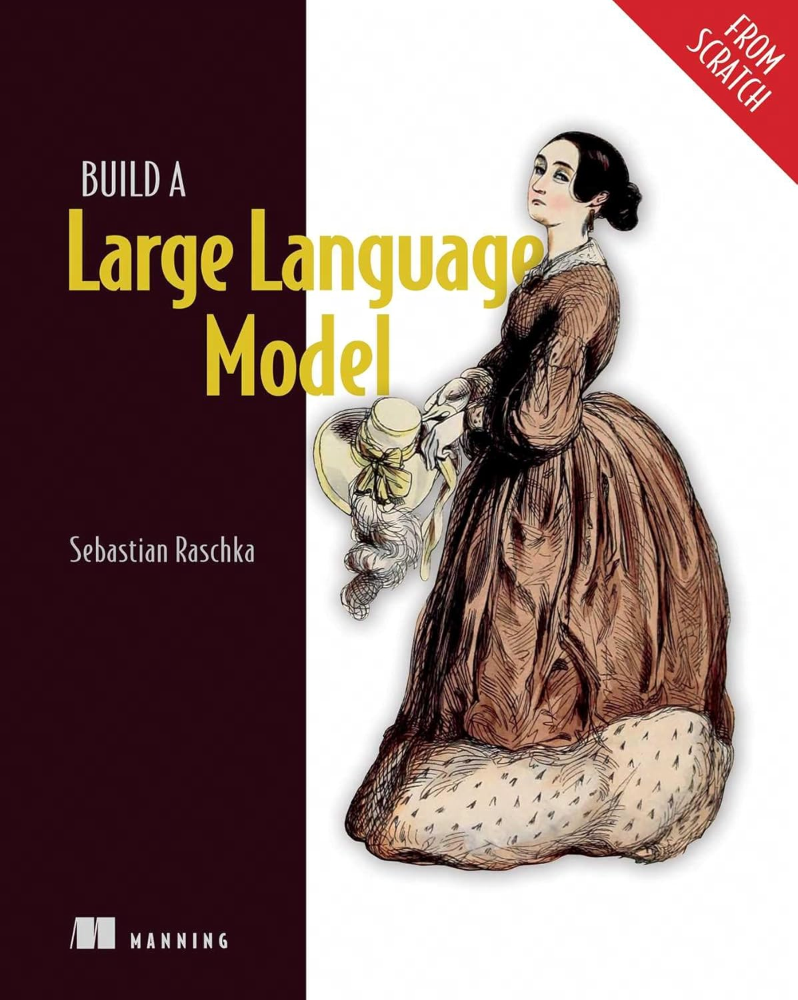
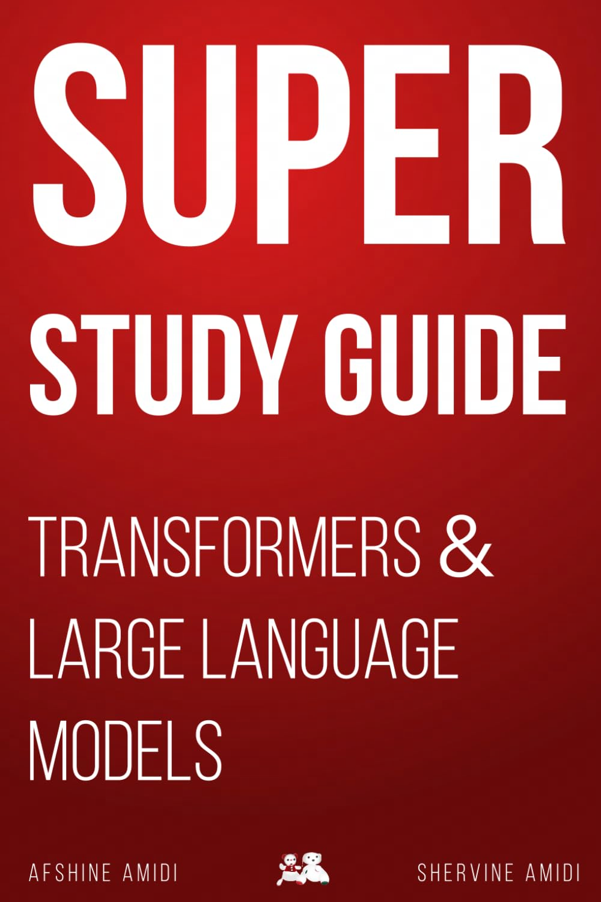
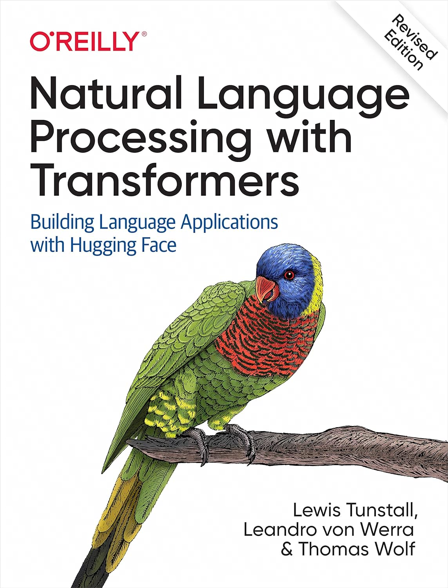
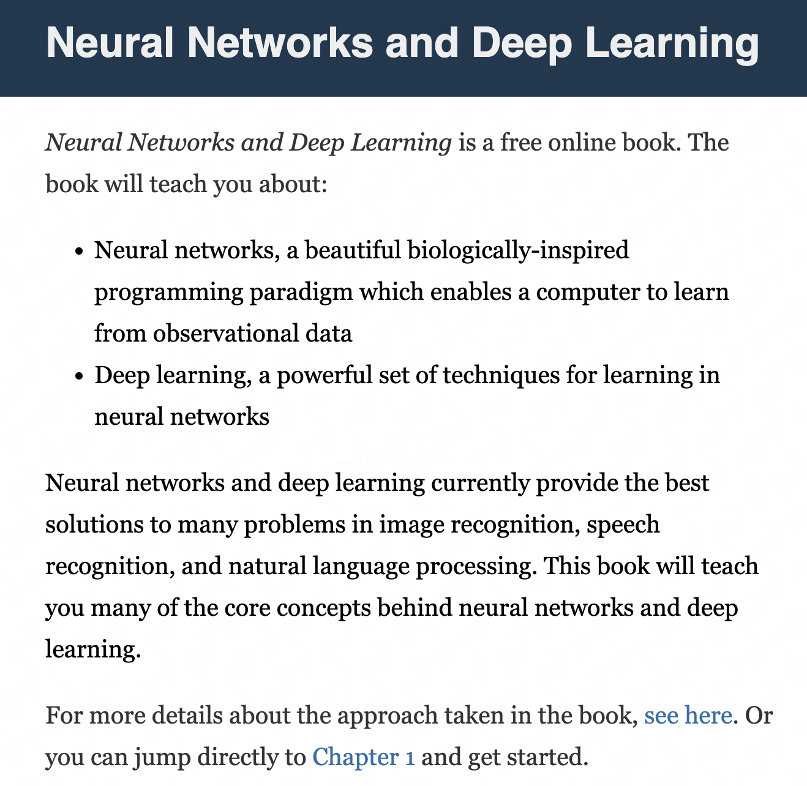
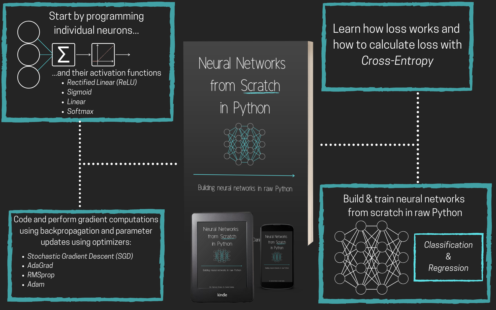
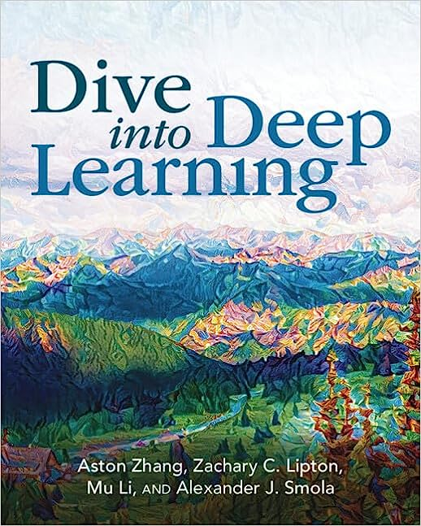
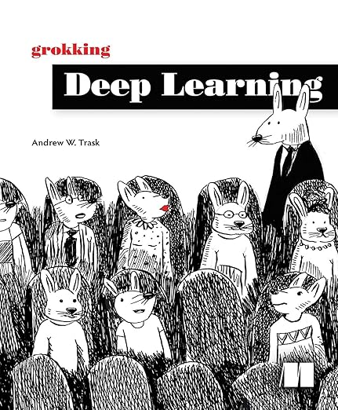

## 前言

之前在朋友圈/推特上推荐的几本NLP/LLM的书大家都比较喜欢，这里为了方便大家查阅，统一整理了一下(另外加上了一些深度学习基础知识学习的书籍)，
同时也发在公众号上方便大家收藏查阅。

<!-- more -->

## 大语言模型三剑客

### Build a Large Language Model (From Scratch)

<figure markdown="span">
  { width="300" height="300" }
</figure>

如果说本期所有的书只推荐一本的话，我会推荐这一本。
这是真正教你从零开始构建GPT模型的书。全书以GPT-2模型为例，用PyTorch从头实现了GPT-2模型网络，
对Tokenizer，Embedding，Transformer等部分都做了极为详细的介绍。
同时载入OpenAI开源的GPT-2模型的权重以验证当前实现的正确性。

因为GPT-2模型很小，所以即使是8G的显卡也能跑得动(没显卡用CPU跑也不会太慢)，非常适合新手入门。
书籍相关代码开源在GitHub(4万Star), 也是很好的学习资料: [https://github.com/rasbt/LLMs-from-scratch](https://github.com/rasbt/LLMs-from-scratch).
我强烈建议大家跟着仓库内的直到一步一步跑一遍代码，这样会对LLM的原理有更深刻的理解。
比如我自己在学习的时候就将代码进行了一些整理并封装成一个Python库，有兴趣的可以参考看下: [https://github.com/ai-glimpse/toyllm](https://github.com/ai-glimpse/toyllm).

### Super Study Guide: Transformers & Large Language Models

<figure markdown="span">
  { width="300" height="300" }
</figure>

如果你只想快速了解LLM相关的**理论知识**，那么这本书可能是目前最好的一本。
本书虽然没什么代码供读者去实践，但是对NLP/Transformer/LLM的核心概念都给出了非常简明的介绍， 可以让读者快速建立对LLM理论的认知。
另外本书有大量的图表来帮助读者理解，对于理解Transformer的原理和LLM的训练过程非常有帮助。

这本书远虽然没有上面 *Build a Large Language Model (From Scratch)* 有名，但是论内容，我认为这本是有过之而无不及的。

### Natural Language Processing with Transformers

<figure markdown="span">
  { width="300" height="300" }
</figure>

上面两本书都是直接面向LLM的书，也都是2024年的新书。
如果你和我一样没什么NLP的基础，那么这本书可能更适合你作为入门的第一本书。

本书从NLP的基础知识开始讲起，依托Huggingface的transformer库对NLP&Transformer模型做了非常详尽的介绍。
书中提供了很多的代码用例，适合初学者夯实基础。

## 深度学习基础

上面的几本书是和NLP/LLM相关的，如果大家看着比较吃力，那么千万别沮丧，这很正常。

!!! quote "It just means you don't know it"

    Not knowing something doesn't mean you're dumb — it just means you don't know it.   —— Jamie Zawinski

可以先看看下面这几本深度学习基础的书。

### Neural Networks and Deep Learning(NNDL)

<figure markdown="span">
  { width="400" height="400" }
</figure>

Michael Nielsen 的 [Neural Network and Deep Learning](http://neuralnetworksanddeeplearning.com/index.html)
至今仍然是我推荐入门学习深度学习的第一选择，本书高屋建瓴，有着对深度学习的真正理解。

!!! quote "Insight is forever"

    You need to understand the durable, lasting insights underlying how neural networks work.
    Technologies come and technologies go, but insight is forever. —— Michael Nielsen

本书先是从理论上把基于梯度下降的优化过程讲清楚，之后写代码从零开始构建神经网络。
条理清晰，层次分明，没有回避任何问题。

另外附上当初我第一次看完这本书时候的感想，希望大家在学习路上都能找到属于自己的NNDL!

!!! note

    不知道具体什么原因，以前一直对 DL 喜欢不起来，所以也就随便看看，没有系统地去学。
    现在看来，主要的原因还是在于没有好的引导资料， 像 Berkley 的 DL 课程，李沐的《深度学习》，我怎么看不下去...
    转折点是在一本书，Michael Nielsen 的Neural Network and Deep Learning.

### Neural Networks from Scratch in Python(NNFS)

<figure markdown="span">
  { width="800" height="800" }
</figure>

如果说 Michael Nielsen 的 NNDL 是高屋建瓴，站在足够的高度为读者展示整个 NN 的蓝图，
那么这本 [NNFS](https://nnfs.io/) 就是踩在坚实的大地上，为读者提供蓝图中的每一处事物并带领你亲身去体验。
其实 NNDL 本身也已经包含了很多 NNFS 提供的内容，但是后者更加具体一些。

**优点**: From Scratch 是透彻理解一个事物的最直接有效的办法，前提是真的 From Scratch;
NN 的 Forward 部分讲的比较详细，逻辑清晰，代码简洁; 对 Nonlinear(Activation function) 的讲解细致，
其中部分应该是参考了 Michael Nielsen, Neural Networks and Deep Learning 中
Chap4 A visual proof that neural nets can compute any function 的内容。
两者可以互为参考; Chap9 Backpropagation 写的极为细致清晰，应该是我目前看到的最为清晰的 BP 讲解与实现，层层递进，引人入胜;
Chap10 Optimizers 算是差强人意，对各个优化器 motivation 的讲解较为清晰，代码写的也比较好。
比较可惜的是没有放任何公式...这些公式又不难，贴上来对着代码讲一下会好很多;
Chap18 Model Object，Chap21 Saving and Loading Models and Their Parameters 都写的不错，条理清晰， 代码也是一步步地讲解

**缺点**: Chap6,7,8 中对 Calculus(Derivative, Gradient 等) 的讲解有些繁琐，且稍显粗浅;
Chap11, 12, 13 分三章讲 Testing Data/Validation Data/Training Data, 每章几页草草了事，大可不必...
不过能提到 data leakage 也算是弥补回来一点.

### Dive into Deep Learning(D2L)

<figure markdown="span">
  { width="300" height="300" }
</figure>

这本书我看的版本比较早，大概 2021 年前后读完此书，当时还是 0.7.1 版本，代码全是 MXNet 实现的。
当时给这本书的评价是“非常全面的一本书，深入浅出，通俗易懂，值得多翻。”

最近版本好像已经添加了 PyTorch 和 TensorFlow 的代码实现。不过也没有仔细对比内容就不做评价了。
需要注意一点就是，本书是有中文版的，但是质量是真的差，建议还是看英文版。

### Grokking Deep Learning

<figure markdown="span">
  { width="300" height="300" }
</figure>

如果你的数学和我一样都不太好，而且上面的书看起来还是比较吃力，那么从这本书入手可能比较好。
先说重点，建议只看前六章。 本书前 6 章写的极其友好，很适合没有任何 DL 基础的人从零开始学起。
印象比较深刻的就是把 NN 比作一个机器， NN 中各个参数比作一个个的旋钮，我们的任务其实就是不断调节各个旋钮的值使得机器按照我们预期的方式工作。
这是一个非常恰当的例子，也几乎贯穿整本书的介绍。

!!! note "LLM in 2024"

    如果你之前读过我写的[LLM in 2024](https://datahonor.com/blog/2024/12/23/ai_think_2024/)，
    且恰好还记得文中将LLM比作一台巨大的机器，且觉得这个类比很有意思，那么这本书可能会让你有所启发:)
    文章中的类比灵感其实就是来自这本书。

本书的第 7, 8 章写的还算可以，中规中矩。
但是从第 9 章开始这书开始错误频出，而且概念也描述得不清楚，不建议继续往下看。不论怎样，前 6 章值得一读。

## 当我们谈论读书时

个人的看法是，深度学习本身是一门和工程绑定很深的学科，所以工程实践就显得尤为重要。
不同于统计机器学习主要处理二维表格数据，深度学习更多的是处理图像，文本，序列等数据，这些数据的特点是更加复杂，更加难以直观理解。
同样地，深度学习的模型相较于统计机器学习也更加难以直观理解，更不用说训练DL模型需要一系列的Tricks。
这一系列问题就导致DL的insight更加难以获得，而这些insight往往是我们在落地实践中最需要的。
所以看书的时候最好还是多动手写一写代码，多实践一下比较好。

## 最后

祝愿大家享受读书的过程，享受真理之海的探索之旅。

!!! note "太阳之剑"

    喏，他又看见那把太阳之剑了！历史上确有那么一天，有只眼睛从海水里浮现出来时，那把剑已经在那里等待它了，并且终于等到了炫耀自己的利刃的机会。
    剑与眼是互相依存的事物：也可能不是因为有了眼睛才产生了剑，而是因为有了剑才产生了眼睛，因为这把剑离不开眼睛，需要有只眼睛来观看它的极致。

