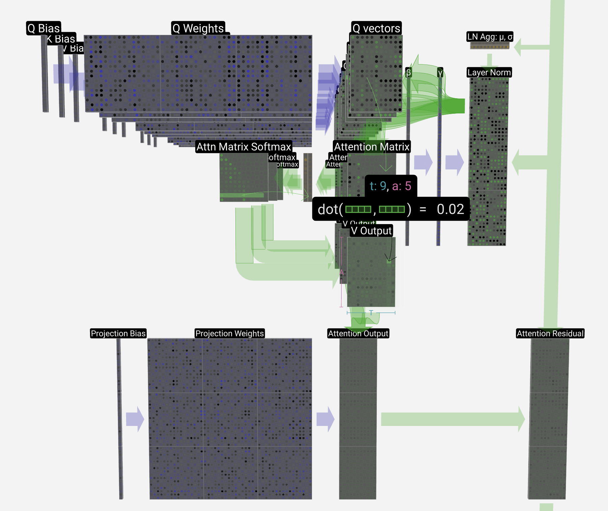
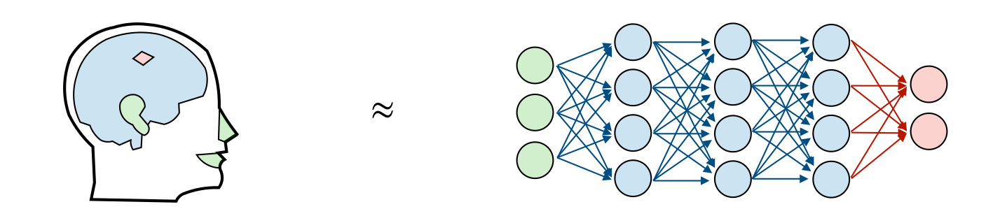
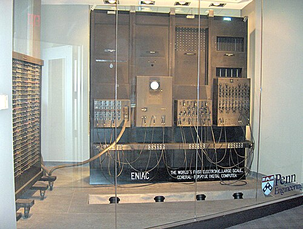

<figure markdown="span">
  { width="800" }
  <figcaption>管窥精密机器内部核心组件 (GPT 模型的内部构造 Transformer 部分) 
    (From <a href="https://bbycroft.net/llm">bbycroft.net/llm</a>)</figcaption>
</figure>

我个人对 AI(人工智能)/LLM(Large Language Model, 大语言模型) 是完全祛魅的。即使是在 ChatGPT 问世之后，即使是在 LLM 在各个领域掀起热潮的今天，
我也仍然认为这里并没有什么所谓“智能”的东西——我个人不认为现在的 LLM 会思考，不认为它能真正地创作等等。
我更倾向于将现在的 LLM 看作一个庞大而又精密的机器：庞大到包含几百亿个元件，精密到可以和人类对话并完成各种复杂的任务。
尽管如此，我仍然认为我们正处于一个人工智能的黄金时代，一个 AI 可以大方异彩，可以很大程度上改变我们的未来生活方式的时代！

<!-- more -->

## 对 LLM 的基本认识

<figure markdown="span">
  { width="800" }
  <figcaption>人工神经网络是受大脑工作方式激发的模型 
    (From <a href="https://superstudy.guide/transformers-large-language-models/">Super Study Guide: Transformers & Large Language Models
</a>)</figcaption>
</figure>

人类的大脑是一个复杂的系统，它内部有着数以百亿计的神经元，这些神经元之间通过突触连接在一起，形成了一个庞大的神经网络。
我们依赖这个神经网络可以处理各种各样的信息，可以完成各种各样的任务。

人类的大脑是一个**自然**的神经网络，而 LLM 是一个**人工**的神经网络 ( ANN, Artificial Neural Network )。
人类通过耳朵，眼睛，鼻子，舌头，皮肤等感官器官接收外界的信息，然后通过大脑处理这些信息，最终做出反应；
人工神经网络也是类似，首先接收输入数据，之后将输入的数据在神经网络中进行计算，最终输出结果数据。

<figure markdown="span">
  { width="500" }
  <figcaption>收音机</figcaption>
</figure>

如果你觉着人工神经网络难以理解，那么你可以将它想象成一个老式的收音机
(尽管收音机和人工神经网络之间有很多不同，但是这个类比可以帮助你建立对神经网络一个大概的认识)：
收音机的每个旋钮都可以看作一个可调节的神经元，它们之间通过电线连接在一起形成了一个人工神经网络，共同完成收音机的功能。
大家口中说到的对大模型的“训练”，“微调”等等操作，其实可以看作在调节这些旋钮。
在收音机中，我们通过调节旋钮使得收音机能够更好地接收和处理电波信号，最终输出想要听到声音；
同样的，我们通过调节神经元的参数使得神经网络能够更好地接收和处理输入数据，最终输出我们想要的结果。

LLM 被称为“大语言模型”，这里的“大”指的是模型参数的数量非常大，大到我们一般按照十亿级 (Billion) 来衡量：
如 70B 的 LLM 指的是这个模型约有 700 亿个参数。
所以如果将 LLM 想象成一个收音机似乎太小了点，因此我倾向于将 LLM 想象成一个**庞大而又精密的机器**——一个有着数以百亿计的元件的机器。
这个机器可以接收各种各样的输入数据，然后通过这些元件进行计算，最终输出我们想要的结果，如回答问题，编写代码等等。

如果你对想象这台巨大的机器感到困难，那么让我们稍微回顾一下历史，看看世界上第一台计算机 ENIAC：

<figure markdown="span">
  { width="500" }
  <figcaption>世界上第一台通用计算机：ENIAC。ENIAC 包含了 17468 个真空管、7200 个晶体二极管、1500 个继电器、10000 个电容器，
            还有大约五百万个手工焊接头。它的重量达 27 吨（30 美吨），体积大约是 2.4m×6m×30.48m（8×30×100 英尺），占地 167 平方米（1800 平方英尺），
            重 30 英吨，耗电 150 千瓦</figcaption>
</figure>

到这里相信你已经对 LLM 有了一个大致的认识，接下来我们将看看 LLM 的内部构造，看看这个庞大而又精密的机器是如何工作的。
LLM 的内部计算过程则是通过神经网络来完成的，如下图所示 (可以看到其核心是基于 Transformer 来构建)：
<figure markdown="span">
  { width="400" }
  <figcaption>LLM 的 神经网络骨架图 
    (From <a href="https://bbycroft.net/llm">bbycroft.net/llm</a>)</figcaption>
</figure>

我们将其中的 Transformer 部分放大，其结构如下图所示 (可以看到整体的结构还是比较复杂的)：

<figure markdown="span">
  { width="800" }
  <figcaption>管窥精密机器内部核心组件 (GPT 模型的内部构造 Transformer 部分) 
    (From <a href="https://bbycroft.net/llm">bbycroft.net/llm</a>)</figcaption>
</figure>

总而言之，LLM 的输入输出理解起来并不困难，但是它内部的计算过程是非常复杂的，这里面涉及到了大量的数学知识，如线性代数，微积分，概率论等等。

<figure markdown="span">
  { width="500" }
  <figcaption>LLM 的输入和输出 
    (From <a href="https://superstudy.guide/transformers-large-language-models/">Super Study Guide: Transformers & Large Language Models
</a>)</figcaption>
</figure>

我们对 LLM 的简单介绍就到这里了[^1]，接下来我们将来探讨一下它将如何改变我们的未来。

[^1]: 本文的内容主要是基于我个人的理解，可能存在一些不准确的地方，欢迎指正。另外后续可能有单独的文章来详细介绍 LLM 的内部构造和工作原理。

## AI 的黄金时代

书接上文，我其实并不认为现在的 LLM 是“智能”的，我认为它只是一个庞大而又精密的机器。
但是就像所有精密的机器 (比如计算机) 一样，LLM 也有着无限的潜力，可以在各个领域发挥巨大的作用——即使它没有所谓的“智能”。

### AI 辅助编程

Redis 的作者 Salvatore Sanfilippo 在年初写过一篇博客
[LLMs and Programming in the first days of 2024](https://antirez.com/news/140).
博客中介绍了 LLM 在编程领域的一些应用，他认为 LLM 很适合用来替代一些琐碎的工作，比如用来写一些一次性的脚本，做一些数据分析等，
这样可以让程序员们更专注于更有意义的工作，比如设计架构，优化性能等。文章另外还有很多有有趣的观点：

!!! quote "LLMs and Programming in the first days of 2024"

    In the field of programming, perhaps their ability would have been of very little interest up to
    twenty or thirty years ago. Back then you had to know a couple of programming languages,
    the classic algorithms, and those ten fundamental libraries. The rest you had to add yourself,
    your own intelligence, expertise, design skills.
    If you had these ingredients you were an expert programmer, able to do more or less everything.
    Over time, we have witnessed an explosion of frameworks, programming languages, libraries of all kinds.
    An explosion of complexity often completely unnecessary and unjustified,
    but the truth is that things are what they are. **And in such a context,
    an idiot who knows everything is a precious ally**.

下面是这段话的中文翻译 (来自[宝玉](https://baoyu.io/translations/llm/llms-and-programming-in-the-first-days-of-2024)):

!!! quote "LLMs and Programming in the first days of 2024"

    在编程领域，直到二十或三十年前，这些能力可能还不太引人注目。那时，你需要掌握几种编程语言、经典算法以及那些基本的库。
    其余的则依靠你自己的智慧、专业知识和设计能力。具备这些素质，你就能成为一名全能的专家级程序员。
    然而，随着时间的推移，我们见证了框架、编程语言、各种库的大量涌现。这种复杂性通常是不必要的，甚至无法自圆其说，但事实就是如此。
    **在这样的情况下，一个无所不知的“白痴”成了宝贵的盟友。**.

这里点明了一个事实：现在的编程环境变得越来越复杂，这也意味着程序员需要掌握更多的知识，花费更多的时间来学习和工作，
而 LLM 可以通过辅助编码来屏蔽这些复杂性来帮助程序员们减轻这些负担，进而让他们专注于更有意义的工作。

这点在 2024 这一年 AI 编程领域的发展中得到了很好的体现，比如 Cursor，Windsurf 等辅助编程工具的强势崛起。
这些辅助编程工具在前端开发领域都有比较好的体验，比如这些工具目前可以通过简单的几句描述就生成漂亮的网页。
我个人浅薄的看法是，前端开发的技术栈变化非常快，也有很多框架，库等，这些都增加了前端开发的复杂性，正好对应了上面 Salvatore 提到的问题
（“框架、编程语言、各种库的大量涌现”）。
而通过 AI 辅助编程工具确实可以很好地解决这些问题：我们不必再去看各个框架自定义的 API，只需要简单地描述我们想要的效果，
LLM 就会帮我们生成符合描述的代码。

同样地，AI 辅助编程在生成数据分析报告，辅助编写 SQL 等方面也有着不错的表现。
这点在上面的博客中也有提到，而我个人在日常工作中也深有体会：AI 已经在实打实地帮助我们减轻很多工作量。

我并不认为 AI 会取代真正的程序员 (未来也不会)，但其换掉这些琐碎的编码工作是大势所趋。
当然这里的“琐碎”是相对的，比如我需要一个 Web 页面来简单地展示数据，这个工作对于我来说就是琐碎的；
但是如果我们需要的是一个拥有良好交互体验且具有相当程度美观性的页面，那么这个工作可能就不再是琐碎的了。
同样地对于数据分析也是，如果我们只需要简单地统计一下数据，那么这个工作就是琐碎的；
如果我们需要从海量数据中找出一些有价值的信息，那么这个工作就不再是琐碎的了。

另外 Salvatore 提到了另外一个值得思考的问题：

!!! quote "LLMs and Programming in the first days of 2024"

    I regret to say it, but it's true: most of today's programming consists of regurgitating
    the same things in slightly different forms. High levels of reasoning are not required.
    LLMs are quite good at doing this, although they remain strongly limited by the maximum size of their context.
    This should really make programmers think. Is it worth writing programs of this kind? Sure, you get paid,
    and quite handsomely, but if an LLM can do part of it, maybe it's not the best place to be in five or ten years.

下面是这段话的中文翻译 (来自[宝玉](https://baoyu.io/translations/llm/llms-and-programming-in-the-first-days-of-2024)):

!!! quote "LLMs and Programming in the first days of 2024"

    不得不说，这是一个事实：现今的编程大多是在微调同样的内容，只是形式略有变化。这种工作并不需要太高的推理能力。
    大语言模型在这方面表现出色，尽管它们的能力仍然受限于上下文长度。这个现象应该引起程序员的深思：真的值得去编写这类程序吗？
    虽然可以赚到不错的收入，但如果大语言模型也能完成其中一部分工作，那么在未来五到十年，这可能并非最佳的职业发展方向。

我个人非常赞同这个观点，也认为这个问题提的非常好： "Is it worth writing programs of this kind?"
我相信在此后的几年时间，对这个问题的讨论会越来越多，而我们对这个问题的不同理解也会进一步地影响我们的未来职业发展方向。

### AI 辅助搜索

AI 辅助搜索是另外一个 AI 领域的热点，这里的 AI 辅助搜索指的是通过 AI 技术来提高搜索引擎的搜索效果。
现在和 LLM 交互的方式本身就类似信息搜索的过程，LLM 强大的语言理解能力使得它可以更好地理解用户的搜索意图
现在已经有不少的产品在逐渐崛起，比如 Perplexity，Phind 等。

个人认为多模态搜索是未来 AI 辅助搜索的一个重要方向，对图片，视频数据的高效搜索会使得目前的搜索引擎更加强大。
让我们举个例子来打开一下思路。前段时间我和冯老师讨论昆汀的电影《落水狗》(*Reservoir Dogs*)：
我们不确定电影中 Mr.Pink 的演员是不是在《杀死比尔》(*Kill Bill*) 中也有出现。
现在 Google 基于 LLM(Gemini) 的搜索引擎就可以很好地解决这个问题：

<figure markdown="span">
  { width="800" }
  <figcaption>Google Gemini</figcaption>
</figure>

那么假如我想搜索一下《落水狗》中所有 Mr.Pink 的镜头呢？假如我们想根据几个关键词来搜索一部几百集的动漫中的一个特定场景呢？
现在好像还没有这样的搜索引擎，而现在一些视频网站似乎也没有这样的功能——但是我相信这样的搜索功会在不久的将来出现。

另外，我相信基于 LLM 的多模态搜索会为我们带来更多的惊喜：我期待着搜索“阿季卢尔福”时出现阿尔冯斯的图片；
搜索“阿尔冯斯”会出现卡尔维诺的《不存在的骑士》；搜索“树先生，太阳新城”时会出现“托马斯·康帕内拉，《太阳城》”......
是的，我满怀期待地等待着这一天的到来，而我坚信这一天一定会到来。

## 结语

最后我想用卡尔·维诺的两句话来结束这个关于 LLM 的讨论： “我会告诉你你想知道的东西，但我从来不会告诉你真实”，
“虚假永远不在于词语，而在于事物自身”。

