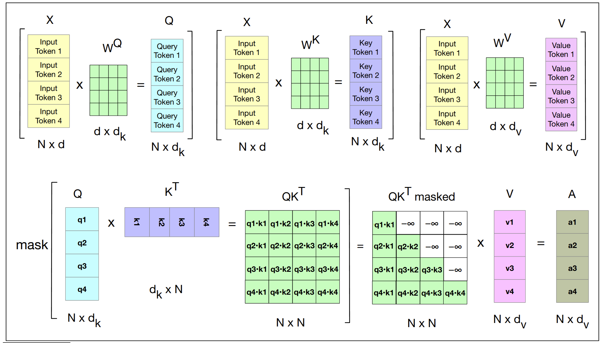
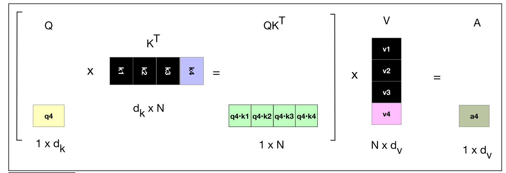

## Introduction

在看很多大语言模型的推理代码时，发现有一个非常重要的概念，就是 KV Cache。
这里我们简要介绍一下 KV Cache 的核心原理并给出基于 GPT-2 的代码实现以便于本地复现。
相关的实验和测试代码同样开源在[toyllm](https://github.com/ai-glimpse/toyllm).

<!-- more -->

## What

- 全称是 Key-Value Cache
- 这里的 Key 和 Value 是 Transformer/Attention 中的 Key 和 Value
- 一种空间换时间的优化策略，主要是为了加速大语言模型推理速度
- 作用是缓存模型在推理过程中计算出的中间结果，以便在后续的推理中复用这些结果，从而减少计算量

## Why & How

目前 LLM 的核心架构都是 Decoder Only 结构 (只用了原始 Transformer 的 Decoder 部分)，其核心结构是基于 Attention 的，
而 Attention 的核心计算是基于`query`，`key`和`value`的矩阵运算。而 KV Cache 就是通过加速 Attention 的矩阵计算来加速整个模型的推理速度。具体来说，是通过缓存`key`和`value`的值来避免重复计算，从而减少计算量。那么一个核心的问题就是原始的 Attention 计算中存在哪些重复计算？下面我们将通过数学推导凸显 LLM **推理阶段原始 Attention 的重复计算问题**。
在重复计算的问题被凸显出来之后，KV Cache 的实现原理也就显而易见了。
下面的推导主要参考了 Lei Mao 的博客： [Transformer Autoregressive Inference Optimization](https://leimao.github.io/article/Transformer-Autoregressive-Inference-Optimization/).


我们先简要回顾一下原始的 Attention 计算过程：

$$
\begin{align}
Attention(Q, K, V) = \text{softmax}(\text{Mask}(\frac{QK^T}{\sqrt{d_k}}))V
\end{align}
$$


<figure markdown="span">
  { width="800" }
  <figcaption>原始 Attention 计算过程。图片来源：<cite>Speech and Language Processing: An Introduction to Natural Language Processing, Computational Linguistics, and Speech Recognition with Language Models</cite></figcaption>
</figure>


在 LLM 推理阶段 (自回归生成，Auto-regressive Generation)，在第 $n+1$ 个 token 的生成过程中会做如下计算：

$$
\begin{align}
Q_n = X_n W^Q \in \mathbb{R}^{n \times d_k}
\end{align}
$$

$$
\begin{align}
K_n = X_n W^K \in \mathbb{R}^{n \times d_k}
\end{align}
$$

$$
\begin{align}
V_n = X_n W^V \in \mathbb{R}^{n \times d_v}
\end{align}
$$

其中$W^Q \in \mathbb{R}^{d_{\text{model}} \times d_k}$, $W^K \in \mathbb{R}^{d_{\text{model}} \times d_k}$, $W^V \in \mathbb{R}^{d_{\text{model}} \times d_v}$分别是 query，key 和 value 的权重矩阵。

我们将此时的 Attention 结果记为$Y_n$，则有：

$$
Y_n = \text{softmax}(\text{Mask}(\frac{Q_nK_n^T}{\sqrt{d_k}}))V_n
$$

在生成第 $n+1$ 个 token 后，其作为新的输入 $x_{n+1} \in \mathbb{R}^{1 \times d_{\text{model}}}$进入模型 (自回归生成)，
此时输入张量变为$X_{n+1} \in \mathbb{R}^{(n+1) \times d_{\text{model}}}$:

$$
\begin{align}
X_{n+1} = \left [
    \begin{array}{c|c}
        X_{n} \\
        x_{n+1} \\
    \end{array}
\right ]
\end{align}
$$

此时为了计算下一个生成的 token，我们需要计算 Attention 结果 $Y_{n+1}$：

$$
\begin{align}
Y_{n+1} = \text{softmax}(\text{Mask}(\frac{Q_{n+1}K_{n+1}^T}{\sqrt{d_k}}))V_{n+1}
\end{align}
$$

其中，

$$
\begin{array}{ccc}
  \begin{aligned}
    Q_{n+1}
    &= X_{n+1} W^{Q} \\
    &=
    \left [
        \begin{array}{c}
            X_{n} \\
            \hline
            x_{n+1} \\
        \end{array}
    \right ] W^{Q} \\
    &=
    \left [
        \begin{array}{c}
            X_{n} W^{Q} \\
            \hline
            x_{n+1} W^{Q} \\
        \end{array}
    \right ] \\
    &=
    \left [
        \begin{array}{c}
            Q_{n} \\
            \hline
            q_{n+1} \\
        \end{array}
    \right ]
  \end{aligned}
  &
  \begin{aligned}
    K_{n+1}
    &= X_{n+1} W^{K} \\
    &=
    \left [
        \begin{array}{c}
            X_{n} \\
            \hline
            x_{n+1} \\
        \end{array}
    \right ] W^{K} \\
    &=
    \left [
        \begin{array}{c}
            X_{n} W^{K} \\
            \hline
            x_{n+1} W^{K} \\
        \end{array}
    \right ] \\
    &=
    \left [
        \begin{array}{c}
            K_{n} \\
            \hline
            k_{n+1} \\
        \end{array}
    \right ]
  \end{aligned}
  &
  \begin{aligned}
    V_{n+1}
    &= X_{n+1} W^{V} \\
    &=
    \left [
        \begin{array}{c}
            X_{n} \\
            \hline
            x_{n+1} \\
        \end{array}
    \right ] W^{V} \\
    &=
    \left [
        \begin{array}{c}
            X_{n} W^{V} \\
            \hline
            x_{n+1} W^{V} \\
        \end{array}
    \right ] \\
    &=
    \left [
        \begin{array}{c}
            V_{n} \\
            \hline
            v_{n+1} \\
        \end{array}
    \right ]
  \end{aligned}
\end{array}
$$


$Y_{n+1}$的计算过程如下：

$$
\begin{align}
Y_{n+1}
&= \text{softmax} \left( \text{Mask} \left( \frac{ Q_{n+1} K_{n+1}^{\top}}{\sqrt{d_k}} \right) \right) V_{n+1} \\
&= \text{softmax} \left( \text{Mask} \left(
\frac{1}{\sqrt{d_k}}
\left [
    \begin{array}{c|c}
        Q_{n} \\
        q_{n+1} \\
    \end{array}
\right ]
\left [
    \begin{array}{c|c}
        K_{n} \\
        k_{n+1} \\
    \end{array}
\right ]^{\top} \right) \right)
\left [
    \begin{array}{c|c}
        V_{n} \\
        v_{n+1} \\
    \end{array}
\right ] \\
&= \text{softmax} \left( \text{Mask} \left(
\frac{1}{\sqrt{d_k}}
\left [
    \begin{array}{c|c}
        Q_{n} \\
        q_{n+1} \\
    \end{array}
\right ]
\left [
    \begin{array}{c|c}
        K_{n}^{\top} & k_{n+1}^{\top} \\
    \end{array}
\right ] \right) \right)
\left [
    \begin{array}{c|c}
        V_{n} \\
        v_{n+1} \\
    \end{array}
\right ] \\
&= \text{softmax} \left( \text{Mask} \left(
\frac{1}{\sqrt{d_k}}
\left [
    \begin{array}{c|c}
        Q_{n}K_{n}^{\top} & Q_{n}k_{n+1}^{\top} \\
        \hline
        q_{n+1}K_{n}^{\top} & q_{n+1}k_{n+1}^{\top} \\
    \end{array}
\right ]
\right) \right)
\left [
    \begin{array}{c|c}
        V_{n} \\
        v_{n+1} \\
    \end{array}
\right ] \\
&= \text{softmax} \left(
\left [
    \begin{array}{c|c}
        \text{Mask} \left( \frac{1}{\sqrt{d_k}} Q_{n}K_{n}^{\top}\right) & -\infty \\
        \hline
        \frac{1}{\sqrt{d_k}} q_{n+1}K_{n}^{\top} & \frac{1}{\sqrt{d_k}} q_{n+1}k_{n+1}^{\top} \\
    \end{array}
\right ]
\right)
\left [
    \begin{array}{c|c}
        V_{n} \\
        v_{n+1} \\
    \end{array}
\right ] \\
&=
\left [
    \begin{array}{c|c}
    \left [
        \begin{array}{c|c}
            \text{softmax} \left(\text{Mask} \left( \frac{1}{\sqrt{d_k}} Q_{n}K_{n}^{\top}\right) \right) & 0 \\
        \end{array}
    \right ] \\
    \hline
    \text{softmax}
    \left(
    \frac{1}{\sqrt{d_k}}q_{n+1}
        \left [
                \begin{array}{c|c}
                    K_{n}^{\top} & k_{n+1}^{\top} \\
                \end{array}
        \right ]
    \right) \\
    \end{array}
\right ]
\left [
    \begin{array}{c|c}
        V_{n} \\
        v_{n+1} \\
    \end{array}
\right ] \\
&=
\left [
    \begin{array}{c|c}
        \text{softmax} \left(\text{Mask} \left( \frac{1}{\sqrt{d_k}} Q_{n}K_{n}^{\top}\right) \right) V_{n} \\
    \hline
    \text{softmax}
    \left(
        \frac{1}{\sqrt{d_k}}q_{n+1} K_{n+1}^{\top}
    \right) V_{n + 1} \\
    \end{array}
\right ] \\
&=
\left [
    \begin{array}{c|c}
    Y_{n} \\
    \text{softmax}
    \left(
        \frac{1}{\sqrt{d_k}}q_{n+1} K_{n+1}^{\top}
    \right) V_{n + 1} \\
    \end{array}
\right ] \\
&=
\left [
    \begin{array}{c|c}
    Y_{n} \\
    y_{n+1} \\
    \end{array}
\right ] \\
\end{align}
$$

从上面的推导我们可以看到，$Y_{n+1}$可以分解为两部分：

1. 历史 token 的 attention 结果$Y_n$，这部分在之前已经计算过
2. 新 token 的 attention 结果$y_{n+1}$，这部分需要重新计算

可以看到，在拿到第$n+1$个 token 后，我们只需要计算这个新 token 的 attention 结果$y_{n+1}$，
因为$Y_n$已经计算过了，不需要重新计算。也就是说，在不使用 KV Cache 时，每次生成一个新 token 时，我们都需要：

1. 计算当前输入序列$X_{n+1}$完整的 attention 矩阵$Q_{n+1}K_{n+1}^T$，计算复杂度为$O(n^2)$
2. 对 $n$ 个 token 重复这个过程，总计算复杂度为$O(n^3)$

**KV Cache 避免重复计算的方式是缓存数据和变更计算流程：缓存数据就是指缓存$K_n$和$V_n$，变更计算流程就是指在生成新 token 时，只需要计算新 token 的 query 与所有 key 的点积。前者避免了$K_n$和$V_n$的重复计算，后者避免了$Y_n$的重复计算**。


<figure markdown="span">
  { width="800" }
  <figcaption>KV Cache 计算过程。图片来源：<cite>Speech and Language Processing: An Introduction to Natural Language Processing, Computational Linguistics, and Speech Recognition with Language Models</cite></figcaption>
</figure>

所以在使用 KV Cache 后：

1. 计算 attention 矩阵时，只需要计算新 token 的 query 向量与所有 key 向量的点积，再乘以 value 向量，计算复杂度为$O(n)$
2. 对 $n$ 个 token 重复这个过程，总计算复杂度为$O(n^2)$

如此一来，我们就将计算复杂度从$O(n^3)$降低到了$O(n^2)$，这里的$n$是输入序列的长度，$n$越大，推理加速效果越明显 (当然显存占用也会增加)。

## Code

代码的实现其实也很简单，我们先来如何变更计算流程来使用 KV Cache。
首先是 `generate` 方法的变更，这里我们只展示关键的变更部分。
可以看到，这里每次传入的 `model_input_tokens` 是当前的输入序列，除了首次传入的长度为 `prompt_tokens.shape[1]` 的序列外，
之后每次传入的序列长度均为`cur_pos - prev_pos = 1`:


```python linenums="1" hl_lines="9 10 13 16 25"
def generate(
    self,
    prompt: str,
    config: GenerationConfig | None = None,
) -> str:
    ...

    prompt_tokens = ...
    prev_pos = 0
    for cur_pos in range(prompt_tokens.shape[1],
                         prompt_tokens.shape[1] + config.max_new_tokens,
                         ):
        model_input_tokens = prompt_tokens[:, prev_pos:cur_pos]
        with torch.inference_mode():
            # shape: (batch_size, n_tokens, vocab_size)
            logits = self.gpt_model(model_input_tokens, prev_pos)
        logits = logits[:, -1, :]  # shape: (batch_size, vocab_size)

        ...

        next_token_id = ...

        prompt_tokens = torch.cat((prompt_tokens, next_token_id), dim=1)
        # Update the previous position
        prev_pos = cur_pos

    generate_text = token_ids_to_text(prompt_tokens)
    return generate_text
```

之后我们再深入这里`self.gpt_model`的实现，这里我们只展示关键的变更部分。

```python linenums="1" hl_lines="7-15 32-35"
class MultiHeadAttention(nn.Module):
    def __init__(
        ...
    ) -> None:
        super().__init__()
        ...
        self.use_kv_cache = use_kv_cache
        if use_kv_cache:
            self.kv_cache = KVCache(
                batch_size=1,
                max_seq_len=ctx_len,
                num_kv_heads=n_heads,
                head_dim=self.head_dim,
                dtype=torch.float32,
            )

    def forward(self, x: GPTInnerType) -> GPTInnerType:
        batch_size, num_tokens, _d_in = x.shape

        queries = self.W_query(x)
        keys = self.W_key(x)
        values = self.W_value(x)

        queries = queries.view(batch_size, num_tokens, self.n_heads, self.head_dim)
        keys = keys.view(batch_size, num_tokens, self.n_heads, self.head_dim)
        values = values.view(batch_size, num_tokens, self.n_heads, self.head_dim)

        queries = queries.transpose(1, 2)
        keys = keys.transpose(1, 2)
        values = values.transpose(1, 2)

        if self.use_kv_cache:
            self.kv_cache.update(keys, values)
            keys = self.kv_cache.k_cache[:, :, : self.kv_cache.size, :]
            values = self.kv_cache.v_cache[:, :, : self.kv_cache.size, :]
        ...

```

最后我们来看 `KVCache` 的具体实现：

```python
import torch
from torch import nn


class KVCache(nn.Module):
    def __init__(
        self,
        batch_size: int,
        max_seq_len: int,
        num_kv_heads: int,
        head_dim: int,
        dtype: torch.dtype,
    ) -> None:
        super().__init__()
        cache_shape = (batch_size, num_kv_heads, max_seq_len, head_dim)
        self.register_buffer("k_cache", torch.zeros(cache_shape, dtype=dtype), persistent=False)
        self.register_buffer("v_cache", torch.zeros(cache_shape, dtype=dtype), persistent=False)
        self.batch_size = batch_size
        self.cache_pos = 0

    def reset(self) -> None:
        """Reset the cache to zero."""
        self.k_cache.zero_()
        self.v_cache.zero_()
        self.cache_pos = 0

    @property
    def size(self) -> int:
        return self.cache_pos

    def update(self, k_val: torch.Tensor, v_val: torch.Tensor) -> tuple[torch.Tensor, torch.Tensor]:
        """Update KV cache with the new ``k_val``, ``v_val`` and return the updated cache.

        Args:
            k_val (torch.Tensor): Current key tensor with shape [B, H, S, D]
            v_val (torch.Tensor): Current value tensor with shape [B, H, S, D]
        """
        bsz, _, seq_len, _ = k_val.shape
        if bsz > self.k_cache.shape[0]:
            raise ValueError(  # noqa: TRY003
                f"The current cache has been setup with a batch size of {self.k_cache.shape[0]}"  # noqa: EM102
                f", but found new key tensors with batch size {k_val.shape[0]}!"
            )
        assert (self.cache_pos + seq_len) <= self.k_cache.shape[2]  # noqa: S101
        k_out = self.k_cache
        v_out = self.v_cache
        k_out[:, :, self.cache_pos : self.cache_pos + seq_len] = k_val
        v_out[:, :, self.cache_pos : self.cache_pos + seq_len] = v_val
        # forward cache_pos seq_len positions along
        self.cache_pos += seq_len
        return k_out, v_out

```

??? note "如果你对这里的`register_buffer`有疑惑"

    简单来说，`register_buffer`可以使得我们在模型中注册一个持久化的buffer，这个buffer不会被视为模型的参数(自然也不会更新)。
    这里存在一个问题，那就是为什么要用`register_buffer`而不是直接用`self.k_cache = ...`呢？
    答案很简单，通过`register_buffer`注册的buffer可以随着`model.to(device)`的调用而自动转移到指定的设备上，而后一种方式则不会。

    >In essence, PyTorch buffers are tensor attributes associated with a PyTorch module or model similar to parameters,
    >but unlike parameters, buffers are not updated during training.

    >Buffers in PyTorch are particularly useful when dealing with GPU computations, as they need to be transferred
    >between devices (like from CPU to GPU) alongside the model's parameters. Unlike parameters, buffers do not require gradient computation, but they still need to be on the correct device to ensure that all computations are performed correctly.

    更多的细节可以参考以下链接：

    - [PyTorch register_buffer](https://pytorch.org/docs/stable/generated/torch.nn.Module.html#torch.nn.Module.register_buffer)

    - [LLMs-from-scratch explain](https://github.com/rasbt/LLMs-from-scratch/blob/main/ch03/03_understanding-buffers/understanding-buffers.ipynb)

注意这里`KVCache`内部`cache`的维度：`cache_shape = (batch_size, num_kv_heads, max_seq_len, head_dim)`.
其中，`batch_size`是模型的 batch size，`num_kv_heads`是模型的 kv head 的数量，`max_seq_len`是模型的最大序列长度，`head_dim`是每个 kv head 的维度。
也就是说，这里会缓存**batch 中每个样本的每个 kv head 在每个位置上的 key 和 value(两者均为维度等于`head_dim`的向量)**。

`KVCache`的`update`方法会将当前的`k_val`和`v_val`更新到缓存中，并返回更新后的缓存。
更新时的操作也很简单，就是把当前的`k_val`和`v_val`更新到缓存中对应的位置上：

```python
k_out[:, :, self.cache_pos : self.cache_pos + seq_len] = k_val
v_out[:, :, self.cache_pos : self.cache_pos + seq_len] = v_val
self.cache_pos += seq_len
```

这里的`self.cache_pos`表示当前缓存的最后一个位置，`seq_len`表示当前输入的序列长度。

???+ note "和 torchtune 实现的些许差别"

    如果你之前看过torchtune的KV Cache实现，那么你会发现这里KV Cache的实现和torchtune基本是一样的——除了`cache_pos`的实现。
    在torchtune最早的实现中`cache_pos`就是上面的这种形式，不过后续为了兼容`torch.compile`将其实现为一个向量而不是一个整数。
    具体参考对应issue: [#2564](https://github.com/pytorch/torchtune/issues/2564), [#1663](https://github.com/pytorch/torchtune/issues/1663).


## The end

KV Cache 作为一项核心的 LLM 推理优化技术，已经在很多框架中应用，相关优化也在持续进行中。本文难以详尽介绍，故仅从其原始形态管窥一二。

最后，笔者花费了大量时间构思本文，力求简明易懂，但仍未达到理想状态。因拖延已久，决定先行发布，后续有时间再补充修改。
