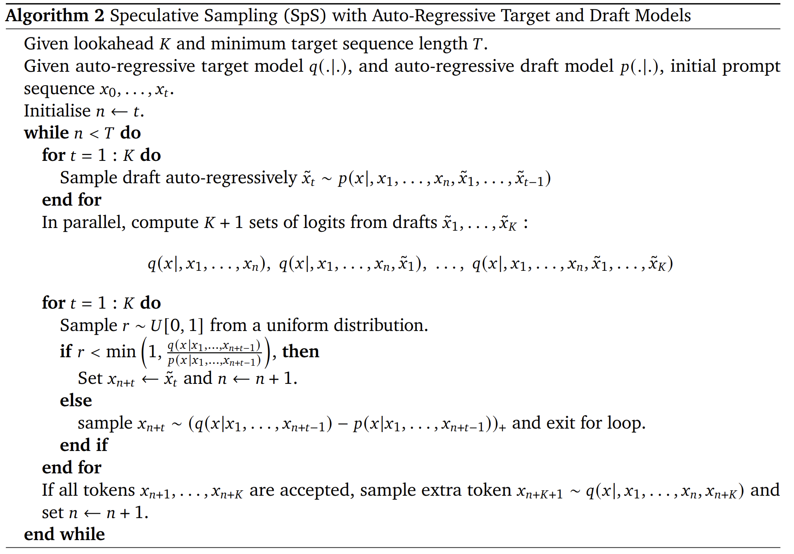
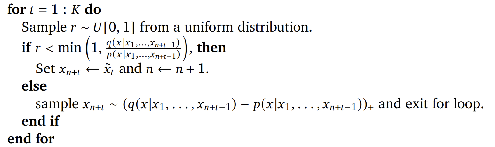
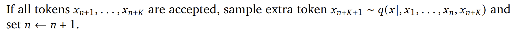

## 前言

今天我们将介绍并复现 Deepmind 的一篇关于 LLM Speculative Sampling 的论文：*Accelerating large language model decoding with speculative sampling*[@sps_deepmind].
我们将用不到 100 行代码来复现这篇论文，并得到 2 倍以上的速度提升。

比如以当前的 Prompt 为例：
```bash
Prompt: Alan Turing theorized that computers would one day become
```


GPT2-XLARGE 的推理的时间为 **16.8244** 秒：
```bash
-------------------- Naive GPT2 Auto-Regressive --------------------
Naive GPT2 Auto-Regressive completed in 16.8244 s
Generated: Alan Turing theorized that computers would one day become so powerful that they would be able to think like humans.

In the 1950s, he proposed a way to build a computer that could think like a human.
(skip ...)
-------------------- Naive GPT2 Auto-Regressive --------------------
```

推测采样可以生成完全一样的推理结果，且其推理的时间为 **7.9031** 秒，提升了 **2.12** 倍：
```bash
-------------------- Speculative Sampling --------------------
Speculative Sampling completed in 7.9031 s
Generated: Alan Turing theorized that computers would one day become so powerful that they would be able to think like humans.

In the 1950s, he proposed a way to build a computer that could think like a human.
(skip ...)
-------------------- Speculative Sampling --------------------
```


## Speculative Sampling 简介

Speculative Sampling 中文翻译有多个，这里我们将统一使用推测采样。
推测采样是一种大语言模型推理加速的方法。具体来说，推测采样是一种空间换时间的推理加速算法。
我们知道，在做一个参数较大的 LLM 模型推理的时候，其推理速度一般会较慢，我们希望能够优化其推理速度。
这里我们称待优化的模型为 Target Model。

为了加速其推理速度，推测采样通过引入一个参数量很小的 Draft Model 来一次做多步推理的预测，
然后通过一种类似于 Rejection Sampling(拒绝采样) 的方法来保证算法生成的分布和 Target Model 是一致的。
推测采样能够生效的关键有两点：Draft Model 的推理速度比 Target Model 要快得多；
Draft Model 和 Target Model 具有较高的相似性。在后续的介绍中我们将对这两点进行展开介绍。
接下来我们来梳理一下算法的流程。
本文中的实验全部基于 GPT2 模型完成，其中 Target Model 为 GPT2-XLARGE，Draft Model 为 GPT2-SMALL。

## 算法原理




>Given lookahead $K$ and minimum target sequence length $T$.

这里是算法的两个参数$K$(lookahead 步长) 和 $T$(最长生成的 Token 长度).
在之前给出例子中，我们实验用的的$K=4$，$T=266$.

>Given auto-regressive target model $q(\cdot | \cdot)$,
> and auto-regressive draft model $p(\cdot | \cdot)$, initial prompt sequence $x_0,\cdots, x_t$

这里 target model $q$就是待优化的参数比较多的模型，比如 GPT-XLARGE，其参数量为 1558M。
draft model $p$就是参数较小的模型，比如 GPT-SMALL，其参数量为 124M。
initial prompt 就是一句初始的提示词，比如上面的 Alan Turing theorized that computers would one day become。
注意这里$x_0,\cdots, x_t$每个$x_i$代表的是 一个 token，而不是一个单词：这里共有 9 个单词，10 个 token.
GPT2 模型的 Tokenizer 使用的是 BPE(Byte Pair Encoding), 上述 9 个单词得到的 10 个 Token 如下 (忽略'<>'符号，主要用于标示出空格)，所以这里的的$t=9$。

```
<Alan>
< Turing>
< theor>
<ized>
< that>
< computers>
< would>
< one>
< day>
< become>
```

下面是算法运行的主要逻辑：
总体流程很简单，就是不断的生成 token 直到生成的 token 长度达到 $T$ 为止。
这里有$t = 9$, 所以$n$的初始值就是 9；$T=266$, 所以直到所有 token 的长度达到 266 时算法才会运行结束。具体到代码，也很直观：
```python
# Initialise n <- t
n = prompt_tokens.size(0)
# while n < T do
while n < target_seq_len:
    ...
```

接下来进入到 while 循环的内部，首先是第一个 for 循环。


这里的就是对 Draft Model 通过自回归进行采样，共采样$K$个 token.这里的$K$被称为 lookahead 步长，即为前瞻步长，在下面的分析中我们将看到此“前瞻”的具体含义。代码同样也很直观：
```python
for _ in range(self.lookahead):
    draft_model_probs = self.draft_model.inference(draft_prompt_tokens, config)
    next_token_id = torch.multinomial(draft_model_probs[-1], num_samples=1)
    draft_prompt_tokens = torch.cat([draft_prompt_tokens, next_token_id], dim=0)
```

之后是同时计算 target model 的$K+1$份 logits(这里具体是用的归一化之后的 logits，也就是概率，后续我均默认其为概率)。


这里其实我们在 taraget model 进行**一次 Forward**就可以得到全部的需要的$K+1$份概率分布：
```python
target_model_probs = self.target_model.inference(draft_prompt_tokens, config)
```

接下来就是推测采样的重头戏了。如果说前面的过程是在做出推测，那么接下来的过程就是在验证这个推测的可靠性，并根据可靠与否做出不同的处理。


下面的过程是对 draft model 推理出来的 K 个 token 进行逐一验证，我们以第一个 token 为例进行说明，此时$t=1$，那么这里的判断条件就是如下的形式，

$$
r < \min\left(1, \frac{q(x|x_1, \cdots, x_n)}{p(x|x_1, \cdots, x_n)}\right)
$$

其实就是给定当前已经生成的 token，比较 target model 和 draft model 在 token $\tilde{x}_1$上的概率值是不是大于$r$, 其中$r \sim U[0, 1]$，服从0到1的均匀分布。如果条件成立，那么就直接采纳当前token $\tilde{x}_1$作为算法的正式输出；否则就拒绝采纳当前token，并从下面的分布中采样出当前步骤要生成的token，同时跳出此for循环，即结束当前的推测检验过程：

$$
q(x|x_1, \cdots, x_n) - p(x|x_1, \cdots, x_n))_{+}
$$

这里$(.)_{+}$定义如下：

$$
(f(x))_{+} = \frac{\max(0, f(x))}{\sum_{x}{\max(0, f(x))}}
$$

其实就是分布做差，按 0 clip 之后再归一化的过程。

小结一下，在这$K$步检验中，我们对 draft model 生成的$K$个 token 进行逐一检验，如果满足预设的概率条件，那么就采纳此 token 并继续检验下一个推测出来的 token；如果不满足预设的概率条件，重新从“差分布”中采样一个 token 出来，同时结束此轮检验过程。这部分的代码实现如下：

```python
all_accept = True
for t in range(self.lookahead):
    r = self.rng.random()

    x = draft_generate_tokens[t]
    px = draft_model_probs[t, x]
    qx = target_model_probs[t, x]

    if r < min(1.0, (qx / px).cpu().item()):
        next_token_id = x.unsqueeze(0)
        prompt_tokens = torch.cat([prompt_tokens, next_token_id], dim=0)
        n += 1
    else:
        all_accept = False
        prob_diff = target_model_probs[t] - draft_model_probs[t]
        prob_diff = torch.clamp(prob_diff, min=0)
        prob_diff = prob_diff / torch.sum(prob_diff)
        next_token_id = torch.multinomial(prob_diff, num_samples=1)
        prompt_tokens = torch.cat((prompt_tokens, next_token_id), dim=0)
        n += 1
        break
```

接下来还有 while 循环内最后一小步。



如果 draft model 推测出来的$K$个 token $x_{n+1}, \cdots, x_{n+K}$全部被采纳，那么继续从 target model 中采样出下一个 token：

$$
x_{n+K+1} \sim q(x|, x_1, \cdots, x_n, \cdots, x_{n+K})
$$

注意，这里论文中的公式应该是有些小的笔误，下面给出的是修正后的版本。下面是对应的代码实现。
```python
if all_accept:
    next_token_id = torch.multinomial(target_model_probs[-1], num_samples=1)
    prompt_tokens = torch.cat([prompt_tokens, next_token_id], dim=0)
    n += 1
```

至此，算法全部的流程就全部走完一遍了。此时再回顾一下之前的问题——为什么 draft model 生成$K$个 token 的过程叫作 lookahead(前瞻)？答案就比较显然了，其实就是预先推测的意思，这也是推测采样 (Speculative Sampling) 内在的含义。

## 完整算法代码实现


## 复杂度分析


## 效果展示


## Insight

- Temperature = 0，退化为 Matching 的模式：拒绝采样的直观理解
- 调节$r$的分布以降智

