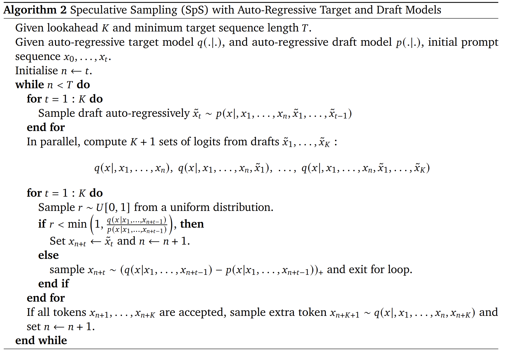
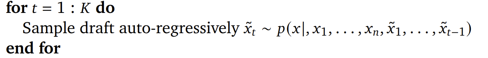
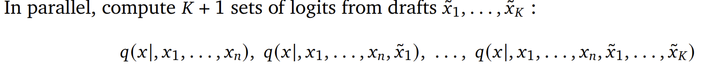
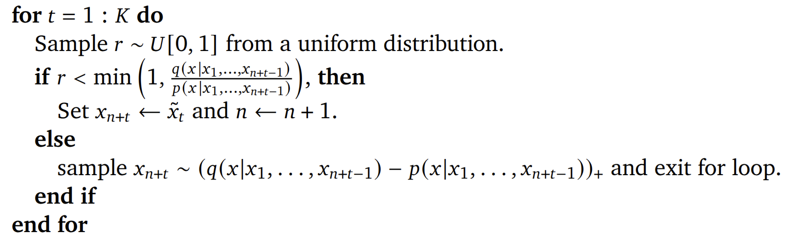
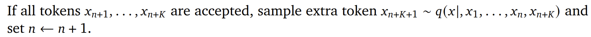
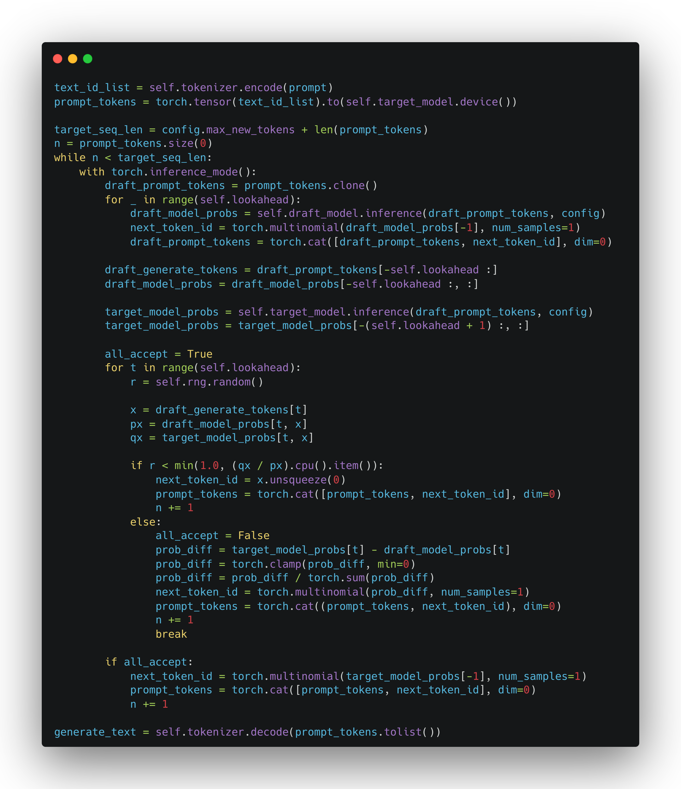

## Introduction

Today we'll explore and implement DeepMind's paper: *Accelerating large language model decoding with speculative sampling* [@sps_deepmind].
I'll demonstrate how to reproduce this technique in less than 100 lines of code while achieving more than 2x speedup in inference time.

<!-- more -->

For example, using the following prompt (with temperature set to 0 to ensure deterministic results):
```bash
Prompt: Alan Turing theorized that computers would one day become
```

GPT2-XLARGE inference time is **16.8244** seconds:
```bash
-------------------- Naive GPT2 Auto-Regressive --------------------
Naive GPT2 Auto-Regressive completed in 16.8244 s
Generated: Alan Turing theorized that computers would one day become so powerful that they would be able to think like humans.

In the 1950s, he proposed a way to build a computer that could think like a human.
(skip ...)
-------------------- Naive GPT2 Auto-Regressive --------------------
```

With speculative sampling, we can generate the exact same inference result in just **7.9031** seconds - a **2.12x** speedup:
```bash
-------------------- Speculative Sampling --------------------
Speculative Sampling completed in 7.9031 s
Generated: Alan Turing theorized that computers would one day become so powerful that they would be able to think like humans.

In the 1950s, he proposed a way to build a computer that could think like a human.
(skip ...)
-------------------- Speculative Sampling --------------------
```

## Overview

Speculative sampling is a technique for accelerating large language model inference. Specifically, it's a method that trades space for time in the inference process.
When running inference on large language models, the process is typically slow. We want to optimize this inference speed.
The model we're trying to optimize is called the "Target Model."

To accelerate inference, speculative sampling introduces a much smaller "Draft Model" that predicts multiple tokens at once.
It then uses a technique similar to rejection sampling to ensure the generated distribution matches the Target Model's distribution.
There are two key factors that make speculative sampling effective:

1. The Draft Model must be significantly faster than the Target Model
2. The Draft Model and Target Model must have high similarity in their predictions

I'll explain both of these factors in detail below.
All experiments in this article are based on GPT2 models, with GPT2-XLARGE as the Target Model and GPT2-SMALL as the Draft Model. The complete implementation code is available on GitHub: [ai-glimpse/toyllm](https://github.com/ai-glimpse/toyllm)


## Algorithm Principles



>Given lookahead $K$ and minimum target sequence length $T$.

These are the algorithm's two parameters: $K$ (lookahead steps) and $T$ (maximum generated token length).
In our earlier example, we used $K=4$ and $T=266$.

>Given auto-regressive target model $q(\cdot | \cdot)$,
> and auto-regressive draft model $p(\cdot | \cdot)$, initial prompt sequence $x_0,\cdots, x_t$

Here, the target model $q$ is the larger model we want to optimize, such as GPT-XLARGE with 1558M parameters.
The draft model $p$ is a smaller model, like GPT-SMALL with 124M parameters.
The initial prompt is our starting text, for example: "Alan Turing theorized that computers would one day become".
Note that $x_0,\cdots, x_t$ represents individual tokens, not words: the 9 words in our prompt translate to 10 tokens.
GPT2 uses BPE (Byte Pair Encoding) tokenization. The 9 words in our prompt yield the following 10 tokens (ignoring '<>' symbols which are used to highlight spaces):

```
<Alan>
< Turing>
< theor>
<ized>
< that>
< computers>
< would>
< one>
< day>
< become>
```

Below is the main algorithm logic:
The overall flow is straightforward - we keep generating tokens until we reach length $T$.
Since $t = 9$, $n$ starts with value 9; and $T=266$, so the algorithm continues until all tokens reach a length of 266. The code is intuitive:

```python
# Initialise n <- t
n = prompt_tokens.size(0)
# while n < T do
while n < target_seq_len:
    ...
```

Now let's look at the first loop inside the while loop:



This is where the Draft Model performs autoregressive sampling for $K$ tokens. $K$ is called the lookahead step length, and we'll see its significance shortly. The code is straightforward:

```python
for _ in range(self.lookahead):
    draft_model_probs = self.draft_model.inference(draft_prompt_tokens, config)
    next_token_id = torch.multinomial(draft_model_probs[-1], num_samples=1)
    draft_prompt_tokens = torch.cat([draft_prompt_tokens, next_token_id], dim=0)
```

Next, we calculate $K+1$ sets of logits (specifically normalized logits, i.e., probabilities) from the target model:



We can obtain all $K+1$ probability distributions with a **single forward pass** through the target model:

```python
target_model_probs = self.target_model.inference(draft_prompt_tokens, config)
```

Now we come to the heart of speculative sampling. If the previous steps were about making predictions, the following steps are about verifying the reliability of these predictions and taking appropriate actions based on that reliability.



This process validates each of the $K$ tokens generated by the draft model. Taking the first token as an example, when $t=1$, the condition is:

$$
r < \min\left(1, \frac{q(x|x_1, \cdots, x_n)}{p(x|x_1, \cdots, x_n)}\right)
$$

This compares whether the ratio of probabilities between the target model and draft model for token $\tilde{x}_1$ exceeds $r$, where $r \sim U[0, 1]$ (a uniform distribution between 0 and 1). If the condition is met, we accept token $\tilde{x}_1$ as the official output; otherwise, we reject it and sample a new token from the following distribution, then break out of this for-loop:

$$
q(x|x_1, \cdots, x_n) - p(x|x_1, \cdots, x_n))_{+}
$$

Here $(.)_{+}$ is defined as:

$$
(f(x))_{+} = \frac{\max(0, f(x))}{\sum_{x}{\max(0, f(x))}}
$$

This is essentially calculating the difference between distributions, clipping at 0, and then normalizing.

To summarize, during the $K$-step verification, we validate each token generated by the draft model one by one. If it meets the probability condition, we accept it and continue verifying the next predicted token. If not, we sample a new token from the "difference distribution" and end this verification round. The code is:

```python
all_accept = True
for t in range(self.lookahead):
    r = self.rng.random()

    x = draft_generate_tokens[t]
    px = draft_model_probs[t, x]
    qx = target_model_probs[t, x]

    if r < min(1.0, (qx / px).cpu().item()):
        next_token_id = x.unsqueeze(0)
        prompt_tokens = torch.cat([prompt_tokens, next_token_id], dim=0)
        n += 1
    else:
        all_accept = False
        prob_diff = target_model_probs[t] - draft_model_probs[t]
        prob_diff = torch.clamp(prob_diff, min=0)
        prob_diff = prob_diff / torch.sum(prob_diff)
        next_token_id = torch.multinomial(prob_diff, num_samples=1)
        prompt_tokens = torch.cat((prompt_tokens, next_token_id), dim=0)
        n += 1
        break
```

Finally, there's one last step inside the while loop:



If all $K$ tokens $x_{n+1}, \cdots, x_{n+K}$ predicted by the draft model are accepted, we sample one more token from the target model:

$$
x_{n+K+1} \sim q(x|, x_1, \cdots, x_n, \cdots, x_{n+K})
$$

Note that the formula in the paper contains a small error; the above is the corrected version. Here's the corresponding code:

```python
if all_accept:
    next_token_id = torch.multinomial(target_model_probs[-1], num_samples=1)
    prompt_tokens = torch.cat([prompt_tokens, next_token_id], dim=0)
    n += 1
```

This completes one full cycle of the algorithm. Now we can see why the draft model's generation of $K$ tokens is called "lookahead" - it's essentially making predictions ahead of time, which embodies the core meaning of Speculative Sampling.

## Complete Algorithm Code

You can find the code implementing this algorithm to generate the example from the introduction in the [toyllm](https://github.com/ai-glimpse/toyllm) project.



## Complexity Analysis

While the original paper doesn't include much complexity analysis, Jay provided a [supplementary analysis](https://jaykmody.com/blog/speculative-sampling/) that helps us better understand speculative sampling.

First, let's define the following:

- $t_{\text{target}}$: Time needed for the target model to perform one inference (produce one token). In the paper, the target model is DeepMind's **70B** Chinchilla, which takes 14.1ms per token.
- $t_{\text{draft}}$: Time needed for the draft model to perform one inference. In the paper, the draft model is DeepMind's **7B** Chinchilla, which takes 1.8ms per token.
- $r'$: Acceptance rate. Calculated as the number of tokens generated per round of speculative sampling (inside the while loop) divided by $K+1$.

Without speculative sampling, the time complexity for a target model to autoregressively generate $N$ tokens is $N \cdot {t_{\text{target}}}$.

With speculative sampling, we need multiple rounds of iterations. Each round involves $K$ autoregressive steps from the draft model and 1 inference from the target model, so the complexity per round is $t_{\text{draft}}K + t_{\text{target}}$. Since the acceptance rate is $r'$, each round produces an average of $r'(K+1)$ tokens, so we need $\frac{N}{r'(K+1)}$ rounds. Therefore, the time complexity of speculative sampling is:

$$
\frac{N}{r'(K + 1)} \cdot (t_{\text{draft}}K + t_{\text{target}})
$$

With both time complexities, we can calculate the theoretical speedup from speculative sampling:

$$
\begin{align}
\text{speedup} & = \frac{\text{time complexity of autoregressive}}{\text{time complexity of speculative}} \\
& = \frac{N\cdot t_{\text{target}}}{\frac{N}{r'(K + 1)} \cdot (t_{\text{draft}}K + t_{\text{target}})}
& \\
& = \frac{r'(K + 1) \cdot t_{\text{target}}}{t_{\text{draft}}K + t_{\text{target}}}
\end{align}
$$

Looking at this final equation, let's revisit the two key factors for speculative sampling's effectiveness: the draft model must be much faster than the target model, and they should have high similarity. For the first point, the faster the draft model (smaller $t_{\text{draft}}$), the smaller the denominator in our equation, resulting in a higher speedup. When $t_{\text{draft}}$ is small enough, we can approximate:

$$
\begin{align}
\text{speedup}
&= \frac{r'(K + 1) \cdot t_{\text{target}}}{t_{\text{draft}}K + t_{\text{target}}} \\
&\approx \frac{r'(K + 1) \cdot t_{\text{target}}}{ t_{\text{target}}} \\
&\approx r'(K + 1) \\
\end{align}
$$

This shows that the speedup is linearly correlated with the acceptance rate. Hence our second point: the higher similarity between the draft and target models, the higher $r'$ will be.

Let's analyze our experimental results to see if they match expectations. The paper tested on HumanEval and XSum with $K=4$: HumanEval had an acceptance rate of $r'=0.8$ and XSum had $r'=0.62$ (from Figure 1 in the paper). For HumanEval, the theoretical speedup is 2.65, while the measured speedup was 2.46. For XSum, the theoretical speedup is 2.05, while the measured speedup was 1.92.

For our example, the target model is GPT-XLARGE (1558M parameters) with an inference speed of 73.3ms/token, so $t_{\text{target}} = 73.3$. The draft model is GPT-SMALL (124M parameters) with an inference speed of 11.9ms/token, so $t_{\text{draft}} = 11.9$. With an average acceptance rate of $r'=0.8125$ and $K=4$, our theoretical speedup is:

$$
\begin{align}
\text{speedup} & = \frac{\text{time complexity of autoregressive}}{\text{time complexity of speculative}} \\
& = \frac{N\cdot t_{\text{target}}}{\frac{N}{r'(K + 1)} \cdot (t_{\text{draft}}K + t_{\text{target}})}
& \\
& = \frac{r'(K + 1) \cdot t_{\text{target}}}{t_{\text{draft}}K + t_{\text{target}}} \\
& = \frac{0.8125(4 + 1) \cdot 73.3}{11.9 \cdot 4 +73.3} \\
& \approx 2.46
\end{align}
$$

Our measured speedup was 2.12 (note that we only used a single prompt for a simple verification, not a rigorous benchmark), which is reasonably close to the theoretical value.

## Insights

So far, we've clarified the algorithm principles, reimplemented the paper from scratch, and analyzed its complexity. It seems we've completed our reproduction, but I still felt something was missing - I didn't feel like I fully understood Speculative Sampling itself. I knew the What and How of the algorithm, but I still had questions about why it truly works. So I tried to dig deeper from different angles.

My first attempt was to work through the mathematical proof. The paper provides a proof that the distribution obtained by speculative sampling matches that of the target model. The proof is straightforward and easy to understand, but working through it didn't provide much insight into the algorithm's essence.

My second attempt was to dive into the algorithm details. Looking at the entire algorithm, the most puzzling part is the rejection sampling:

$$
r < \min\left(1, \frac{q(x|x_1, \cdots, x_n)}{p(x|x_1, \cdots, x_n)}\right), r \sim U[0, 1]
$$

How do we intuitively understand this acceptance condition? And another question: speculative sampling only guarantees distributional similarity, so why did our test produce identical outputs?

When we consider these questions together, some insights emerge. The key lies in setting the temperature to 0 during inference. With temperature at 0, both $q(x|x_1, \cdots, x_n)$ and $p(x|x_1, \cdots, x_n)$ become discrete distributions over the vocabulary space, with all probability mass concentrated on a single token - meaning only one token has a probability of 1, and all others are 0. For the draft model, since $p(x|x_1, \cdots, x_n)$ represents the probability of the selected token, it always equals 1 when temperature is 0. Thus, the acceptance condition simplifies to:

$$
\begin{align}
r &< \min\left(1, \frac{q(x|x_1, \cdots, x_n)}{p(x|x_1, \cdots, x_n)}\right) \\
&= \min\left(1, q(x|x_1, \cdots, x_n) \right) \\
&= q(x|x_1, \cdots, x_n)
\end{align}
$$

This means the acceptance condition reduces to whether $q(x|x_1, \cdots, x_n)$ is greater than $r$. Since $q(x|x_1, \cdots, x_n)$ also equals 1 for only one token, acceptance only happens when $q(x|x_1, \cdots, x_n)=1$, which meaning the target model would also assign a probability of 1 to the same token the draft model predicted. In simple terms, at temperature 0, there's no randomness; it's just comparing whether the draft and target models generate the same token. This explains why we get identical results when temperature is 0.

Let's go deeper and consider more general cases beyond temperature 0. Looking at the acceptance condition:

$$
r < \min\left(1, \frac{q(x|x_1, \cdots, x_n)}{p(x|x_1, \cdots, x_n)}\right)
$$

We can observe: For a token $x$ predicted by the draft model, the higher $q(x|x_1, \cdots, x_n)$ is, the more likely we are to accept this token. When $q(x|x_1, \cdots, x_n)$ is very small, even if $p(x|x_1, \cdots, x_n)=1$, the acceptance probability remains low.

By now, I believe we've gained a deeper understanding of the algorithm. Our journey is nearly complete! Finally, I'd like to share a fun idea I had for discussion:

We could actually adjust the distribution of $r$ and the size of $K$ to deliberately "dumb down" the model. For instance, by changing $r$'s distribution to $r \sim U[0, 0.5]$ (increasing acceptance rate) and increasing $K$, we can achieve a higher speedup (by reducing the number of target model inferences):

$$
\text{speedup} \approx r'(K + 1)
$$

The trade-off is that the sampled distribution no longer matches the target model's, but leans more toward the draft model, hence "dumbing down." This is easy to implement in practice. For example, one could configure a custom $b$ for certain regions/users, so that during inference $r \sim U[0, b]$. This part is just for fun - please take it with a grain of salt!

## Conclusion

This concludes our journey. Happy learning!
