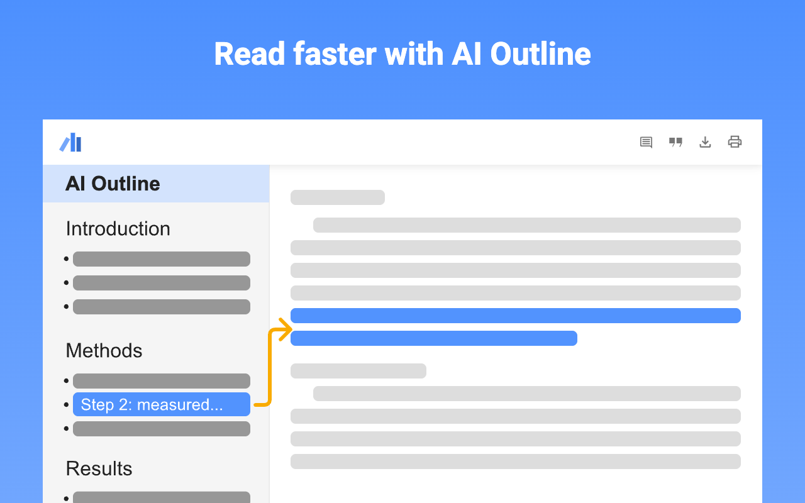
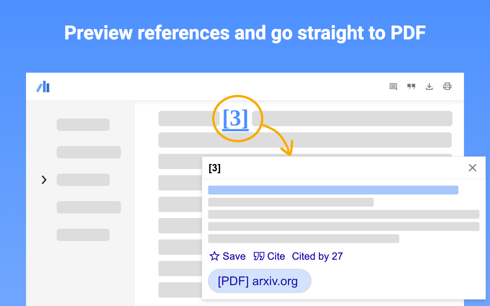
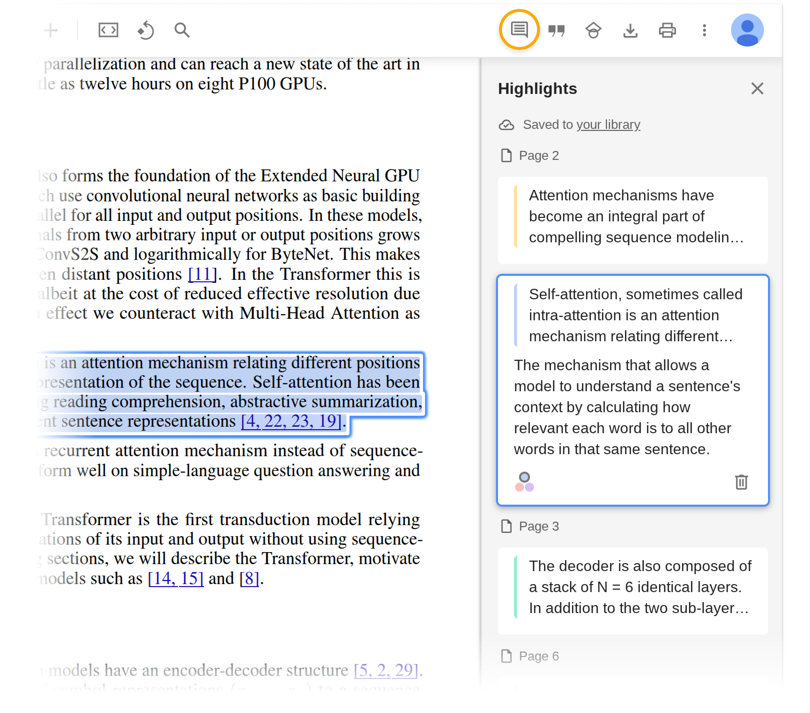

## TL;DR

直接Chrome web store搜索 [Google Scholar PDF Reader](https://chromewebstore.google.com/detail/google-scholar-pdf-reader/dahenjhkoodjbpjheillcadbppiidmhp?utm_medium=blog&utm_source=scholar.googleblog.com&utm_campaign=kp&utm_content=bottom) 安装试用即可.

## 去年的更新

在[去年11月](http://scholar.googleblog.com/2024/11/ai-outlines-in-scholar-pdf-reader-skim.html)的时候，Google在Google Scholar PDF Reader插件上推出了一个新的 AI 驱动的导航栏功能，大致长这样：

<!-- <figure markdown="span">
  { width="800" }
  <figcaption>Google Scholar AI 导航栏</figcaption>
</figure> -->

对于一些比较长且复杂的文档/论文，这个导航栏确实可以帮助我们快速定位到文档的不同部分，但是对于大部分普通论文来说，这个功能的实用性并不高，毕竟大部分论文的结构都比较简单，章节也不会太多。所以这个功能的实用性因人而异。

不过，同时更新的另外的一个功能就非常实用了：引用文献快速查看功能，如下图所示：

这个功能真的非常好用，尤其是在阅读论文时需要频繁查看引用文献的情况下。只需将鼠标悬停在引用上，就能快速查看引用文献的摘要和相关信息，极大地提高了阅读效率。

## 最近的更新

在前几天的更新中，Google Scholar PDF Reader 又推出了两个新功能：Highlight & Comment 和 Scholar Labs.

### Highlight & Comment

Google Scholar Blog 在[2025/11/10](https://scholar.googleblog.com/2025/11/mark-it-up-highlight-and-comment-in.html)号发布的博客介绍了这个功能。简单来说，就是允许用户在PDF文档中高亮文本并添加评论。

这些高亮和评论会同步到用户的Google Scholar账户中，方便用户随时查看和管理。这个功能其实非常有用。有Google做背书，用户可以放心地将重要的论文和文献进行标记和注释，方便日后查阅。

### Scholar Labs

用LLM帮忙查过文献的朋友都知道，LLM捏造不存在文献的能力是相当地强...
所以个人一直比较苦恼的事情就是精准地找到相关文献。Google Scholar Blog 在[2025/11/18](https://scholar.googleblog.com/2025/11/scholar-labs-ai-powered-scholar-search.html)号发布的博客介绍了Scholar Labs，标题就是"Scholar Labs: An AI Powered Scholar Search"，正是我一直需要的功能！

## 最后

总的来说，Google Scholar PDF Reader 的引用文献快速查看功能非常实用。最近的Highlight & Comment 和 Scholar Labs也都是很好用的工具，强烈推荐！
