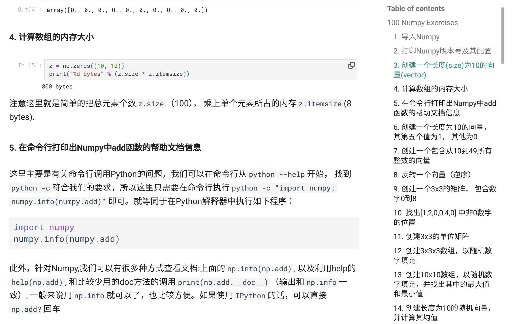

# Oh-Numpy & Oh-PyTorch

100 道 Numpy 练习题的 Numpy 和 PyTorch 解答：[Oh-Numpy](https://datahonor.com/Oh-Numpy/100-Numpy-Exercises/), [Oh-PyTorch](https://datahonor.com/Oh-PyTorch/100-PyTorch-Exercises/).

<!-- more -->

## Oh-Numpy

大概 6 年前，我为了系统地学习 Numpy 找来了[100 numpy exercises](https://github.com/rougier/numpy-100).
题目用来练习总体还是不错的，不过就是题干的描述有些比较难读，另外就是给出的解答代码有些比较难理解。

所以我就将自己的笔记整理了下，另外加上题干的翻译放到一个[Oh-Numpy](https://github.com/shenxiangzhuang/Oh-Numpy)项目底下。

<figure markdown="span">
  { width="800" }
  <figcaption>Oh-Numpy</figcaption>
</figure>

一次偶然的机会在知乎看到已经有比较多的资源，不过还是贴了下项目的链接，有位热心大哥的话让我甚至感动：

<figure markdown="span">
  { width="600" }
  <figcaption>知乎评论区</figcaption>
</figure>

## Oh-PyTorch

最近又把这些题目用 PyTorch 做了一下，所以也就有了[Oh-PyTorch](https://github.com/shenxiangzhuang/Oh-PyTorch)。
目前已经把两个项目通过静态文档站关联起来，可以直接在网页 ([Oh-Numpy](https://datahonor.com/Oh-Numpy/100-Numpy-Exercises/), [Oh-PyTorch](https://datahonor.com/Oh-PyTorch/100-PyTorch-Exercises/)) 上丝滑跳转：

<figure markdown="span">
  { width="600" }
  <figcaption>文档关联</figcaption>
</figure>
