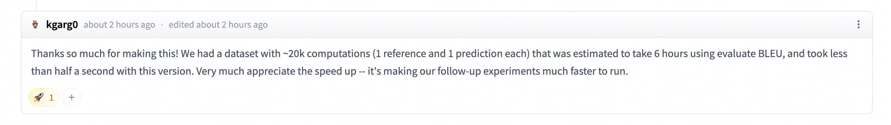
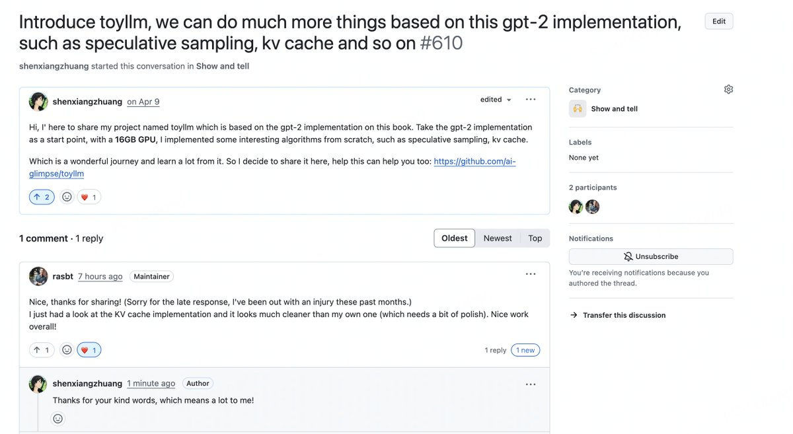

和大家分享一下近期做开源项目收获的一些正反馈和自己的一些体会。

<!-- more -->

## 简单的小工具也能给地球上的某人带来大的帮助
 
去年写的一个 Python 画图显示中文的小工具 [zhplot](https://datahonor.com/blog/2024/12/08/zhplot/) 目前已经受到了 64 个 Star.
我在知乎和 V2EX 上发布的帖子也受到了很多感谢，每当这个时候我就感到非常开心——我也从开始的小小白变得可以帮助别人了！

也是去年写的一个 BLEU 计算库 ([bleuscore](https://datahonor.com/blog/2024/12/28/2024_summary/?h=bleu#bleuscore))，在前几天又收到 Huggingface 上的一条留言，说之前写的帮助他将评估程序的运行时间从 6 个小时提升到半秒：

正如之前我在推上写的感慨：网友的正反馈就像是魂游给谏言的点赞，可以加血，且加在地球 online 这个系统。

## 为工作中第一个复现的算法提交 PR 的感受

在从事时序异常检测相关工作时，我接触的第一个算法就是 SPOT。
如果你正好看过我对[时序异常论文的一些总结](https://datahonor.com/odyssey/aiops/tsad/paper/)，就能知道我其实非常喜欢这个算法，也很敬佩这位作者：

>这位作者配得上匠人的称号。开源的第一版是用 Cpp 写的，后来大佬觉着用 Cpp 有点 Overskill 了，所以就用 C(c99) 重写了，然后连标准库也不依赖，我是真的 respect。

我之前想用 Rust 写一个基于 SPOT 算法的时序异常算法，直接通过 FFI 调用这个 C 实现，一切都非常丝滑，直到在写 WASM Binding 的时候发现通过 FFI 调用 C 代码
写 Binding 非常麻烦 (反正我是没玩明白)。但是我个人又很喜欢 WASM，因为我觉着算法直接跑在浏览器很酷...所以我就把这个 C 库用 Rust 重写了，在 AI 的帮助下这个重写工作意外的轻松！同时在深入看 C 代码实现的时候还发现了一个比较关键的 Bug，这个 Bug 会导致算法内部状态更新有问题，所以就提了个[PR](https://github.com/asiffer/libspot/pull/24)帮修了下——这是我人生中第一次提交 C 代码的 PR。

从复现到魔改整个过程让我学到了很多东西，也让我对这个算法有了更深的理解。
如今能帮原作者贡献一些自己的力量，也是一种非常不错的体验。

## 我单纯地喜欢造轮子

我一向将费曼的那句"What I cannot create, I do not understand."奉为圭臬，所以多年以来我一直沉迷造轮子...从开始的[toyml](https://github.com/ai-glimpse/toyml)和[toydl](https://github.com/ai-glimpse/toydl)，到后来的[toyllm](https://github.com/ai-glimpse/toyllm), [toyrl](https://github.com/ai-glimpse/toyrl), 再到最近的[toynlp](https://github.com/ai-glimpse/toynlp)...这个过程中我学到了关于各类算法的大量知识。个人认为，能够架起数学到代码的桥梁，是迈过理论和现实鸿沟的关键一步。

我偶尔也会把这些复现的过程写成博客分享出来。之前写的两篇 LLM 算法复现的文章 ([LLM Speculative Sampling
](https://datahonor.com/blog/2025/03/08/llm_sps/), [LLM KV Cache: A Simple Implementation](https://datahonor.com/blog/2025/06/03/llm_kv_cache/))，其实就是 toyllm 项目的副产品。

同样地，这些代码也都或多或少地受到了一些好评并帮助了一些朋友。
比如下面和 Sebastian(LLM from Scratch 作者) 的互动 (当然这位大佬本身就很友善):

> 这老哥真的非常有趣且真诚...上次和大佬互动是 5 年前在深圳实习的时候，那个时候老哥回复我的 issue 说他在外面旅行，时间比较少 hhh

## 最后

希望你也能在开源的道路上找到乐趣，收获成长。
