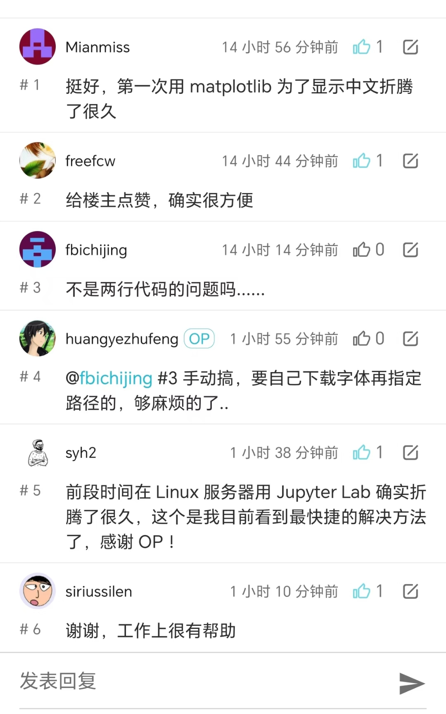

在日常工作的少数的场景，我需要用 Python 画一些包含中文的图，一般为了简单快捷都会使用 matplotlib。
半分钟不到写完画图代码后，发现图片的文字部分一堆方框后是真的很无奈...
是的，中文字体的支持并不在很多开源库的考虑范围内，这是事实，在社区搜一下能看到一大把的图片显示中文的 issue。

我本来只是想画个图而已，但是我现在需要去搜索怎么安装中文字体，怎么让这些开源库能够找到自己安装的字体...本来半分钟搞定的事情，
现在怎么都要花个十来分钟去搜索解决方案，并做一系列字体相关的操作。
这种“小而烦”的问题有时候很影响心情，更不用说这种 Contex Switch 的带来的原工作节奏扰乱。
解决这个“小而烦”的问题就是 zhplot 项目要达成的目标。

<!-- more -->

## 大家的评价
在完成[zhplot](https://github.com/shenxiangzhuang/zhplot) 0.1.0 版本后
我把这个项目分享到了[V2EX](https://www.v2ex.com/t/1093996)，稍有些意外的发现挺多人都觉着有帮助：

## 极简使用

zhplot 的使用很简单，通过`pip install zhplot`之后，在做图前`import zhplot`即可。

这里采用`zhplot`命名最大的原因就是好记，我希望用户在使用这个库的时候可以做到最小的记忆负担。
另外希望这个库的使用可以最大限度的简单，所以你只需要 import 即可。

## 简单实现
zhplot 的方案很简单，就是内置一个中文字体，在使用 pip 安装这个库的时候会把这个字体下载下来，之后`import zhplot`就会指定使用此字体。
整个库的代码行数也就几十行。

## 开源的好处

因为代码是开源的，所以有 V 站的朋友发现了在 0.1.0 版本使用的字体 (SimHei)
是可能存在版权问题的。(关于这个版权问题其实我事先是大概查了下的，但是没有查到明确的结论就先行作罢)
在细致地了解了版权的情况后，还是决定替换为更加保险的方案，就把字体换到了[noto-cjk](https://github.com/notofonts/noto-cjk)。
出于最后 Python 库打包大小的考虑，这里选择了一个更小的字体文件。

## 快速开发的小利器

其实一个库从写代码到构建发布的过程中需要大量的 CI 配置工作：自动测试，部署文档，自动发布库到 PyPI...
所我这里是直接用的自己配的一个模板 Repo ([MPPT](https://github.com/shenxiangzhuang/mppt))，
直接根据模板创建新项目，然后改改名字就直接完成了上面全套的配置。得益于此，整个项目完成只用了几个小时就完成了。

## Talk is cheap

对于个人的项目，尤其是投入没那么大的项目，直接写代码发布就行了：如果成了，很好；如果不及预期，也很好，我们成功验证了一个想法。
