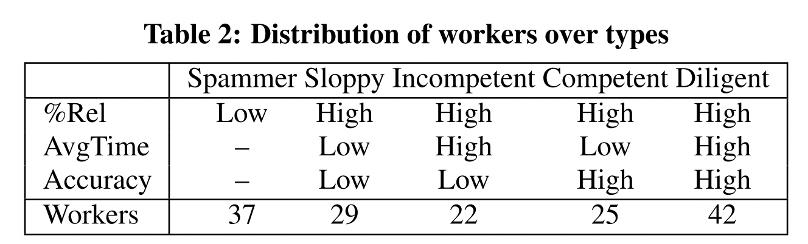
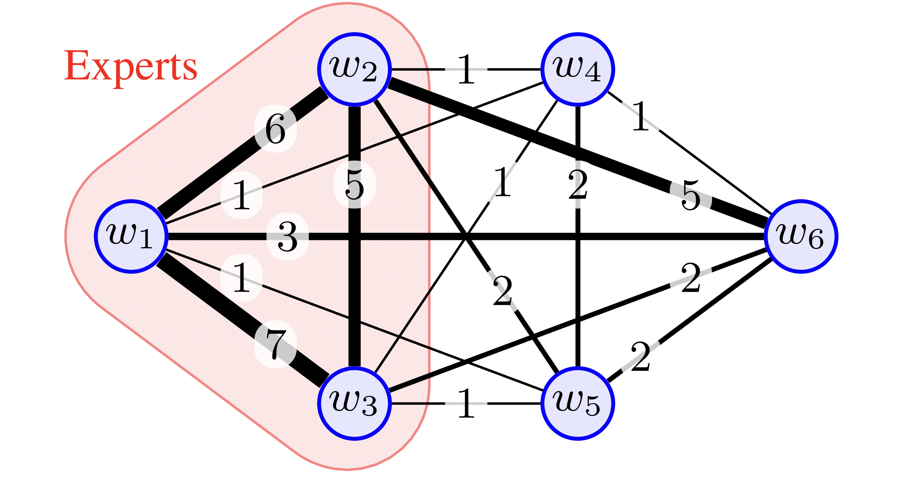
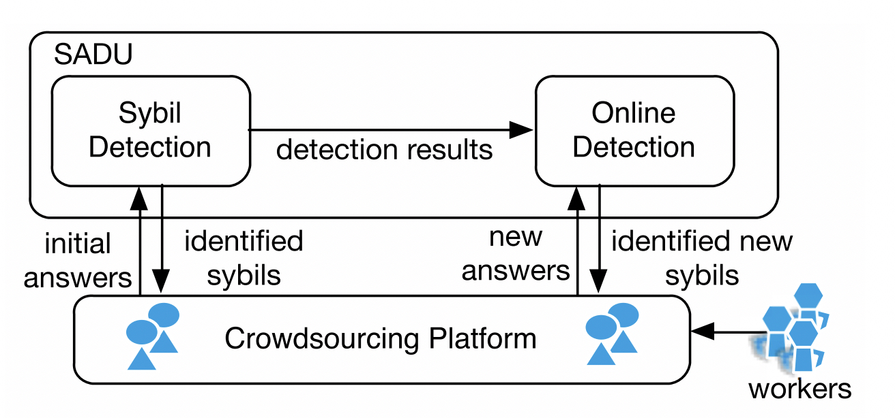

# Paper

介绍数据标注/众包平台相关的论文

## Overview
Topics: 真值推断，用户一致性，用户画像，异常检测

## Quality Control General
标注平台的质量控制是平台的核心竞争力，因为数据标注的好坏直接影响到后续模型的好坏，
这是平台需求方最为关注的问题。

标注数据的质量保障是一个很综合的问题，需要从多个角度同时切入来共同保障标注数据的质量。
因此，在质量控制的全流程涉及较多的子问题，如真值推断，标注一致性，标注异常检测等。

### 2013-HKU&NYU-Quality Assurance Framework
A framework for quality assurance in crowdsourcing[@quality-assurance-framework-2013]

### 2017-Quality Control in Crowdsourcing
Quality Control in Crowdsourcing: A Survey of Quality Attributes, Assessment Techniques and Assurance Actions
[@quality-control-in-crowdsourcing-2017]

## Truth inference
在标注平台上，标注者的质量参差不齐，有的标注者质量很高，有的标注者质量很差。
如何将不同质量的标注者的标注结果进行合理的融合，就成了一个很重要的问题。
而真值推断解决的就是这一问题，即从worker annotations/answers中找出真正的truth label。

### DS(1979) & FastDS(2018)

真值推断的很多研究都是围绕DS算法[@ds-1979]展开的。
DS算法最早源与医学统计领域的研究，后续DS以其普适性被广泛应用于数据标注领域。

???+ "稳定高效的DS算法"

    其实从后来的很多研究都可以看出，DS算法的效果是相当能打的。
    一些所谓的改进算法其实在效果上改进的并不多，而又引入了不必要的复杂度。
    所以在工程落地时，DS算法依然是首选。

DS算法的计算复杂度相对较高，有些研究重点在于DS算法的加速，如2018年的FastDS[@fastds-2018].

???+ "FastDS Resources"

    - Website: [https://sites.google.com/view/fast-dawid-skene](https://sites.google.com/view/fast-dawid-skene)
    - Github: [sukrutrao/Fast-Dawid-Skene/](https://github.com/sukrutrao/Fast-Dawid-Skene/)

### 2009-GLAD
*Whose vote should count more: Optimal integration of labels from labelers of unknown expertise*
[@glad-2009].

### 2013-Aggregation evaluation

An evaluation of aggregation techniques in crowdsourcing[@chc-aggregation-2013].
对MD, HP, ELICE, EM, GLAD, SLME, and ITER等算法进行了评估。

### TODO: KOS

### TODO: MMSR

### TODO: MACE

## Agreement
这里的Agreement是指标注者之间的一致性，即标注者对于同一个标注任务的标注结果是否一致。
目前看到的相关研究比较少，主要是围绕Kappa值展开的。

### 1960-Cohen's Kappa
Kappa的起源最早可以追溯到*A coefficient of agreement for nominal scales*[@cohen-kappa-1960].
论文引入了Kappa值的定义。

### 1971-Fleiss' Kappa

*Measuring nominal scale agreement among many raters*[@fleiss-kappa-1971].
是对Cohen's Kappa的推广。

### 2005-Kappa Statistic in Reliability Studies
*The kappa statistic in reliability studies: use, interpretation, and sample size requirements*[@sim2005kappa]
对Kappa值进行了进一步的解释说明。

## Persona
在上述Truth inference中， 可以看到标注员的质量一般是根据其历史标注结果计算出其准确率/混淆矩阵，
平台可以通过这些信息来判断标注员的质量，进而进行用户的筛选。

标注准确率是很重要的指标，但是有些单一，有些时候我们需要一些更加综合的指标来描述标注员的质量，
这里的Persona就是指用户画像，是对标注员综合描述指标的全称。

这部分的研究相对比较散乱。这里仅选择部分在落地实践中较为有用的研究进行介绍，
如用户类型，信誉度等。

### 2011-Microsoft-Worker types

论文*Worker types and personality traits in crowdsourcing relevance labels*[@2011-microsoft-worker-types]
首次给出了基于答题行为数据的众包工人分类方法，共分为以下五类:

???+ "Diligent/Competent/Incompetent/Sloppy/Spammer"
    | Worker type | Description |
    | ----------- | ----------- |
    | **Diligent workers** | Diligent workers take care in completing their HITs and may thus be characterized by a high ratio of useful labels, longer average time spent per HIT, and a high label accuracy. |
    | **Competent workers** | Competent workers may be skilled workers who provide many useful labels and obtain a high accuracy, but work fast, making them very efficient and effective workers. |
    | **Incompetent workers** | Incompetent workers may also provide many useful labels, but despite spending considerable time per HIT only obtain a low accuracy, plausibly due to lacking skills or competencies such as a poor understanding of the task. |
    | **Sloppy workers** | Sloppy workers care little about the quality of their work. They may still provide a high fraction of useful labels, but they work as fast as possible, spending relative little time per HIT. As a result, their Accuracy is expected to be low. |
    | **Spammers** | Spammers may come in different shapes and forms, but those workers that deliver very few useful labels are an obvious case of malicious workers. |

这里给出了工人分类的定性标准，可以很好地对当前的工人群体做划分。但是论文并没有给出定量标准，因此无法直接使用。
我们结合下面的这篇论文来对工人进行定量分类。

### 2014-Reputation

*Reputation-based Worker Filtering in Crowdsourcing*[@jagabathula2014reputation].
论文基于worker-task assignment graph给出标注员信誉计算的方法。
大致的思路是，如果一个标注员的标注结果与其他标注员的标注结果越不一致，
给予的信誉度惩罚就越高，那么该标注员的信誉就会降低。

### 2019-Crowd anatomy

论文*Crowd anatomy beyond the good and bad: Behavioral traces for crowd worker modeling and pre-selection*[@2019-crowd-anatomy]
给出了更加详细的工人分类方法，且基于用户行为数据给出了基于分位点的定量分类的标准。我们结合上述Worker Type[@2011-microsoft-worker-types]的分类和
当前论文的分类方法，给出最终的工人定量分类标准。

不同于上述微软论文中给出的5种工人分类，这里给出了更加细致的工人分类，共分为以下7类,
其中四类是重合的，即CW(Competent Workers), LW(Less-competent Workers), SW(Sloppy Workers), DW(Diligent Workers)
另外针对异常的工人给出了三种分类: FD(Fast Deceivers), SD(Smart Deceivers), RB(Rule Breakers).

总体来看，前四种工人类型较为普遍，分类的依据也更加具有说服了，后面三类有些过于细化，且定义不够明确，因此我们只采用前四种工人类型。

### 2019-Extracting experts

*Graph mining meets crowdsourcing: Extracting experts for answer aggregation*[@kawase2019graph].
论文给出一个根据用户行为数据来判断用户是否为专家的方法。
总体是先构建用户之间的加权图，之后从图上挖掘专家标注员。

## Anomaly detection

在上述Persona: Worker Type的介绍中就可以看出，数据标注/众包平台上异常行为
的定义和一般异常检测任务上异常的定义一样困难。

具体来说，异常行为的定义是非常模糊的，因为异常行为的定义是随着任务的不同而不同的。
比如对于图片标注任务，标注速度很快并不一定就是异常，但是在文本任务上标注很快一般
就有些问题了(因为文本阅读和理解本身就需要较长的时间)。

???+ warning 🦀部分任务(如图片相关)标注时间长/速度慢带来的标注结果并不一定好

    实际观察到，对于比较难的图片任务，标注员标注时间长/速度慢的标注结果并不一定好。
    一种可能的情况是标注员无法确认图片的标注结果，因此花费了较长的时间来判断，
    最后给出了一个猜测的结果。

其他还有各种类型的异常行为：如用户全部选一个结果；多个用户共谋(collude)选相同的答案等。

### 2014-CMU-Collusion

*Detecting Non-Adversarial Collusion in Crowdsourcing*[@cmu-collusion-2014]

### 2017-THU-Sybil defense

*Sybil defense in crowdsourcing platforms*[@thu-sybil-2017]
论文主要针对选择题，通过定义用户相似度+层次聚类的方法来把sybil user聚类，
之后根据gold question筛选出准确率比较低的cluster即sybil cluster。
最后从sybil cluster中把误分进来的好人给剔除掉
(因为答题过少导致和sybil相似度较高，被错误低)，剩下的就是欺诈用户。

该方案相对值得借鉴，算是比较通用的流程且落地容易。

???+ info "定义相似度 → 聚类 → 筛选 → 剔除"

    - 相似度定义：可以更加灵活一些，引入更多的特征来计算相似度
    - 聚类：层次聚类相对就比较适合, 另外可尝试HDBSCAN, 在AAAI2023中有用其做collusion检测的
    - 筛选：金标题目说服力更强一些，其他替代方案可以参考，但应谨慎
    - 剔除：可以剔除的更多一些，保证不误伤

### 2023-ACCD
*ACCD: An Adaptive Clustering-Based Collusion Detector in Crowdsourcing (Student Abstract)*
[@xu2023accd]

论文整体的方法类似上述THU的思路，基本也是聚类+筛选的思路。

## Industrial Applications

### 2023-Toloka-Crowd-Kit
  [Crowd-Kit](https://github.com/Toloka/crowd-kit)[@crowdkit]是发布的开源库，用于控制数据打标质量。
  目前该库已经覆盖了相当丰富的算法实现。

