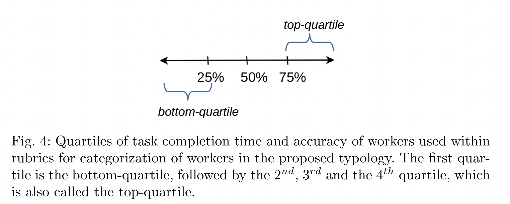

# Paper

介绍数据标注/众包平台相关的论文

## Overview
Topics: 真值推断，用户一致性，用户画像，异常检测

## Quality Control General
标注平台的质量控制是平台的核心竞争力，因为数据标注的好坏直接影响到后续模型的好坏，
这是平台需求方最为关注的问题。

标注数据的质量保障是一个很综合的问题，需要从多个角度同时切入来共同保障标注数据的质量。
因此，在质量控制的全流程涉及较多的子问题，如真值推断，标注一致性，标注异常检测等。

### 2013-HKU&NYU-Quality Assurance Framework
A framework for quality assurance in crowdsourcing[@quality-assurance-framework-2013]

### 2017-Quality Control in Crowdsourcing
Quality Control in Crowdsourcing: A Survey of Quality Attributes, Assessment Techniques and Assurance Actions
[@quality-control-in-crowdsourcing-2017]

## Truth inference
在标注平台上，标注者的质量参差不齐，有的标注者质量很高，有的标注者质量很差。
如何将不同质量的标注者的标注结果进行合理的融合，就成了一个很重要的问题。
而真值推断解决的就是这一问题，即从 worker annotations/answers中找出真正的truth label。

### DS(1979) & FastDS(2018)

真值推断的很多研究都是围绕 DS 算法[@ds-1979]展开的。
DS 算法最早源与医学统计领域的研究，后续 DS 以其普适性被广泛应用于数据标注领域。

???+ "稳定高效的 DS 算法"

    其实从后来的很多研究都可以看出，DS算法的效果是相当能打的。
    一些所谓的改进算法其实在效果上改进的并不多，而又引入了不必要的复杂度。
    所以在工程落地时，DS算法依然是首选。

DS 算法的计算复杂度相对较高，有些研究重点在于 DS 算法的加速，如 2018 年的 FastDS[@fastds-2018].

???+ "FastDS Resources"

    - Website: [https://sites.google.com/view/fast-dawid-skene](https://sites.google.com/view/fast-dawid-skene)
    - Github: [sukrutrao/Fast-Dawid-Skene/](https://github.com/sukrutrao/Fast-Dawid-Skene/)

### 2009-GLAD
*Whose vote should count more: Optimal integration of labels from labelers of unknown expertise*
[@glad-2009].

### 2013-Aggregation evaluation

An evaluation of aggregation techniques in crowdsourcing[@chc-aggregation-2013].
对 MD, HP, ELICE, EM, GLAD, SLME, and ITER 等算法进行了评估。

### TODO: KOS

### TODO: MMSR

### TODO: MACE

### 2022-LA: One/Two Pass

!!! abstract ""

    :simple-thealgorithms: 算法 ·
    :octicons-beaker-24: 适合POC ·
    :material-airplane-landing: 适合落地

*A Light-weight, Effective and Efficient Model for Label Aggregation in Crowdsourcing*[@yang2022lightweight]
是一篇 2022 年的关于标注结果聚合的论文，论文提出了 LA 算法，分为 OnePass, TwoPass 两个衍生算法。

LA 算法可以认为是 DS 算法的简化版本，将 DS 算法或者说依赖 EM 算法系的算法进行了简化——将原来的迭代过程简化为了一次/两次迭代，
分别对应 OnePass 和 TwoPass 算法。

!!! tip "LA 算法的优/劣势"

    - 速度快：从算法的 Benckmark 结果上来，LA 算法的效果是相当不错的，且计算复杂度相对较低。
    算法最大的可取之处在于其时间复杂度较低，计算 load 相比 DS/类 DS 的 EM 系算法会低很对，
    可以在实际落地中得到较好的应用。

    - 可解释性强：LA 相比 DS，推理过程更加明确/易懂，这对于算法落地时的调试和维护也是非常重要的。

    - Accuracy 可能不如 DS: 虽然从论文的实验结果上来看，LA 算法的效果要比 DS 算法好，但是这不太符合
      直觉，因为 LA 算法是 DS 算法的简化版本，因此在实际落地中，还是要先验证 LA 的聚合 Accuracy 是否真的比 DS 好。

### 2024-Meta-OAK :material-alert-decagram:{ .mdx-pulse title="Industrial" }

!!! abstract ""

    :fontawesome-brands-meta: Meta ·
    :simple-thealgorithms: 算法 ·
    :octicons-beaker-24: 适合POC ·
    :material-airplane-landing: 适合落地

*Efficient Online Crowdsourcing with Complex Annotations*[@meta-2024-oak]
是 Meta 在 2024 年关于复杂在线众包任务的一篇论文，主要是关于 OAK 算法的。

!!! note "基础假设"

    [Anna Karenina Principle](https://en.wikipedia.org/wiki/Anna_Karenina_principle),
    放在众包的场景中就是：好的标注员都是相似的，坏的标注员各有各的坏。

!!! note "基础理论"

    另外论文证明了一个基础理论:
    >the expected average similarity of a labeler is linear in their accuracy conditional on the reported label.

    即标注员的相似度与其准确率是线性相关的。这个理论和上述基础假设(Anna Karenina principle)也是一致的。
    也就是说，标注员的准确率越高，其相似度也就越高，反之亦然。
    基于这个理论，我们即使没有任何先验的信息，也可以通过标注员的相似度来**近似/估计**其准确率，

    基于这一理论，论文提出了一种基于标注员相似度的标注结果聚合和评估算法，
    可以在标注过程中动态判断当前标注是否已经满足了一定的一致性要求，当判断满足要求时可以及时停止标注，
    从而节省成本。

从算法架构可以看出其确实是考虑了实际的落地情况，比如将相似度计算抽象出来以适配不同的复杂标注任务，
评估当前标注准确率时引入$\gamma$超参数 (也是为了适配不同的任务场景) 等。
另外就是算法整体流程比较清晰，实现起来也相对容易，这点在做算法落地时尤为重要。

## Agreement
这里的 Agreement 是指标注者之间的一致性，即标注者对于同一个标注任务的标注结果是否一致。
目前看到的相关研究比较少，主要是围绕 Kappa 值展开的。

### 1960-Cohen's Kappa
Kappa 的起源最早可以追溯到*A coefficient of agreement for nominal scales*[@cohen-kappa-1960].
论文引入了 Kappa 值的定义。

### 1971-Fleiss' Kappa

*Measuring nominal scale agreement among many raters*[@fleiss-kappa-1971].
是对 Cohen's Kappa 的推广。

### 2005-Kappa Statistic in Reliability Studies
*The kappa statistic in reliability studies: use, interpretation, and sample size requirements*[@sim2005kappa]
对 Kappa 值进行了进一步的解释说明。

## Persona
在上述 Truth inference 中，可以看到标注员的质量一般是根据其历史标注结果计算出其准确率/混淆矩阵，
平台可以通过这些信息来判断标注员的质量，进而进行用户的筛选。

标注准确率是很重要的指标，但是有些单一，有些时候我们需要一些更加综合的指标来描述标注员的质量，
这里的 Persona 就是指用户画像，是对标注员综合描述指标的全称。

这部分的研究相对比较散乱。这里仅选择部分在落地实践中较为有用的研究进行介绍，
如用户类型，信誉度等。

### 2011-Microsoft-Worker types

论文*Worker types and personality traits in crowdsourcing relevance labels*[@2011-microsoft-worker-types]
首次给出了基于答题行为数据的众包工人分类方法，共分为以下五类：

???+ "Diligent/Competent/Incompetent/Sloppy/Spammer"
    | Worker type | Description |
    | ----------- | ----------- |
    | **Diligent workers** | Diligent workers take care in completing their HITs and may thus be characterized by a high ratio of useful labels, longer average time spent per HIT, and a high label accuracy. |
    | **Competent workers** | Competent workers may be skilled workers who provide many useful labels and obtain a high accuracy, but work fast, making them very efficient and effective workers. |
    | **Incompetent workers** | Incompetent workers may also provide many useful labels, but despite spending considerable time per HIT only obtain a low accuracy, plausibly due to lacking skills or competencies such as a poor understanding of the task. |
    | **Sloppy workers** | Sloppy workers care little about the quality of their work. They may still provide a high fraction of useful labels, but they work as fast as possible, spending relative little time per HIT. As a result, their Accuracy is expected to be low. |
    | **Spammers** | Spammers may come in different shapes and forms, but those workers that deliver very few useful labels are an obvious case of malicious workers. |

这里给出了工人分类的定性标准，可以很好地对当前的工人群体做划分。但是论文并没有给出定量标准，因此无法直接使用。
我们结合下面的这篇论文来对工人进行定量分类。

### 2014-Reputation

*Reputation-based Worker Filtering in Crowdsourcing*[@jagabathula2014reputation].
论文基于 worker-task assignment graph 给出标注员信誉计算的方法。
大致的思路是，如果一个标注员的标注结果与其他标注员的标注结果越不一致，
给予的信誉度惩罚就越高，那么该标注员的信誉就会降低。

### 2019-Crowd anatomy

论文*Crowd anatomy beyond the good and bad: Behavioral traces for crowd worker modeling and pre-selection*[@2019-crowd-anatomy]
给出了更加详细的工人分类方法，且基于用户行为数据给出了基于分位点的定量分类的标准。我们结合上述 Worker Type[@2011-microsoft-worker-types]的分类和
当前论文的分类方法，给出最终的工人定量分类标准。

不同于上述微软论文中给出的 5 种工人分类，这里给出了更加细致的工人分类，共分为以下 7 类，
其中四类是重合的，即 CW(Competent Workers), LW(Less-competent Workers), SW(Sloppy Workers), DW(Diligent Workers)
另外针对异常的工人给出了三种分类：FD(Fast Deceivers), SD(Smart Deceivers), RB(Rule Breakers).

总体来看，前四种工人类型较为普遍，分类的依据也更加具有说服了，后面三类有些过于细化，且定义不够明确，因此我们只采用前四种工人类型。

### 2019-Extracting experts

*Graph mining meets crowdsourcing: Extracting experts for answer aggregation*[@kawase2019graph].
论文给出一个根据用户行为数据来判断用户是否为专家的方法。
总体是先构建用户之间的加权图，之后从图上挖掘专家标注员。

## Anomaly detection

在上述 Persona: Worker Type 的介绍中就可以看出，数据标注/众包平台上异常行为
的定义和一般异常检测任务上异常的定义一样困难。

具体来说，异常行为的定义是非常模糊的，因为异常行为的定义是随着任务的不同而不同的。
比如对于图片标注任务，标注速度很快并不一定就是异常，但是在文本任务上标注很快一般
就有些问题了 (因为文本阅读和理解本身就需要较长的时间)。

??? warning "部分任务 (如图片相关) 标注时间长/速度慢带来的标注结果并不一定好"

    实际观察到，对于比较难的图片任务，标注员标注时间长/速度慢的标注结果并不一定好。
    一种可能的情况是标注员无法确认图片的标注结果，因此花费了较长的时间来判断，
    最后给出了一个猜测的结果。

其他还有各种类型的异常行为：如用户全部选一个结果；多个用户共谋 (collude) 选相同的答案等。

### 2014-CMU-Collusion

*Detecting Non-Adversarial Collusion in Crowdsourcing*[@cmu-collusion-2014]

### 2017-THU-Sybil defense

*Sybil defense in crowdsourcing platforms*[@thu-sybil-2017]
论文主要针对选择题，通过定义用户相似度 + 层次聚类的方法来把 sybil user 聚类，
之后根据 gold question 筛选出准确率比较低的 cluster 即 sybil cluster。
最后从 sybil cluster 中把误分进来的好人给剔除掉
(因为答题过少导致和 sybil 相似度较高，被错误低)，剩下的就是欺诈用户。

该方案相对值得借鉴，算是比较通用的流程且落地容易。

???+ info "定义相似度 → 聚类 → 筛选 → 剔除"

    - 相似度定义：可以更加灵活一些，引入更多的特征来计算相似度
    - 聚类：层次聚类相对就比较适合，另外可尝试 HDBSCAN, 在 AAAI2023 中有用其做 collusion 检测的
    - 筛选：金标题目说服力更强一些，其他替代方案可以参考，但应谨慎
    - 剔除：可以剔除的更多一些，保证不误伤

### 2023-ACCD
*ACCD: An Adaptive Clustering-Based Collusion Detector in Crowdsourcing (Student Abstract)*
[@xu2023accd]

论文整体的方法类似上述 THU 的思路，基本也是聚类 + 筛选的思路。

## Industrial Applications

### 2023-Toloka-Crowd-Kit
  [Crowd-Kit](https://github.com/Toloka/crowd-kit)[@crowdkit]是发布的开源库，用于控制数据打标质量。
  目前该库已经覆盖了相当丰富的算法实现。

