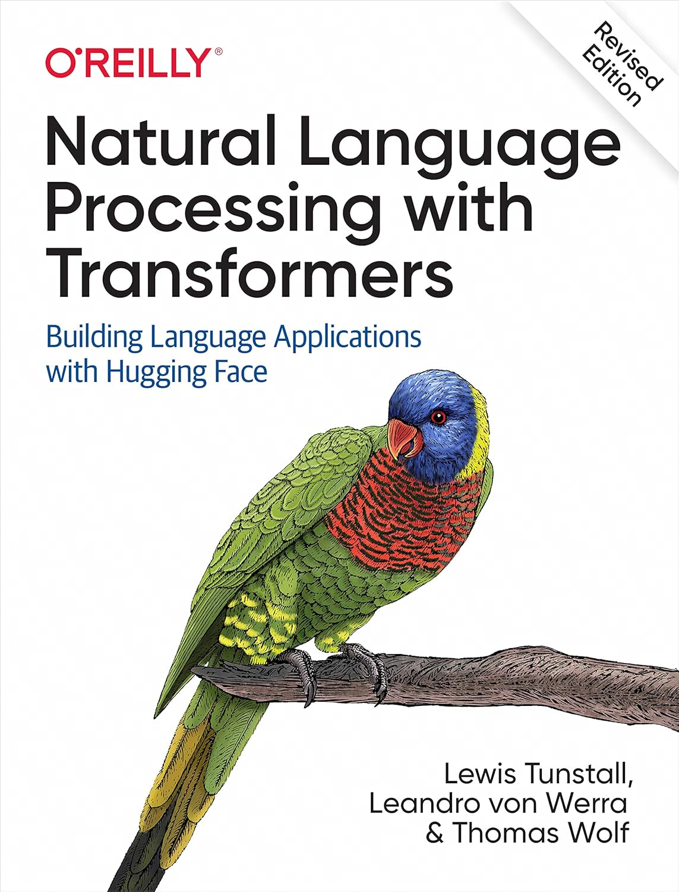
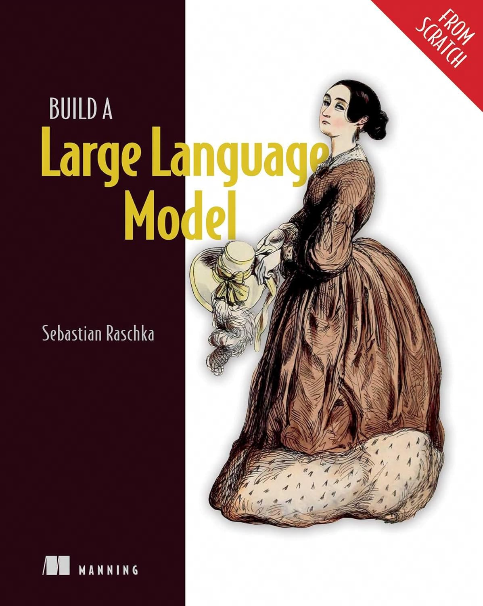

# Large Language Model

## Books

- [x] Natural Language Processing with Transformers

    

!!! note

    从NLP的基础知识开始讲起，依托Huggingface的`transformer`库对NLP&Transformer模型做了非常详尽的介绍。
    书中提供了很多的代码用例，适合初学者夯实基础。

- [x] Build a Large Language Model (From Scratch)

    

!!! note

    真正教你从零开始构建GPT的书。全书以GPT-2模型为例，用PyTorch从头实现了GPT-2模型网络，
    对Tokenizer，Embedding，Transformer等部分都做了极为详细的介绍。
    同时载入OpenAI开源的GPT-2模型的权重以验证当前实现的正确性。

    书籍相关代码开源在GitHub, 也是很好的学习资料: [rasbt/LLMs-from-scratch](https://github.com/rasbt/LLMs-from-scratch)

    个人学习的时候将代码进行了一些整理并封装成一个Python库，详见: [ai-glimpse/toyllm](https://github.com/ai-glimpse/toyllm)

- [ ] Super Study Guide: Transformers & Large Language Models

    

!!! note

    如果你只想快速了解LLM相关的理论知识，那么这本书可能是目前最好的一本。
    本书虽然没什么代码供读者去实践，但是对NLP/Transformer/LLM的核心概念都给出了非常简明的介绍，
    可以让读者快速建立对LLM理论的认知。
