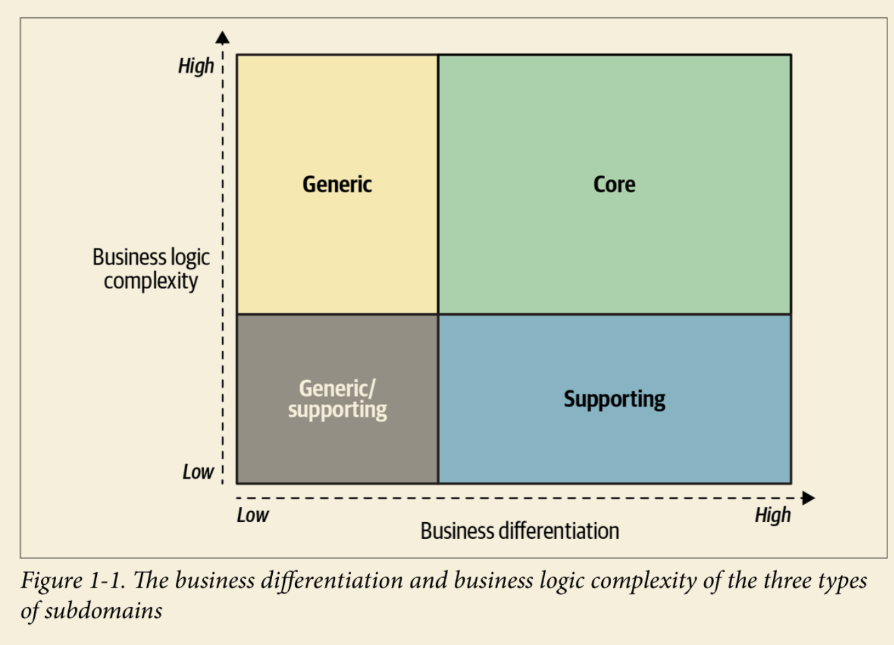

# Book: Learning DDD

*Learning Domain-Driven Design: Aligning Software Architecture and Business Strategy*

## PART I: Strategic Design

???+ "DDD 方法论：战略与战术"

    - 战略层面：回答"what"和"why?"
    - 战术层面："how"

### Chap1: Analyzing Business Domains

???+ "Definition: Business Domain & Subdomain"

    - Business domain: A business domain defines a company's main area of activity.
        - Starbucks is best known for its coffee

    - Subdomain: A subdomain is a fine-grained area of bussiness activity
        - All of a company's subdomains form its business domain: the service it provides to its customers.

???+ "Types of subdomains: Core, Generic, Supporting"

    - Core subdomain: what a company does differently from its competitors.

        - Core subdomains are naturally complex: they should be
          as hard for competitors to copy as possible —— the company's profitability depends on it

        - Change often and continuously: the solution must be maintainable and easy to evolve.
          Thus, core subdomains require implementation of the most advanced engineering techniques

    - Generic subdomain: businness activities that all companies are performing in the same way
        - Complex and hard to implement
        - Do **NOT** provide any competitive edge for the company

    - Supporting subdomian: support the company's business.
        - Simple: ETL(extract, transform, load), CRUD(createm read, update, delete) and so on
        - Do **NOT** provide any competitive advantage

### Chap2: Discovering Domain Knowledge

!!! warn "Importance of understanding the business"

    Without an understanding of the business problem and the reasoning behind the requirements,
    our solutions will be limited to "translating" business requirements into source code.

!!! tip "Software development is a learning process"

    Software development is a learning proces; working code is a side effect.

#### Communication with the ubiquitous language

!!! tip

    - Effective communication and knowledge sharing are crucial for a successful software
    project. Software engineers have to understand the business domain in order to
    design and build a software solution.

    - Domain-driven design’s ubiquitous language is an effective tool for bridging the
    knowledge gap between domain experts and software engineers. It fosters communi‐
    cation and knowledge sharing by cultivating a shared language that can be used by all
    the stakeholders throughout the project: in conversations, documentation, tests, dia‐
    grams, source code, and so on.

    - To ensure effective communication, the ubiquitous language has to eliminate ambiguities
    and implicit assumptions. All of a language’s terms have to be consistent—no
    ambiguous terms and no synonymous terms.

    - Cultivating a ubiquitous language is a continuous process. As the project evolves,
    more domain knowledge will be discovered. It’s important for such insights to be
    reflected in the ubiquitous language.

#### Model of the Business Domain

??? tip "What Is a Model"

    - A model is a simplified representation of a thing or phenomenon that intentionally
      emphasizes certain aspects while ignoring others. Abstraction with a specific use in mind.
      ——Rebecca Wirfs-Brock

    - A model is not a copy of a real world but a human constract that helps use make sense
      of real-world systems...An effective model contains only the details needed to fulfill its perpose...
      A model is intended to solve a problem, and it should provide just enough information for that purpose.

    - All model are wrong, but some are useful.  ——**George Box**

    - In its essence, a model is an abstraction. The notion of abstraction allows us to handle complexity by
      omitting unnecessary details and leaving only what's needed for solving the probelm at hand.

    - The purpose of abstracting is not to be vague but to create a new semantic level in which one can be
      absolutely precise.  ——**Edsger W. Dijkstra**

#### Tools: Glossaries & Gherkin tests

!!! tip "Glossaries & Gherkin tests(BDD)"

    - Tools such as **wiki-based glossaries** and **Gherkin tests**(BDD, Behaviour-Driven Development)
    can greatly alleviate the process
    of documenting and maintaining a ubiquitous language. However, the main prerequisite
    for an effective ubiquitous language is usage: the language has to be used consistently
    in all project-related communications.
