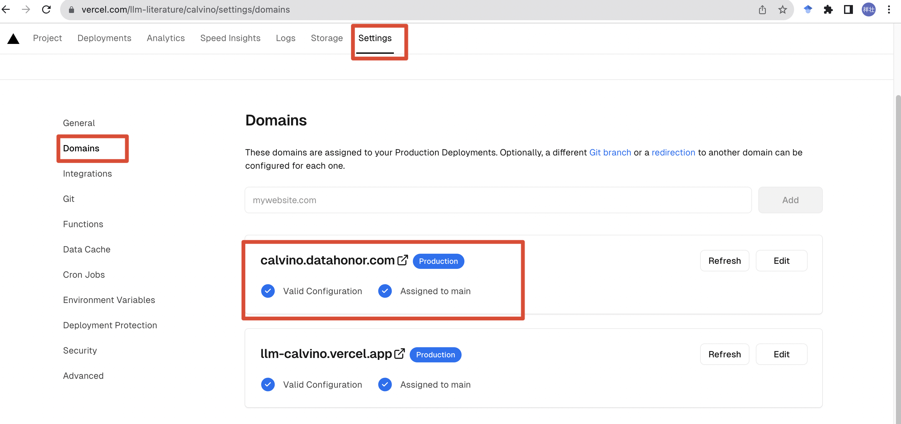

# Vercel Domain

Vercel 服务域名绑定，添加 DNS 解析支持国内访问。

## 添加域名

在 Vercel 项目中，点击`Settings`，在`Domains`中添加域名。

比如我自己现有的域名为[datahonor.com](https://datahonor.com),
这里我想把 Vercel 的服务链接到`calvino.datahonor.com`上，直接在`Domains`中绑定`calvino.datahonor.com`即可。

## 添加 DNS 解析
!!! warning "`cname-china`"

    注意这里添加的记录值为`cname-china.vercel-dns.com`，而不是`cname.vercel-dns.com`。

域名解析[^1]添加 CNAME 记录，将`calvino.datahonor.com`解析到`cname-china.vercel-dns.com`,
[^1]: 这里以阿里云域名解析设置为例，其他域名解析服务商类似。

等待 DNS 解析生效后，即可通过[calvino.datahonor.com](https://calvino.datahonor.com/)访问 Vercel 服务。

## 其他

### 新增解析记录解析多久可以生效？
实时生效[^2]

[^2]: 来自阿里云文档[新增解析记录解析多久可以生效？](https://help.aliyun.com/document_detail/39837.html)
