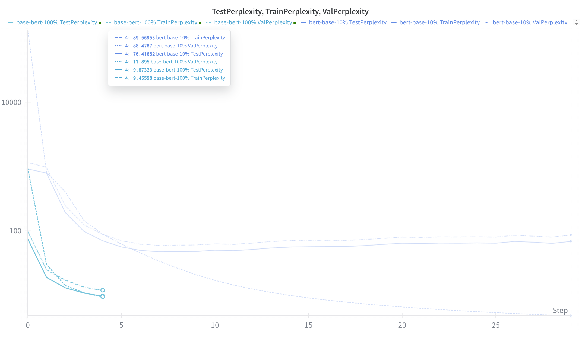
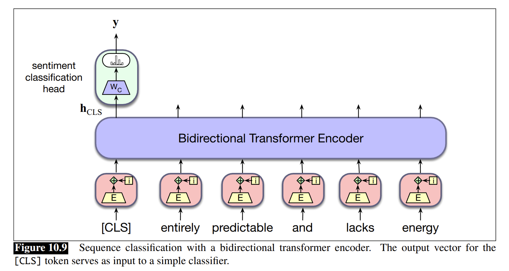
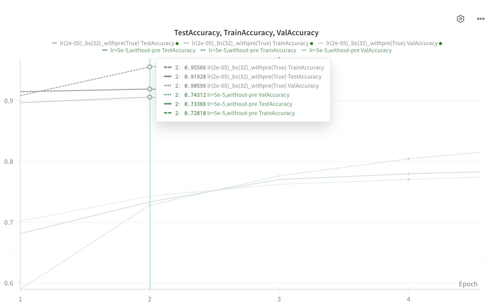

## 关于我们做到了哪一步

我在网上搜到了很多 BERT 复现的项目，有博客，也有 GitHub 代码仓库等。
这些文章和代码会告诉你他们在复现 BERT，介绍 BERT 是什么，原理是什么，代码要怎么写……
但是几乎没有人提及是否复现了论文的指标，甚至也不会放当前实现的指标出来——这就让人不得不怀疑其正确性。所以在开始之前，我们先来谈一谈正确性的问题。

<!-- more -->

首先是模型结构的正确性。我们通过和 Huggingface 上的 BERT 实现进行对比，确保了模型参数是完全一致的，即 base-bert 模型参数为 109482240，large-bert 模型参数为 335141888：

```python
def test_bert_architecture() -> None:
    # base bert config
    base_bert_config = BertConfig(
        max_seq_length=512,
        vocab_size=30522,
        d_model=768,
        attention_d_k=768,
        attention_d_v=768,
        head_num=12,
        d_feed_forward=3072,
        encoder_layers=12,
    )
    base_bert = Bert(base_bert_config, padding_idx=0)
    base_bert_param_count = sum(p.numel() for p in base_bert.parameters())
    # Make sure the parameter count matches the expected value for BERT base
    # 109482240 match EXACTLY with Huggingface implementation: BertModel.from_pretrained("bert-base-uncased")
    assert base_bert_param_count == 109482240  # 110M params

    # large bert config
    large_bert_config = BertConfig(
        max_seq_length=512,
        vocab_size=30522,
        d_model=1024,
        attention_d_k=1024,
        attention_d_v=1024,
        head_num=16,
        d_feed_forward=4096,
        encoder_layers=24,
    )
    large_bert_model = Bert(large_bert_config, padding_idx=0)
    large_bert_param_count = sum(p.numel() for p in large_bert_model.parameters())
    # Make sure the parameter count matches the expected value for BERT large
    # 335141888 match EXACTLY with Huggingface implementation: BertModel.from_pretrained("bert-large-uncased")
    assert large_bert_param_count == 335141888  # 335M params
```


之后是训练过程的正确性，这个主要通过复现结果来验证，下面是我们的复现结果：

| Metric | Original BERT | This Implementation |
|:--------:|:---------------:|:-------------------:|
| Perplexity(#L=12, #H=768, #A=12) | 3.99 | 5.90 |
| SST2 Accuracy | 93.5% | 91.93% |


上面就是我们当前复现指标和论文给出指标的比较。
**啊，是的，我们终究是没能完全复现论文给出的指标。**
但其实我们因为算力限制，并没有做论文 1:1 的复现，差别如下所示：

| Aspect | Original BERT | This Implementation |
|:--------:|:---------------:|:-------------------:|
| Max Sequence Length | 512 | 128 |
| Pretraining Dataset | BookCorpus + English Wikipedia | BookCorpus only |
| Training Epochs | 40 | 23 |

也就是说，我们用了更小的序列长度 (模型也略小一些)，更少的训练数据和更少的训练轮次。
虽然这些都是我们当前复现不及论文指标的原因，但个人认为训练数据缺失带来的影响是更大的。

总而言之，这就是我们这里对“复现”的定义了 (代码完全开源在 [ai-glimpse/toynlp](https://github.com/ai-glimpse/toynlp/tree/master/toynlp/bert))。
虽然后续我可能会进行一次 1:1 的复现，但是目前为止，这就是我们复现的配置和得到的结果了。


## BERT 简介

虽然我们这篇文章的重点是记录模型复现的过程和经验教训，并非模型本身。但是在这之前，我们还是简单来介绍一下 BERT 模型。


自 2017 年 Transformer(Encoder + Decoder 结构) 横空出世至今天，基于 Transformer 的模型架构存在多个不同发展分支，其中两个重要的分支就是 Encoder only 和 Decoder only：前者的代表就是 BERT，后者的代表就是 GPT(目前生成 LLM 的基石).

如今大家对 GPT 都比较熟悉，其本质上是“文本续写”，即根据前面的文本生成后续的文字，比较像小学语文课里面的“故事续写”。GPT 训练的时候通过将文本的下一个词作为标签来训练模型根据上文 (`prompt`) 来生成下一个词的能力。

BERT 的方法则更加类似于英语课中的“完形填空”，即根据待填空部分的上下文来选择当前位置的词语。
当然不同的是，我们自己做题只需要从 4 个候选项中选一个，而 BERT 模型需要从其高达 3 万 (30522) 的词表 (`vocab`) 中选出正确的答案。至于模型的训练，就是随机地将文本中的一些词语给掩盖掉 (打上`MASK`)，然后将其原来的词语作为标签进行预测。需要注意的是，BERT 对数据的预处理部分做得相当精细 (复杂)，这个可以具体参考实现代码来理解。

在对 BERT 有个大致了解之后，下面就可以来聊一聊这长达一个多月的有趣的复现过程了。


## 有趣的观察

### 预训练过程的有趣现象

我们在预训练阶段，复现了 *Characterizing Learning Curves During Language Model Pre-Training: Learning, Forgetting, and Stability* 这篇论文中观察到的预训练模型的学习模式。
注意这篇论文是基于 GPT 模型的研究，并非 BERT。但是我们在 BERT 预训练的时候也观察到类似的模式，即模型训练开始的时候会随机生成。
之后倾向于预测一些高频的 Token，比如 `the`, `.`等：

```
Input Tokens: [CLS]|#|#|skyscr|##aper|arch|##ipe|##lag|##o|[SEP]|trying|to|recover|nuclear|weapons|now|[MASK]|[MASK]|bottom|[MASK]|the|ocean|.|.|.|.|[MASK]|were|trying|to|keep|a|nuclear|power|-|plant|from|melting|down|.|hait|.|.|[MASK]|high|[MASK]|ranking|officials|were|still|alive|at|the|submerged|un|compound|.|.|.|.|all|[MASK]|of|[SEP]
Target Tokens: skyscr|at|the|of|they|power|.|some|-|sorts
Predicted Tokens: .|.|.|.|.|.|.|.|.|.
```

再之后才会出现一些真正有意义的预测：

```
Input Tokens: [CLS]|"|never|mind|.|i|was|only|making|##ival|joke|familial|[MASK]|he|said|,|and|then|he|questioned|his|new|companion|.|"|i|don|'|t|feel|the|[MASK]|strap|anymore|.|how|is|it|that|i|delir|[MASK]|you|?|"|[SEP]|[MASK]|workers|be|sent|into|fields|for|the|harvest|.|the|very|next|verses|in|matthew|[MASK]|s|[MASK]|are|jesus|sending|out|the|apostles|to|do|the|exact|same|thing|he|had|been|[MASK]|(|matt|10|:|[MASK]|-|7|[MASK]|.|they|were|to|be|the|[MASK]|that|were|sent|out|to|gather|[MASK]|harvest|.|this|is|our|call|[MASK]|,|to|go|to|[MASK]|lost|,|hungry|and|thirsty|(|the|lost|sheep|of|this|[MASK]|[SEP]
Target Tokens: a|,|"|translator|anymore|can|understand|more|'|gospel|doing|matt|1|)|workers|the|too|the|age
[train]Predicted Tokens: a|,|"|same|anymore|can|about|more|'|gospel|born|matt|1|)|workers|the|too|the|age
```


以下是我本人观察到这一现象后的一些自娱自乐：

> 这其实和婴儿学习说话有些相似之处，比如刚出生不久大多都是哭（无意冒犯：哭声算是噪声，类似于上文提到的“随机生成”）；之后开始“咿咿呀呀”地重复说一些简单的字/词，如“这个”、“啊”等（类似上文的 `the`、`.`）；再之后就可以说一些有意义的词语和句子了。

### 数据非常非常重要

在用全量的 BookCorpus 数据集进行预训练之前我们先进行了小规模数据 (10% 的样本) 训练以验证模型及训练脚本的正确性。下图是我们在小规模数据集和全量数据集上训练的结果对比：




从图中可以看到：
- 在前 5 个 epoch 中，全量数据集的困惑度远低于小规模数据集。例如，在第 5 个 epoch 时，全量数据集的测试困惑度约为 9.67，而小规模数据集的测试困惑度约为 70.41。
- 小规模数据集在 10 个 epoch 内就出现了过拟合，最佳测试困惑度约为 47.46。

这也再次印证了数据对于预训练模型的重要性。虽然我们在小规模数据集上也能看到困惑度的下降，但整体表现远不及全量数据集。过拟合现象的出现也表明，有限的数据量限制了模型的泛化能力。


### 从 Finetune 管窥预训练的威力

如前文所述，我们采用 SST2 数据集对预训练好的 BERT 模型进行了微调。SST2 是一个二分类任务，旨在判断文本的情感倾向（正面或负面）。

Finetune 模型的结构如下，就是一个简单的 BERT 模型加上一个线性分类器：



> The figure is from [Speech and Language Processing (3rd ed. draft)](https://web.stanford.edu/~jurafsky/slp3/).

模型实现代码如下：
```python
class SST2BertModel(torch.nn.Module):
    def __init__(self, config: BertConfig) -> None:
        super().__init__()
        self.bert = Bert(config, padding_idx=bert_tokenizer.token_to_id("[PAD]"))
        self.classifier = torch.nn.Linear(config.d_model, 2)  # SST-2 has 2 classes

    def forward(self, input_ids: torch.Tensor, token_type_ids: torch.Tensor) -> torch.Tensor:
        bert_output = self.bert(input_ids, token_type_ids)
        cls_hidden_state = bert_output[:, 0, :]
        logits = self.classifier(cls_hidden_state)
        return logits
```

我们首先看看没有预训练的 BERT 模型在 SST2 数据集上的表现。
注意我们这里使用了较小的`max_seq_length=128`(因为预训练时的输入长度就是 128)，而原始 BERT 使用的是`max_seq_length=512`。下面是在不同学习率下的训练曲线：


可以看到：
- 使用学习率为`5e-5`时，模型在测试集上达到了约 80% 的最佳准确率。
- 使用学习率为`1e-5`和`1e-6`时，模型的性能更差。
- 所有学习率在经过若干个 epoch 后都出现了过拟合现象。


接下来我们看看加载了预训练权重的 BERT 模型在 SST2 数据集上的表现：



可以看到，在经过 1 个 epoch 的微调后，模型在测试集上的准确率就超过了 90%，更是在第 2 个 epoch 下达到了 91.93% 的准确率。

另外在微调的时候也发现，经过少数几个 epoch 的训练后，模型就达到了最佳的效果，之后继续训练反而会导致过拟合。这可能就是论文中基本都微调 3 个 epoch 的原因：
> We use a batch size of 32 and fine-tune for 3 epochs over the data for all GLUE tasks.

通过对比可以明显看出预训练对模型性能的提升作用。预训练好的 BERT 模型在 SST2 数据集上表现出了更强的泛化能力和更快的收敛速度。


## 错误与教训


### 即使在极小数据集上也无法过拟合

我想先确认从数据加载、分词到模型训练的整条流水线都是正确的，所以在放大规模之前，我想先确保模型能在一个很小的数据集上过拟合。为了加快“刻意过拟合”的速度，我把学习率调大（0.01/0.001）。但我发现，即便在非常小的数据集上，也过拟合不起来。

我花了很多时间，尝试了各种方法来排查问题：
- 重新检查数据准备流程
- 校验模型结构
- 尝试不同的超参数
- 确保 mask token 的使用是正确的
- ……

这些尝试都没能让模型在小数据集上过拟合。你可能会问：大模型/AI 能帮上忙吗？答案是不行！真的不行。它们给了很多没有意义的建议。于是我换个思路，用更小的数据集 (只用一个样本训练)，并在代码里多加打印，直观地看看问题出在哪。
最终，我看到了这样的输出：

```
====================================================================================================
Epoch 146/1000 - Train Loss: 2.3028, Train MLM Loss: 2.3028, Train NSP Loss: 0.0000, Train NSP Accuracy: 1.0000,
====================================================================================================
Input Tokens: [CLS]|#|#|skyscr|##aper|arch|##ipe|##lag|##o|[SEP]|trying|to|recover|nuclear|weapons|now|[MASK]|[MASK]|bottom|[MASK]|the|ocean|.|.|.|.|[MASK]|were|trying|to|keep|a|nuclear|power|-|plant|from|melting|down|.|hait|.|.|[MASK]|high|[MASK]|ranking|officials|were|still|alive|at|the|submerged|un|compound|.|.|.|.|all|[MASK]|of|[SEP]
Target Tokens: skyscr|at|the|of|they|power|.|some|-|sorts
Predicted Tokens: at|at|at|at|at|at|at|at|at|at
====================================================================================================
Epoch 147/1000 - Train Loss: 2.3028, Train MLM Loss: 2.3028, Train NSP Loss: 0.0000, Train NSP Accuracy: 1.0000,
====================================================================================================
Input Tokens: [CLS]|#|#|skyscr|##aper|arch|##ipe|##lag|##o|[SEP]|trying|to|recover|nuclear|weapons|now|[MASK]|[MASK]|bottom|[MASK]|the|ocean|.|.|.|.|[MASK]|were|trying|to|keep|a|nuclear|power|-|plant|from|melting|down|.|hait|.|.|[MASK]|high|[MASK]|ranking|officials|were|still|alive|at|the|submerged|un|compound|.|.|.|.|all|[MASK]|of|[SEP]
Target Tokens: skyscr|at|the|of|they|power|.|some|-|sorts
Predicted Tokens: some|some|some|some|some|some|some|some|some|some
====================================================================================================
```

损失一直在 2.3 附近上下抖动（主要是 MLM 损失，NSP 损失几乎为 0）。
这让我意识到模型可能卡在了一个局部极小点，而原因很可能是**学习率过大**。
于是我把学习率调小到 `0.0001`，训练损失就能下降到 0.0，预测的 token 也终于能与目标对齐：

```
====================================================================================================
Epoch 29/1000 - Train Loss: 0.0004, Train MLM Loss: 0.0000, Train NSP Loss: 0.0004, Train NSP Accuracy: 1.0000,
====================================================================================================
Input Tokens: [CLS]|#|#|skyscr|##aper|arch|##ipe|##lag|##o|[SEP]|trying|to|recover|nuclear|weapons|now|[MASK]|[MASK]|bottom|[MASK]|the|ocean|.|.|.|.|[MASK]|were|trying|to|keep|a|nuclear|power|-|plant|from|melting|down|.|reap|.|.|[MASK]|high|[MASK]|ranking|officials|were|still|alive|at|the|submerged|un|compound|.|.|.|.|all|[MASK]|of|[SEP]
Target Tokens: skyscr|at|the|of|they|power|.|some|-|sorts
Predicted Tokens: skyscr|at|the|of|they|power|.|some|-|sorts
====================================================================================================
Epoch 30/1000 - Train Loss: 0.0000, Train MLM Loss: 0.0000, Train NSP Loss: 0.0000, Train NSP Accuracy: 1.0000,
====================================================================================================
Input Tokens: [CLS]|#|#|skyscr|##aper|arch|##ipe|##lag|##o|[SEP]|trying|to|recover|nuclear|weapons|now|[MASK]|[MASK]|bottom|[MASK]|the|ocean|.|.|.|.|[MASK]|were|trying|to|keep|a|nuclear|power|-|plant|from|melting|down|.|reap|.|.|[MASK]|high|[MASK]|ranking|officials|were|still|alive|at|the|submerged|un|compound|.|.|.|.|all|[MASK]|of|[SEP]
Target Tokens: skyscr|at|the|of|they|power|.|some|-|sorts
Predicted Tokens: skyscr|at|the|of|they|power|.|some|-|sorts
====================================================================================================
```

> 为了加快过拟合速度，我把学习率设得更大（0.01/0.001）。

故事大概就是这样：更大的学习率确实能让模型更快收敛，但也更容易把你带进局部极小值里。(嗯，很老套的错误...)

至于我为什么这么着急想让模型更快训练完？因为我的 4060Ti 实在太慢了，只想尽快结束训练。
总之，还是要耐心点，慢就是快。

### 一次性预处理全量数据，CPU 加班，GPU 休假

在开始的实现中，我把数据集的转换放在了数据加载环节，一次性把整个数据集都转换完：

```python
def get_split_dataloader(
    dataset_path: str,
    split: str,
    config: BertConfig,
) -> DataLoader:
    raw_dataset = get_dataset(dataset_path, None, split)  # type: ignore[call-arg]
    pretrain_dataset = dataset_transform(raw_dataset, config)
    dataloader = torch.utils.data.DataLoader(
        pretrain_dataset.with_format(type="torch"),
        batch_size=config.batch_size,
        collate_fn=lambda batch: collate_fn(batch, bert_tokenizer),
    )
```

这行 `pretrain_dataset = dataset_transform(raw_dataset, config)` 会一次性把整个数据集转换完，这是非常耗时的操作（12 颗 2.1GHz CPU 也花了 7 天多……）。
更好的做法是把这步放到训练时按 batch 即时转换。(但这并没有想象中那么简单，见下文)


### 试图用临时手搓的玩意儿达到很好的性能

为了解决上面的问题，我尝试自己做一个缓存 (Producer->Cache<-Consumer) 来存放已转换好的样本，但效率依然很低。（快速搓的一个很挫的版本，性能差也是预期内的）

后来我意识到，与其自己造一个看似简单（其实并不简单）的缓存，不如再看看能不能用 `datasets` 库和 `DataLoader` 自带的能力来优化数据加载与转换。我相信自己遇到的问题并不罕见，社区里应该有人解决过类似的问题。

然后就发现 `datasets` 有 `streaming=True` 的配置，正是这里需要的流式加载功能：

```python
dataset = load_dataset(path=dataset_path, name=dataset_name, split=split, streaming=True)
...
raw_dataset = raw_dataset.shuffle(seed=42).to_iterable_dataset(num_shards=32)
```

在 DataLoader 中使用 `prefetch_factor` 提升数据加载吞吐：


```python
dataloader = torch.utils.data.DataLoader(
    pretrain_dataset.with_format(type="torch"),
    batch_size=config.batch_size,
    collate_fn=lambda batch: collate_fn(batch, bert_tokenizer),
    num_workers=16,
    prefetch_factor=10,
    pin_memory=True,
    persistent_workers=True,
)
```

这个方法基本解决了“GPU 等 CPU”的问题，GPU 利用率也基本可以处于打满的状态。
但它又间接引起了其他问题，见下文。


### workers 和 prefetch 因子设得过大导致 OOM

当我设置 `num_workers=16`（我的 CPU 有 16 核）和 `prefetch_factor=10` 时，GPU 的确不再闲着了，但 DataLoader 进程的内存一直上涨，最终把系统内存（16GB）吃光，被 OOM 杀掉 (大约训练 16 小时后触发)：

```python
File "/toynlp/.venv/lib/python3.12/site-packages/torch/nn/modules/linear.py", line 125, in forward
    return F.linear(input, self.weight, self.bias)
           ^^^^^^^^^^^^^^^^^^^^^^^^^^^^^^^^^^^^^^^
File "/toynlp/.venv/lib/python3.12/site-packages/torch/utils/data/_utils/signal_handling.py", line 73, in handler
    _error_if_any_worker_fails()
RuntimeError: DataLoader worker (pid 2972) is killed by signal: Killed.
```

我通过减小 `num_workers` 和 `prefetch_factor`，并去掉 `pin_memory` 与 `persistent_workers` 选项来缓解：

```python
dataloader = torch.utils.data.DataLoader(
    pretrain_dataset.with_format(type="torch"),
    batch_size=config.batch_size,
    collate_fn=lambda batch: collate_fn(batch, bert_tokenizer),
    num_workers=8,
    prefetch_factor=4,
)
```

根据 [pytorch/issues/13246](https://github.com/pytorch/pytorch/issues/13246)
和 [datasets/issues/7269](https://github.com/huggingface/datasets/issues/7269)
上关于内存泄漏的讨论，为了尽量避免 OOM，我参考上面的讨论在每个 epoch 后调用 `torch.cuda.empty_cache()` 来清理显存。这些变更应用之后，长时间的训练终于没有再出现任何 OOM 问题。


### 没有优雅处理 DataLoader worker 的异常

在用 **10%** BookCorpus 数据训练时一切正常。
但当我切到 **全量** BookCorpus 数据集后，训练约 26 小时发生了异常，直接导致训练流程中断：

```python
  File "/app/toynlp/toynlp/bert/dataset.py", line 344, in <lambda>
    batch_instances := batch_create_pretraining_examples_from_documents(
                       ^^^^^^^^^^^^^^^^^^^^^^^^^^^^^^^^^^^^^^^^^^^^^^^^^
  File "/app/toynlp/toynlp/bert/dataset.py", line 301, in batch_create_pretraining_examples_from_documents
    random_document = batch[rng.choice([j for j in range(len(batch)) if j != i])]
                            ^^^^^^^^^^^^^^^^^^^^^^^^^^^^^^^^^^^^^^^^^^^^^^^^^^^^
  File "/root/.local/share/uv/python/cpython-3.12.10-linux-x86_64-gnu/lib/python3.12/random.py", line 347, in choice
    raise IndexError('Cannot choose from an empty sequence')
IndexError: Cannot choose from an empty sequence
```

于是我在 DataLoader worker 里加了不少 try-except，把这类错误尽量“吞掉并跳过”，让训练能够在数据异常时继续跑。你可以在当前实现（`bert/dataset.py`）里看到这些处理。
代码的实现目前不够优雅，但确实解决了问题。

### 评估时使用了错误的 tokenizer

在用 SST2 做微调评估预训练模型时，我一度错用了旧的 tokenizer（基于 BookCorpus 10% 训练）
而不是新的 tokenizer（基于 90% 训练，留出的 10% 用于验证/测试）来分词，导致微调后的 SST2 表现明显变差。
用错 tokenizer 时最佳测试准确率约 83%，而用正确的 tokenizer 后，最佳测试准确率约 89%。(这是预训练中间态模型的结果，最终模型表现更好，见上文结果表格。)


## 最后

在这长达一个多月的复现过程中，我踩了很多的坑，也学到了很多经验。这些宝贵的经验教训让我对预训练有了更深的理解——这是从读论文中所无法获得的。
在踩了这些坑之后，我隐隐约约地看到科学先辈的筚路蓝缕；在这段旅程结束时，我觉得自己也找到了一块算不得好看的鹅卵石，而“真理的大海则横陈在我面前”。
最后，希望每一位读者都能踏上属于自己的奇妙旅程。
