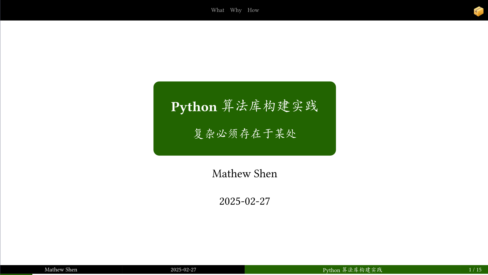
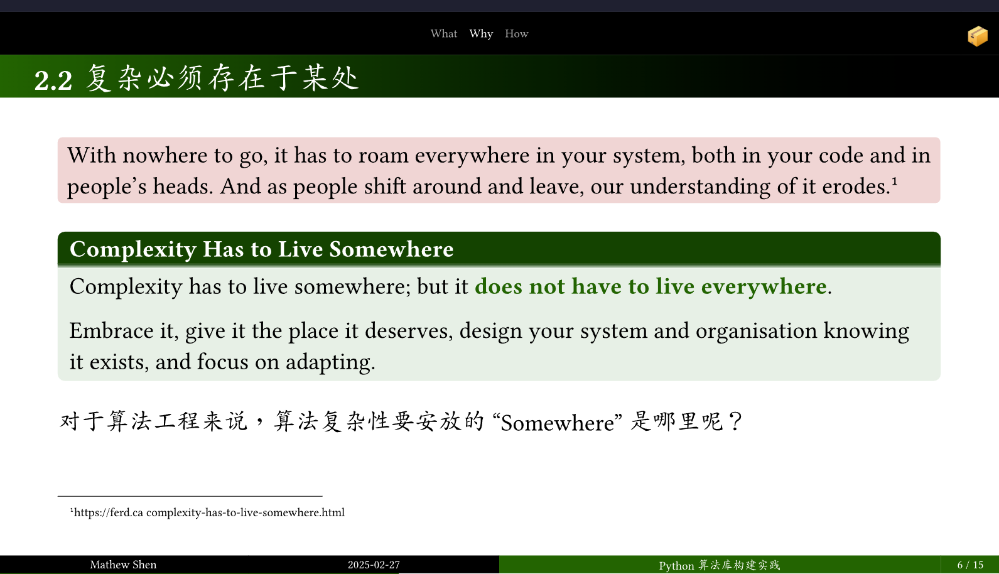
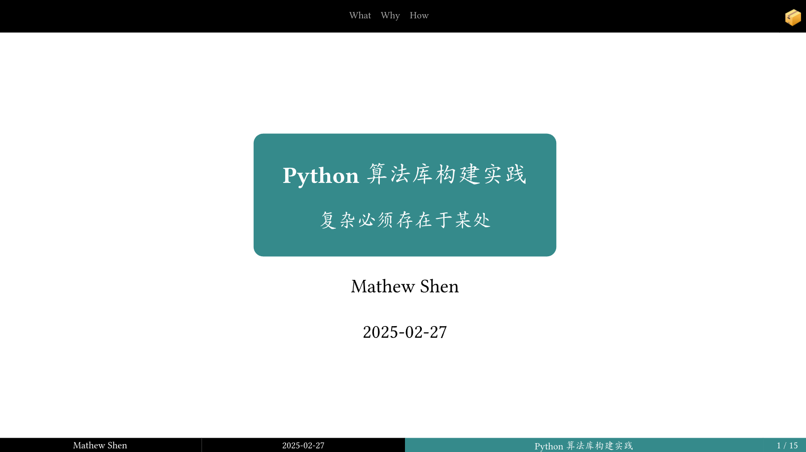
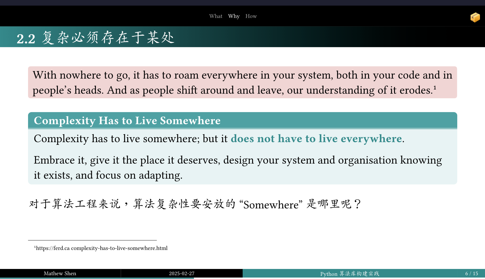
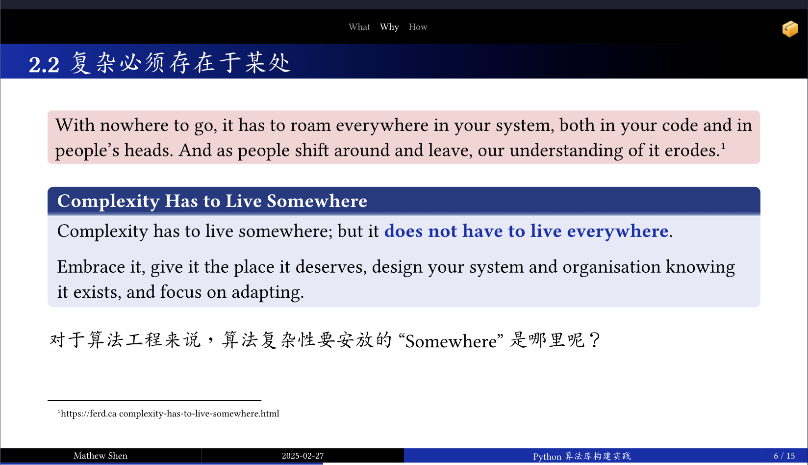
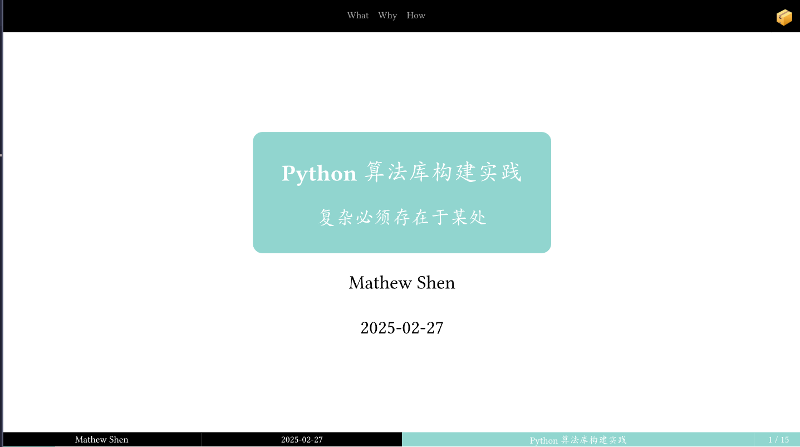
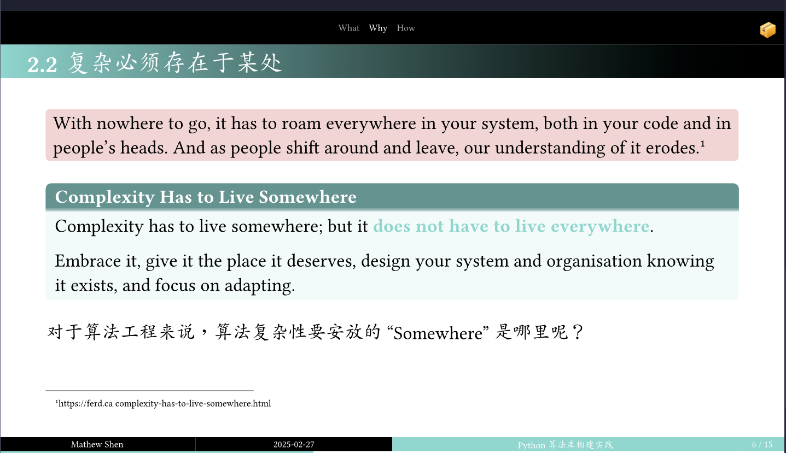
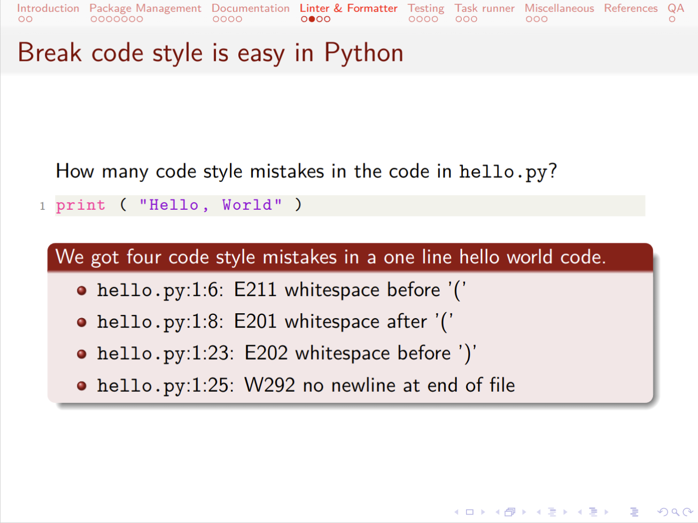

## Why

我真的用不好 PowerPoint，Keynote 也不行，这些工具对我来说都太复杂了。
这些基于拖拽的工具有很多小的问题让我很难受，比如两段文字到底有没有对齐……
我想要的是一个简单的工具，让我可以专注于内容，且可以自动生成美观大方的排版。
同时这些内容的源文件是 文本，这样我就可以用 Git 来做版本控制了。

对于这个问题，我的第一个解法 LaTeX 的 Beamer，第二个解法是 Typst 的 Touying。

<!-- more -->

## What

[Presentia](https://github.com/shenxiangzhuang/presentia)
是一个开源的 Presentation 模板集合，这里有我一直在使用的 Presentation 模板。
模板有两套，一套是基于 LaTeX Beamer 的，另一套是基于 Typst Touying 的。

### Typst: Touying Stargazer

#### Standard Green

| Cover                                                                                                     | Inner                                                                                                     |
|-----------------------------------------------------------------------------------------------------------|-----------------------------------------------------------------------------------------------------------|
|  |  |

#### Mars Green
| Cover                                                                                             | Inner                                                                                             |
|---------------------------------------------------------------------------------------------------|---------------------------------------------------------------------------------------------------|
|  |  |

#### Klein Blue
| Cover                                                                                             | Inner                                                                                             |
|---------------------------------------------------------------------------------------------------|---------------------------------------------------------------------------------------------------|
|  |  |

#### Tiffany Blue
| Cover                                                                                                 | Inner                                                                                                 |
|-------------------------------------------------------------------------------------------------------|-------------------------------------------------------------------------------------------------------|
|  |  |

#### Schenbrunn Yellow
| Cover                                                                                                           | Inner                                                                                                           |
|-----------------------------------------------------------------------------------------------------------------|-----------------------------------------------------------------------------------------------------------------|
|  |  |

### LaTeX Beamer: Frankfurt

| Cover                                                                                | Inner                                                                                |
|--------------------------------------------------------------------------------------|--------------------------------------------------------------------------------------|
|  |  |
