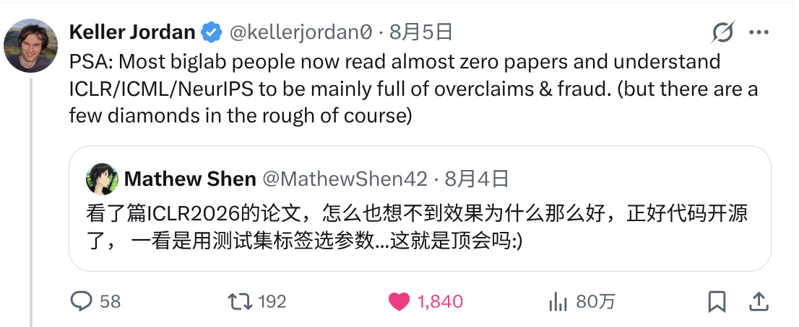

我并不是一个做学术的人，只是偶尔在某个早晨或深夜写一些代码，验证自己的想法或者复现别人的模型。
当我验证了自己的想法或者成功复现了模型时，我会由衷地感到快乐；反之，我会有些沮丧。

在前几天的一个早晨，我看到了一篇结果看起来很好的论文，而且还开源了代码。
所以我就开始阅读代码，然后发现这篇论文好像在用测试集的标签来选择算法的阈值，再把这个阈值下的结果作为测试集的结果。
看到这个问题时，我的第一反应是：一定是我哪里看错了——因为这是最基础的常识问题。
所以我让 Codex 严格检查了一遍，分析结果和我的结论一致，确实是标签泄露。

白白浪费了一番时间后，我感叹所谓顶会的可信度不过如此，于是就随手吐槽了一下，然后 Keller Jordan 引用并回复了这条吐槽：

我感觉 Keller Jordan 的回复相当友善，而且也确实引发了我的一些思考。我给他回复的是：

> Thank you for the reminder. It seems we have entered an era that demands a revaluation of all values.

是的，虽然和尼采的出发点不一样，但我想我们的确进入了一个需要重估一切价值的时代——我们必须重新审视已有的一切。

当我们无法判断当下的一些事情时，可以回望一下历史。我们来看看人工智能之父 A. M. Turing（图灵）在 76 年前（1950 年）的论文 [COMPUTING MACHINERY AND INTELLIGENCE](https://courses.cs.umbc.edu/471/papers/turing.pdf) 是怎么写的吧：

> I propose to consider the question, "Can machines think?" This should begin with
> definitions of the meaning of the terms "machine" and "think." The definitions might be
> framed so as to reflect so far as possible the normal use of the words, but this attitude is
> dangerous, If the meaning of the words "machine" and "think" are to be found by
> examining how they are commonly used it is difficult to escape the conclusion that the
> meaning and the answer to the question, "Can machines think?" is to be sought in a
> statistical survey such as a Gallup poll. But this is absurd. Instead of attempting such a
> definition I shall replace the question by another, which is closely related to it and is
> expressed in relatively unambiguous words.

正是在这篇论文中，图灵提出了如今被称为图灵测试（原文称为“imitation game”，即模仿游戏）的思想。
我想，图灵这段文字所体现的严谨性值得我们学习。这无关时代，无关地位，只关乎科学的严谨性本身。
如果一些论文连基础的严谨都做不到，那么所谓的权威认证就只是空谈，其价值也需要被重估。

我在 [LLM in 2024](/blog/2024/ai-think-2024/) 和 [AI 的黄金时代](/blog/2025/ai-golden-age/)
中都写到，如今 AI 的发展将在很大程度上重构我们的生活。这两年 AI 也在飞速发展，所以我认为需要重估价值的不仅仅是这些论文，还有很多其他事物，甚至是一切事物。需要说明的是，我不是说 AI 会直接改变很多事物，而是说它将在很大程度上改变人类的生活方式，进而影响与人相关的几乎一切事物，最终使我们有必要重估一切事物的价值。

以教育为例，LLM 将人类数千年来积累的知识凝聚到一起，并以一种前所未有的姿态向人类呈现——我们可以直接通过简单对话快速获取这些知识，这种方式极大地促进了知识的平权。就在 2022 年 ChatGPT 发布之前，最好的信息检索方式还是在 Google 上通过一系列检索技巧来搜寻问题的答案，而现在我们只要打开一个手机 App，就可以得到针对性更强、更翔实、更有帮助的答案。那么，这对教育有什么影响呢？站在 2026 年下半年的这个时间节点，我认为现在 AI 的综合能力已经超越了全国 90% 以上的高校教授。而且在不远的未来，这个数字会无限接近 100%。
基于这一点，我认为现有高等教育的价值必须被重估。同样地，以接受高等教育并拿到认证为目标的高考以及此前的所有教育，都必须被重估。
如果你觉得我说得有些绝对，不妨先体验一下最先进的 AI，然后问自己一个问题：如果能够重新选择，你会选择让 AI 当你的老师，还是选择你曾经的初中、高中和大学老师？
为了避免误解，我再澄清一点：我认为现有教育的价值必须被重估，并不是说 AI 可以取代这一切并做得更好，而是说传统教育带来的价值需要被重新计算。
就我个人来说，十几年的学校生活给我带来的不仅仅是知识，更多的是与同学、老师快乐相处的时光——这是 AI 永远也无法取代的，其价值也无法被估量。
另一方面，我依然无法忘记我初中语文老师在课堂上说“义愤填Ying”的“Ying”是“老鹰的鹰”，我也无法忘记我的反驳如何被打压，
更无法忘记我从家里的词典中撕下那一页给她看时，她扭头看也不看的样子。

其实不仅仅是教育，现在的 AI 基本上对所有问题都能给出回答（即使很多时候并不准确）。而且，因为模型在训练时都会被要求保持客观公正，所以大部分时候（是的，并不是所有时候），我们都能得到相对独立和客观的回答。
这些回答可以解决很多问题，比如生活和情感方面的问题——而解决这些问题，过去通常需要支付极为昂贵的咨询费用。
当然，现在 AI 还无法取代一些专业咨询，但是这些咨询的价值也需要被重估。

渐渐地，人们不再满足于仅仅将 AI 作为一个“缸中之脑”，开始为其提供各种可以改变物理世界的工具，使其能够完成很多原本只有人才能完成的工作。这当然会导致更多人失业，但这也向人本主义发起了最为有力的挑战。我认为这是好事。如今，人类对这个世界少了许多应有的敬畏，以至于时常会忘记整个地球也不过是浩瀚宇宙中的一个[暗淡蓝点（Pale Blue Dot）](https://en.wikipedia.org/wiki/Pale_Blue_Dot)。
我相信，随着机器智能的发展，人们终将意识到，人类智能也只是整个智能宇宙中的一个暗淡蓝点。
而到那时，人们将会回想起那句“认识你自己”。在人类重新认识自己之时，一切事物的价值也终将被重估。

最后，我要感谢我的女朋友冯老师。在一次街头漫谈中，我们聊到了尼采。她为我讲解了何谓“重估一切价值”，令我受益匪浅；本文的标题也由此而来。
