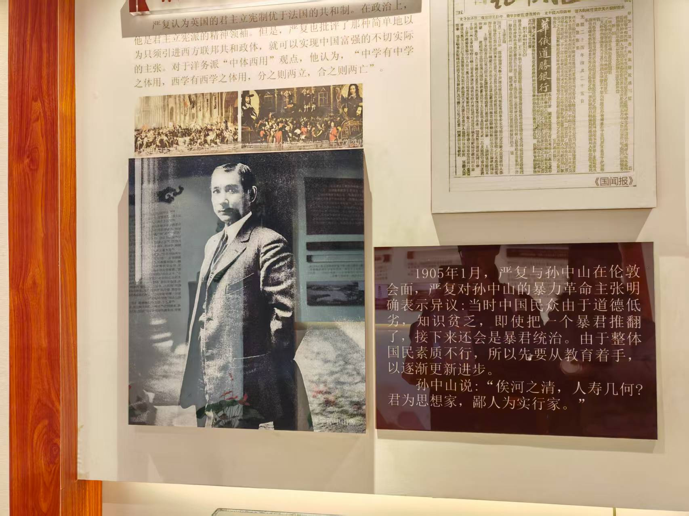

26 年初，去了趟福州，在三坊七巷参观了严复故居。看到严复和中山先生之间的对话后，大感震撼，心情久久不能平复。

<!---->

[严复认为](https://gb.china-embassy.gov.cn/dssghd/2014/201411/t20141114_3376404.htm)：“为今之计，唯急从教育上着手，庶几逐渐更新乎”，即中国的根本问题在于教育，革命非当务之急。而中山先生的回应是：“俟河之清，人寿几何？君为思想家，鄙人乃实行家也。”

这是 1905 年 1 月的讨论，六年之后，中山先生发动辛亥革命推翻了清朝的统治。但亦如严复先生所言，[辛亥革命并未从根本上改变当时中国贫穷、落后的面貌](https://gb.china-embassy.gov.cn/dssghd/2014/201411/t20141114_3376404.htm)。

我个人非常同意严复先生“根本问题在于教育”的观点。长期来看，这几乎是最根本且最重要的事情。但正如中山先生所引的这句“俟河之清，人寿几何”所言，我们真的要去等吗？

十几年的初等教育里，所有历史书都在写百年前革命家的心情如何迫切，但我始终无法切身体会——直到看到中山先生说“俟河之清，人寿几何”。这短短八个字让我真正感受到了百年前革命领袖的迫切心情，同时也让我重新思考很多事情。严复先生的观点是从根本出发解决问题，不急于施行一些临时的解决方法，因为这很可能会导致几乎无意义的重复；中山先生所说的“实行”，更多是在有生之年尽可能解决当下能解决的问题。

在参观时看到这句话的时候，我想起 Ilya Sutskever 和 Sam Altman：
我想，如果二人都精通中国文化，Sam 对 Ilya 说上一句“俟河之清，人寿几何”，之后的事情可能会简单许多 :)

人生短短数十载，我们在每个需要长期等待的时刻，不妨问自己一句：“俟河之清，人寿几何？”
