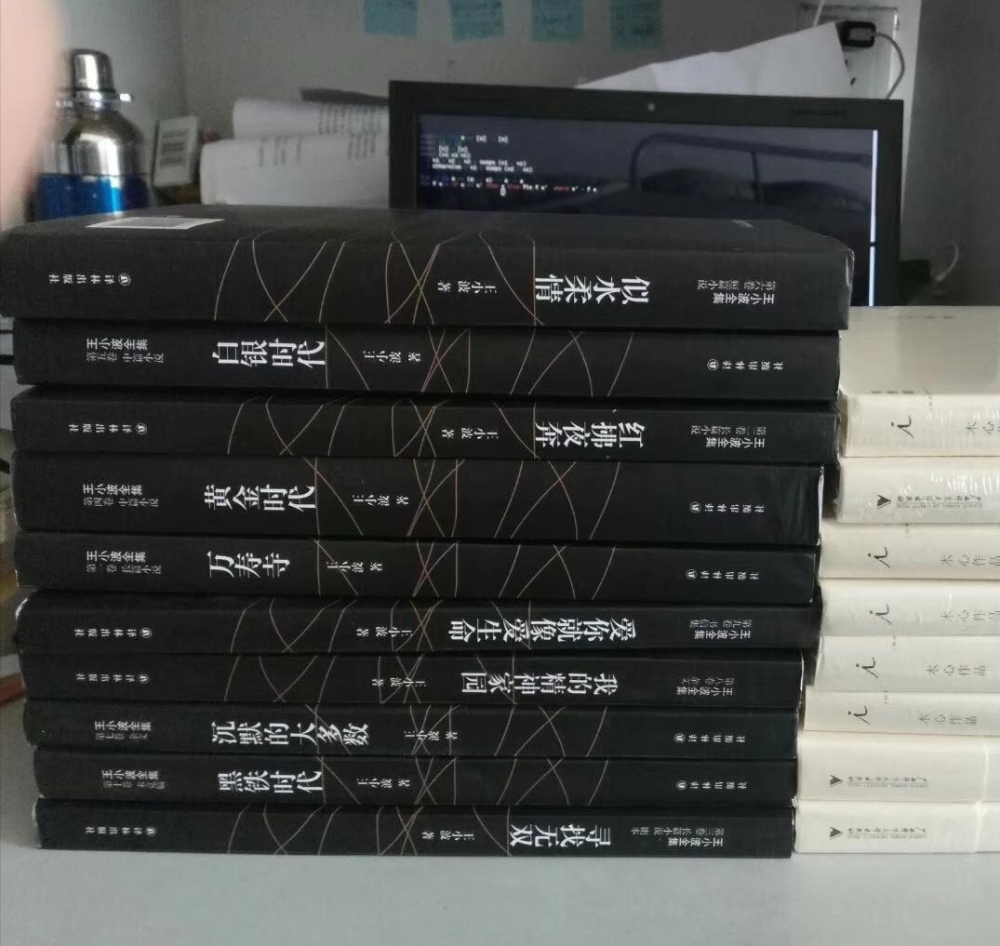
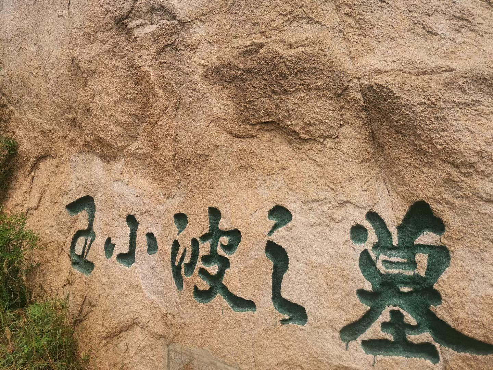

1997年4月11日，王小波逝世，之后不到三个月，1997年7月5日（农历六月初一），我出生了。
如今，距离王小波逝世，已经过去29年，我也即将29岁。
这些年我也写了一些和王小波有关的文章：
[寻找无双](https://mathewshen.me/blog/2019/wushuang/)（2019）, 
[所谓偶然](https://mathewshen.me/blog/2019/chance/)（2019）, 
[王二下班之后](https://mathewshen.me/blog/2025/wang-work/)（2025）。

但是11年前，确切地说是2015年的那个夏天之前，我从未听说过王小波。

## 失败的教育，成功的教育

2015年我正好18岁，正是高考的年纪。那个夏天，也正是我高考后的夏天。
啊，是的，我当时搞砸了。考得很烂，刚考完我就知道。
那时我分不清读书、高考、教育的区别，我认为它们都是一件事。
听起来很荒谬吧，但我当时就是认为这是一件事。在我眼里，既然高考没考好，那么一切都变得无意义了。

回家后我就闷在家里不出门，我父母自始至终没有责备我一句——但这反而让我更加难受——他们明明把教育看得比什么都重要！
家里实在不想待，只想出去，于是就去济南找我姐，顺便也结识了一些朋友。其中一位正巧在读王小波的《沉默的大多数》。
我随手翻了几页，觉着很不错，就借过来读。
十多年过去了，我依然清晰地记得当时读《沉默的大多数》的场景：
天气很热，我吃完午饭会去拿书，之后去一个商场的长凳上读。大部分时候，我都是边看边笑。
在一次次的微笑/大笑/会心一笑后，原本束缚我的一些枷锁也渐渐斑驳，腐朽，直至消散……

如今我已经明白，我真正的教育是在高考失败后才开始的，这段教育的老师就是我的家人以及王小波。
我的家人让我明白，无论我怎样，他们都会和我一起面对；王小波让我学会独立思考，学会用自己的眼光(而不是用一种被规训的角度)去看待世界。
真正的教育让我明白，应试教育的成败只能反映一个人应试教育的能力，除此之外并不决定任何事情。

## 纸上谈兵

在我大学入学以后，我买来了王小波几乎所有的书，然后在大三左右的时候就读完了，之后又读他很推崇的卡尔维诺。

在大学时代，涉世经验仍然很少，所以我和很多内容还无法共鸣。，有点“纸上谈兵”的感觉（但我当时并不这么认为）。

## 纸上得来终觉浅

毕业后去北京工作，算是告别了学生时代，真正走进社会。这时，原本浮于表面的一切逐渐变得刻骨铭心。
在大学时读《寻找无双》，看到下面这句时，基本没什么感觉：

> 王仙客在宣阳坊，所恃仗的就是自己的智慧。可惜的是，他的智慧解决不了眼前的问题。

如今再读，已是“欲语泪先流”！

> 人活在世界上，就如同站在一个迷宫面前，有很多的线索，很多的岔路，别人东看看，西望望，就都走过去了。
> 但是我们就一定要迷失在里面。这是因为我们渺小的心灵里，容不下一个谜，一点悬而未决的东西。所以我们把一切疑难都放进自己心里，把自己给难死了。

在经历了一些事情后，这些原本晦涩的文字已经有了鲜活的生命。

> 何况尘世嚣嚣，我们不管干什么，都是困难重重。

## 扼腕墓道

2021年7月到北京工作，8月就去了王小波的墓地。
墓地前有几瓶不满的酒，几束干枯的花，其他就没什么了。
在这个陵园，大家都知道王小波。

## 一位老师

我无意去评论王小波的文学成就或是其他，我只是单纯地喜欢他的文字。
于我而言，他是一位真诚的老师，一个真诚有趣的朋友。
